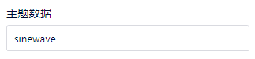
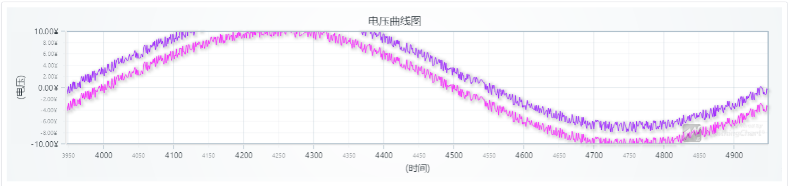
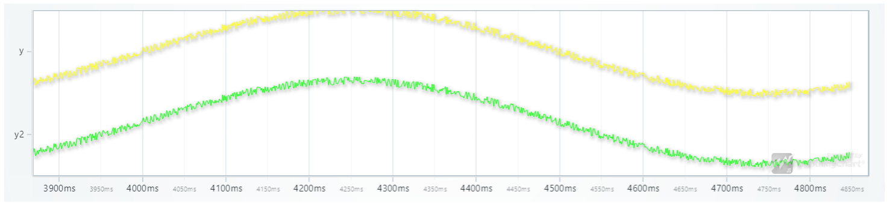
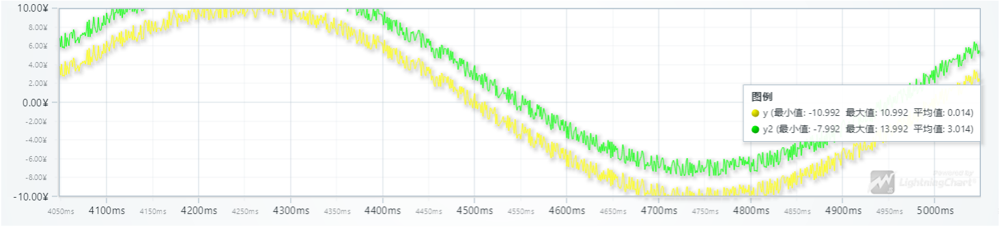
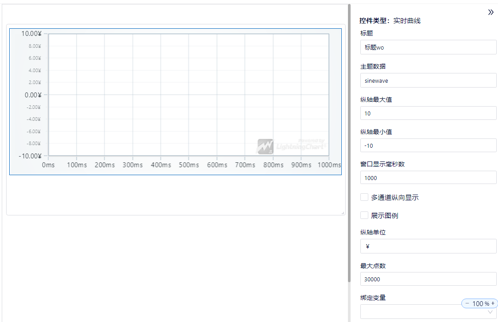
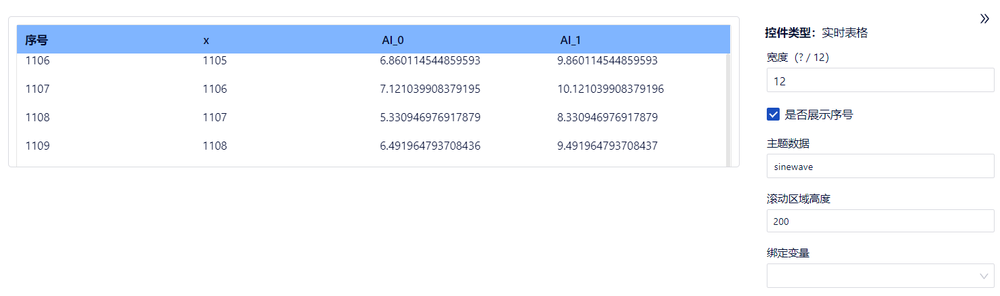
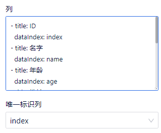
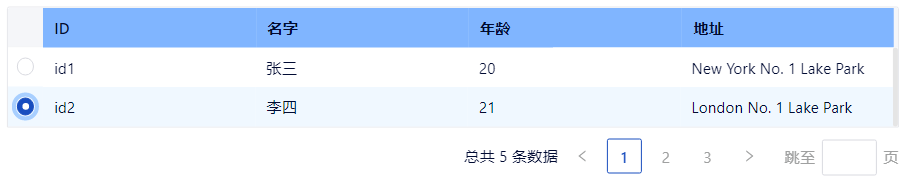
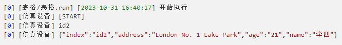
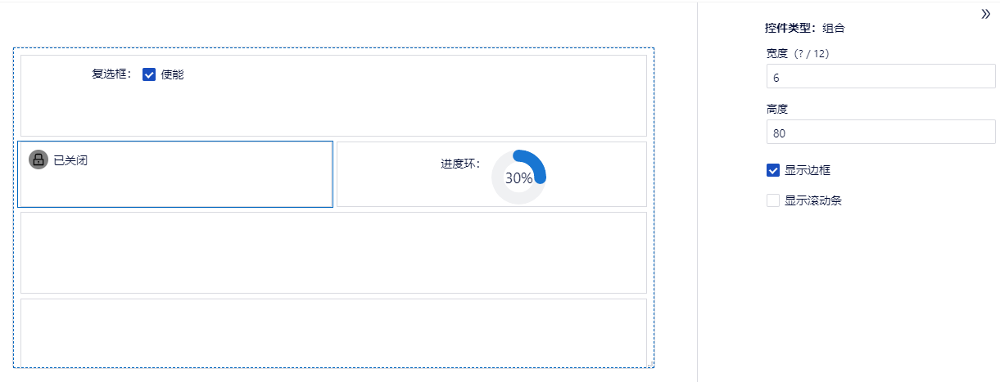

### 复杂组件
- 实时曲线
  - 独占面板：一个组件使用一个面板。
  + 主题数据：需要输入创建主题数据的名称，该主题数据需要事先在lua文件里使用etopic.create()创建。
  ```lua
  etopic.create('sinewave', 'xyy', { rate=1000, style = 'line', title ='电压曲线图', axis={x="(时间)",y="(电压)"}, labels = {y="AI_0",y2="AI_1"}, colors = {y="#CB42CF", y2="#8317DB"} })
  ```
  

  + 纵轴最大值，纵轴最小值：标记纵轴的范围
  + 窗口显示毫秒数：标记横轴最大值
  + 多通道纵向显示：适用于同一张图表中，显示多条曲线，每条曲线代表不同的数据集或变量。

    - 不勾选“多通道纵向显示”的场合：

      

    - 勾选“多通道纵向显示”的场合：

      

  + 展示图例：来解释和标识不同元素或数据集的说明性图标或文字。
  勾选“展示图例”的场合如下图：图例中，可以点击对应的黄色，绿色的点，从而选择显示哪条曲线。

  

  + 纵轴单位：字面意思，填写纵轴的单位名称
  + 最大点数：曲线图的最大点数。当数据点的数量超过最大点数时，可能会出现数据重叠或图表变得拥挤难以阅读的情况。
  - 绑定变量：绑定字符串类型的网络变量。
    - 例：
      - 绑定变量：$.sinewave
      - *.yml：sinewave: "sinewave"
    - 注意：如主题数据和绑定变量同时有内容，绑定变量起作用。

  

- 实时表格
  - 是否展示序号：勾选后在表格显示序号，不勾选不显示。
  - 主题数据：填写主题数据名称。
  - 滚动区域高度：表格显示的高度。
  - 绑定变量：绑定字符串类型的网络变量。
  - 注意：主题数据和绑定变量只能二选一。不能同时有内容。

  

- 表格
  - 功能：展示表格内容，并可以选中某行
  - 独占面板：一个组件使用一个面板。
  + 列：定义表格每列的表头名称和索引。遵循yaml语法，可修改关键字title，dataIndex所对应的值
  + 唯一标识列：可以根据下拉框选择列的名称，该名称作为后续选定行的唯一标识。该列的每行内容不能相同
  + 行数据：定义表格每行的内容。根据需要修改内容，增减行数
  + 可视区域宽度：指的是滚动区域的宽度（前提：有滚动条）
  + 可视区域高度：指的是滚动区域的高度（前提：有滚动条）
  + 首列展示自增下标：勾选后，首列会出现以“序号”为表头，每行内容为该行的行号
  + 分页器的设定：当表格数据总条数超过每页条数的时候，会使用分页器
    - 不使用分页：默认不勾选，代表使用分页，并显示下面三个配置项
      - 分页器位置：可选居左，居中，居右
      - 每页条数：显示每页显示表格的行数
      - 支持快速跳转：输入想要跳转的页码，回车后，跳转到该页
  + 选中类型：“单选”的场合运行时，通过单选框选中单行。“多选”的场合运行时，通过复选框可选多行。
  + 选中回调：选择中“行”后，可触发回调函数。
    - 输入内容：
      - (api, {rowKeys, rows}) => {} 
        
        使用JS语法格式，{}里的代码内容参考[【界面开发API】](#/document?catalogId=85&id=80&type=doc)
      - rowKeys是数组，对应“列”是“唯一标识”，“行”为选中行的内容（行可多选）
      - rows是数组，对应所有“列”，“行”为选中行的内容（行可多选）
    - 例：
      - "选中回调"输入：(api, {rowKeys, rows}) => {api.cmd("send",[rowKeys,rows])}
      - lua脚本内容：
        ```lua
        function send(id,idrows)
          for k,v in ipairs(id) do 
            print(v)
          end
        
          for k,v in ipairs(idrows) do 
            print(v)
          end
        end
        function entry()
        --空
        end
        ```
      - 下图，因为“唯一标识列”为“ID”列，所以选中第二行时，rowKeys的值为“id2”

      

      

      

  + 绑定变量：绑定任意型“数组”的网络变量。
    - 网络变量例：myArrayAny: []
    - 当绑定网络变量场合，执行时“行数据”的内容不会显示，所以如果绑定的网络变量没值为空，那么执行时只显示表头。

- 组合
  - 功能：组合是可以灵活嵌套使用的组件容器，方便布局。相当于面板，但是需要在面板上使用。
  - 宽度：组合相对于面板的占比（1~12）
  - 高度：组合的高度。
  - 显示边框：默认为勾选状态，显示边框；如果取消勾选，则不显示边框。
  - 显示滚动条：默认为不勾选状态，不显示滚动条；如果勾选，当需要滚动显示时会显示滚动条。

 