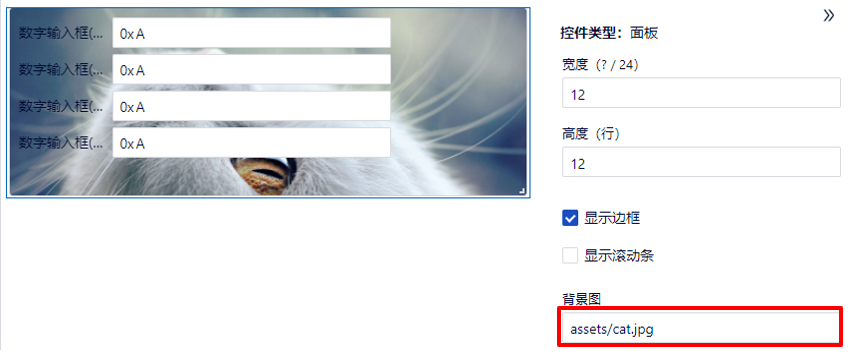
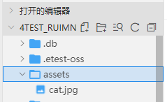

### 布局组件

- 面板
    + 选中面板的右下角直角图标可调整大小。
    - 高度（行）：表示面板所占的高度，默认值为12，高度设置没有限制。
    - 显示边框：默认为勾选状态，显示边框；如果取消勾选，则不显示边框。
    - 显示滚动条：默认为不勾选状态，不显示滚动条，如果勾选，当需要滚动显示时会显示滚动条。
    - 背景图：可以设置面板背景显示。单击输入框，选择图片（类型支持PNG、GIF、JPG、JPEG），会将刚才选择的图片复制到当前项目的文件夹assets下。

      

      