## 界面

- 界面是人机交互界面设计的简称，系统提供了大量可视化操作的组件，通过这些组件可以快速搭建自定义的人机交互界面。
- 在使用过程中，可以分为界面设计和编程两部分。界面设计是确定界面的布局、颜色、字体等方面的要求。设计过程通常需要考虑用户体验、可用性和可访问性等因素；在设计完成后，需要使用ETest通过绑定脚本和网络变量等方式来实现界面交互功能。

### 界面文件新建

- 界面文件以".rui"为扩展名结尾的文件，名称不能重复。

鼠标选中对应的文件夹->鼠标右键选择【新建文件】->选择【界面(react)】

### 设置界面主题和分辨率

- 主题设置

进入index.prj文件，可以选择浅色、深色两种主题模式进行切换设置，设置后打开界面文件，可以看到不同的主题效果。没有特殊要求时，使用默认设置即可。

- 屏幕分辨率设置

进入index.prj文件，可以根据使用的显示器进行分辨率的设置。没有特殊要求时，使用默认设置即可。

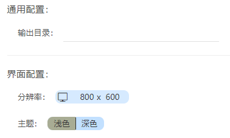

### 工作区放大缩小设置

- 鼠标点击“+”或者“-”进行画布的放大缩小。

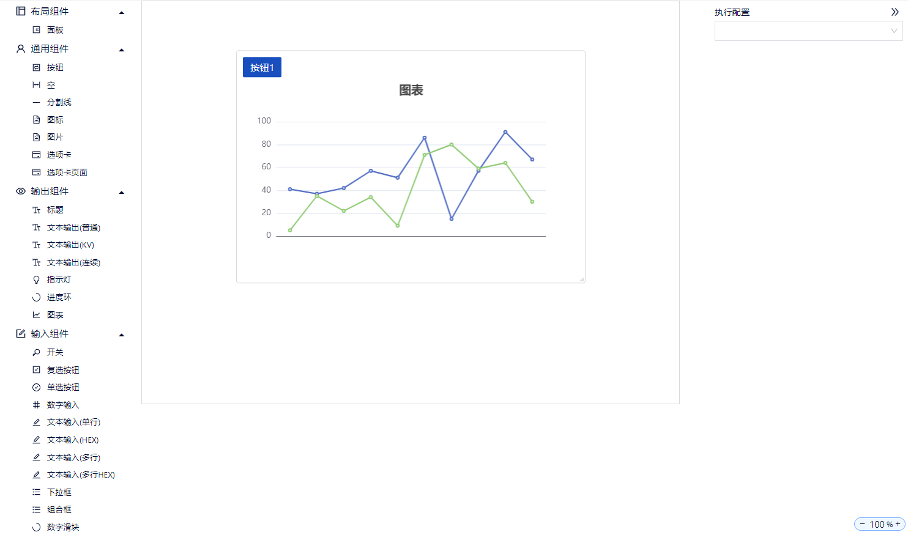

### 批量修改属性

- 选择多个相同类型的组件，右键“批量修改属性”，右侧会出现多选组件的属性。此时，右侧属性栏的“控件名称”旁边会出现红色的“ * ”
- 右侧属性栏的值：多选的组件的最下面组件的属性值。

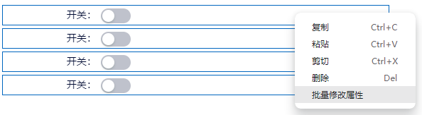

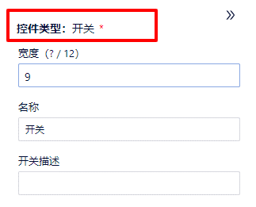

- 多选要求：
  - 必须是同一种类的组件。比如都是“开关”。
  - 选择对象：面板或者组件
  - 选择对象的位置：
    - 相同或不同面板的相同类型组件
    - 不同选项卡的相同类型组件

    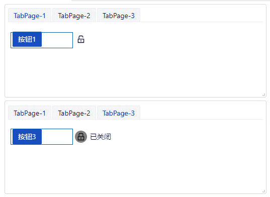

- 注意：批量修改“面板”组件，批量修改高度或者宽度其中一个属性后，被批量选中的组件的高度和宽度都会变成一样的。

### 编辑、预览模式切换

- 点击界面右上角的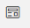编辑/预览切换按钮，进入对应的模式下。编辑模式下支持面板及组件的操作；预览模式是对设计的界面进行预览操作。

### 绑定执行配置

- 界面要实现交互功能，就要与执行配置文件和网络变量进行绑定。因此需要设置执行配置文件和网络变量文件。
  - 新建界面文件成功，界面右侧会出现文件的属性配置。
    + 执行配置：选择该界面所需要的执行配置文件。
    + 网络变量：选择执行配置文件后，网络变量会自动配置为“执行配置”文件里已经配置的网络变量文件。

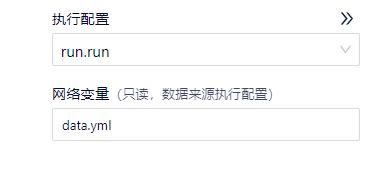

### 组件的通用属性说明
  + 进行界面设计的前提条件是要先添加面板，有了面板之后，才能向面板里添加各个组件，进行界面设计。
  + 独占面板：选项卡，选项卡页面，图表，实时曲线，表格，仪表盘不能和其他组件共用一个面板。它们需要一个组件使用一个面板。
  + 添加面板：鼠标左键选中面板，向中间画布区域进行拖拽即可创建面板。
  + 添加（面板以外的）组件：鼠标左键选中组件，拖拽到面板区域后，组件添加成功。
  + 编辑模式选中组件，鼠标右键支持组件的复制、粘贴、剪切、删除操作，同时支持相应的快捷键操作。
  + 选中组件按住鼠标左键进行拖拽可以实现组件与组件之间位置关系的移动。
  + 编辑模式选中组件，右侧显示其属性，修改对应属性值后，组件会跟随变化。
  + 宽度（？/12）：表示总宽度占12份，最大可以设置到12，如果设置成6，意味着该组件占用总宽度的一半。
  + 格式化脚本：进行格式化操作改变控件的值。需要使用JS语法，符合JS语法的格式化脚本都支持。
    - 例1：(v) => '我的'+v（增加可读性）
    - 例2：(v) => v=== "UnlockOutlined" ? "CheckOutlined" : "ExclamationOutlined"（引号里面为icon类型）
  + 回调函数：
    - 输入内容：(api) => {} 
      
      使用JS语法格式，大括号里的代码内容参考[【界面开发API】](#/document?catalogId=85&id=80&type=doc)
    - 例：
      - (api, value) => { api.cmd("fun_name",["$.myBool"]) }
      
        注意：参数value是形参，一般代表该组件的值。
      - (api, value) => { api.cmd("fun_name",[value]) }
      - (api, {rowKeys, rows}) => {api.cmd("send",[rowKeys,rows])}

        注意：参数不唯一的场合用大括号括起来。
    - 触发回调函数的契机：
      - 按钮：勾选(复选按钮)，或点击。
      - 输入框：输入数据后，点击其他地方。
    - 一个组件只能有一个(api) => {}，大括号{}里可以有多个函数，用“;”隔开。
      
      例：(api) => {api.set_value('$.radio', 2);api.set_value('$.button', 'btn new');}

  + 绑定变量：点击绑定变量，会弹出下拉列表，显示yml文件里添加的所有网络变量，可以选择设置网络变量。设置网络变量后，脚本执行过程中修改了该网络变量后，组件值（或名称）会变为该网络变量修改后的值（或名称）。
  + 验证函数：使用JS语法，验证输入内容是否满足条件，如不满足，则验证不成功，输入框会变成红色。
      
    例：v => v.length > 5（验证v是否大于5，输入“sd”，长度不大于5，所以输入框变红了）
      v => typeof v === 'string'（v如果不是字符串，输入框变红）

    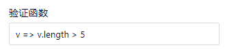

    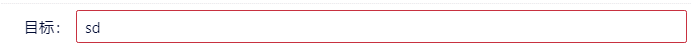

### 通信协议自动生成界面

界面右上方点击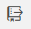导入->选择导入协议文件->选择生成列数，协议导入成功。

协议：

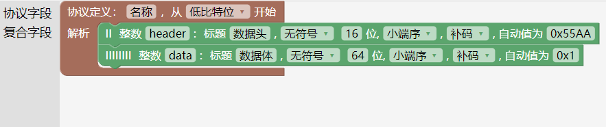

选择导入协议文件：

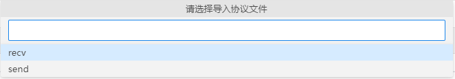

选择生成的列数：

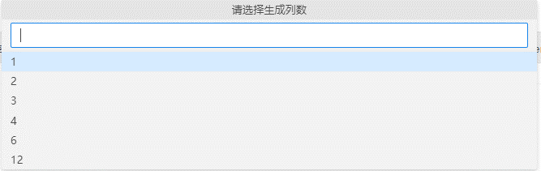

选择1，代表1行只显示1个组件，该组件占用一整行。

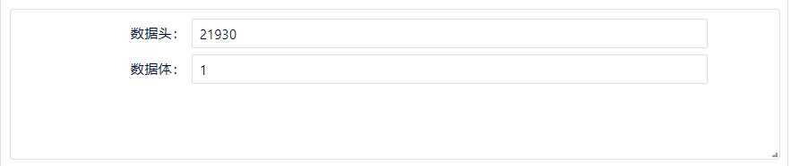

选择12，代表1行可以显示12个组件，每个组件占用该面板宽度的1/12。下图的两个组件，共占用面板的1/6。

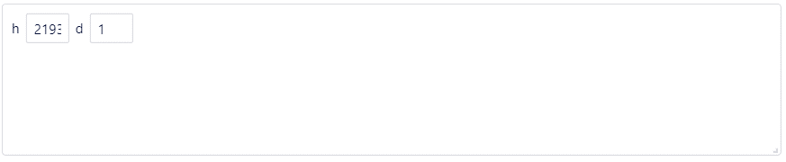

组件的名称默认为协议段的名称，组件的输入值默认为协议段的值。

### 调试模式

在调试模式下，可以进行界面与脚本之间的调试和测试。

- 打开调试模式

  1. 进入rui文件界面，点击打开调试模式按钮（右上角瓢虫图标），进入调试模式下，执行输出显示执行日志。

  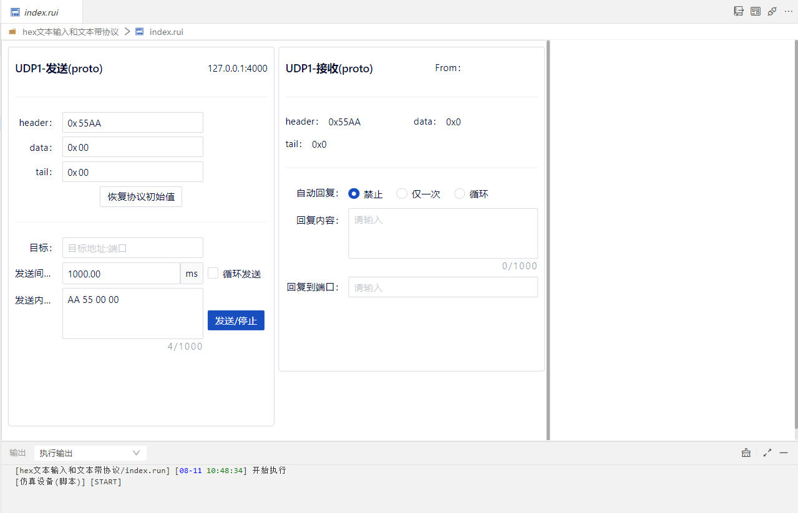

  2. 进入调试模式界面，可以进行交互操作（例如：可以进行发送数据和接收数据的测试）。

  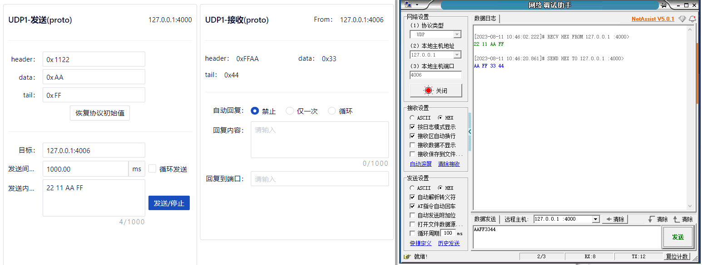

- 关闭调试模式

  - 点击关闭调试模式按钮（右上角的插头图标），关闭调试模式。

  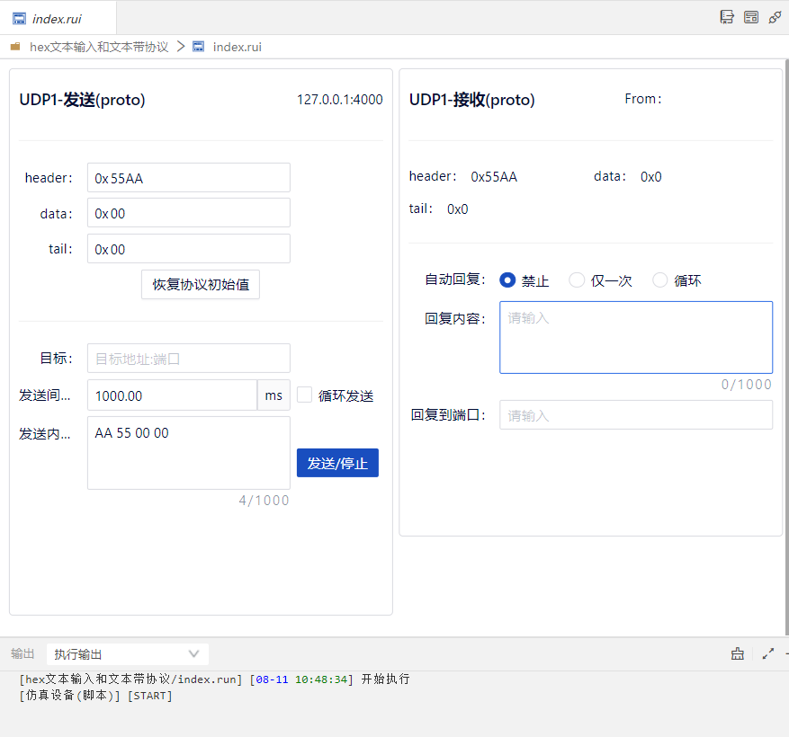