### 输入组件

输入组件常用于数据输入的使用。

- 开关
    - 功能：作为输入组件的开关，一般通过点击开关来改变“开”，“关”状态，从而改变自身的值。
    - 名称：输入内容，显示开关的名称。
    - 开关描述：可以输入开关使用的说明内容。
    - 是否选中：默认不勾选，没有选中开关状态；勾选后，开关显示选中状态。
    - 是否反转开关：默认不勾选，不进行开关反转；勾选后，开关反转，打开状态（false），关闭状态（true）。
    - 只读：默认不勾选，开关可进行状态切换；勾选后，开关不能进行状态切换。
    - 名称宽度：输入宽度：修改占比值，可以调整开关名称和描述的显示区域范围。
    - 气泡显示名称：默认不勾选，鼠标移动到名称位置后，不显示气泡名称；勾选后，鼠标移动到名称位置后，显示气泡名称。
    - 绑定变量：绑定“布尔”，“数字”类型的网络变量。
      
      注意：
        - 布尔类型的场合：值为0，1，true，false。
        - 数字类型的场合：值只能是0，1。
        

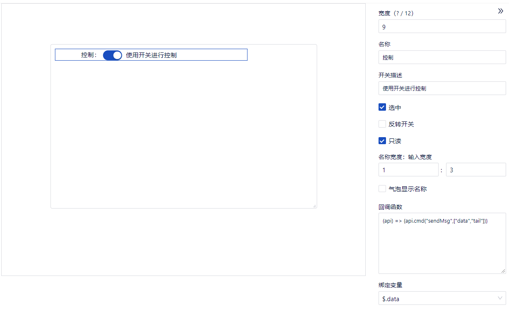

- 复选按钮
  - 和复选组的区别：复选按钮是单独一个框，复选组框的个数可以自定义成一个或多个。
  - 是否反转勾选：
    - 【是否反转勾选】不勾选时，复选按钮的值勾选为true，不勾选为false。
    - 【是否反转勾选】勾选，复选按钮的值勾选为false，不勾选为true。
    
 

- 复选组
    - 名称：输入内容，显示复选组的名称。
    - 选中值：选中值与选项相关联，选中值的内容对应的是选项里的内容；选中值可以分为数字和字符两种类型；可以新增或删除选中值。
    - 选项：选项可以新增或删除选项；可以编辑选项名称、选项类型和选项内容。
    - 选项水平间距（像素）：可以修改选项之间的距离。
    - 水平展示：默认水平展示；取消勾选后变为垂直展示。
    - 只读：不勾选时，选项内容可以编辑；勾选后，选项内容不能进行编辑。
    - 名称宽度：输入宽度：修改占比值，可以调整名称和选项的显示区域范围。
    - 气泡显示名称：默认不勾选，鼠标移动到名称位置后，不显示气泡名称；勾选后，鼠标移动到名称位置后，显示气泡名称。
    - 绑定变量：绑定“字符串型数组”，“数字型数组”类型的网络变量。

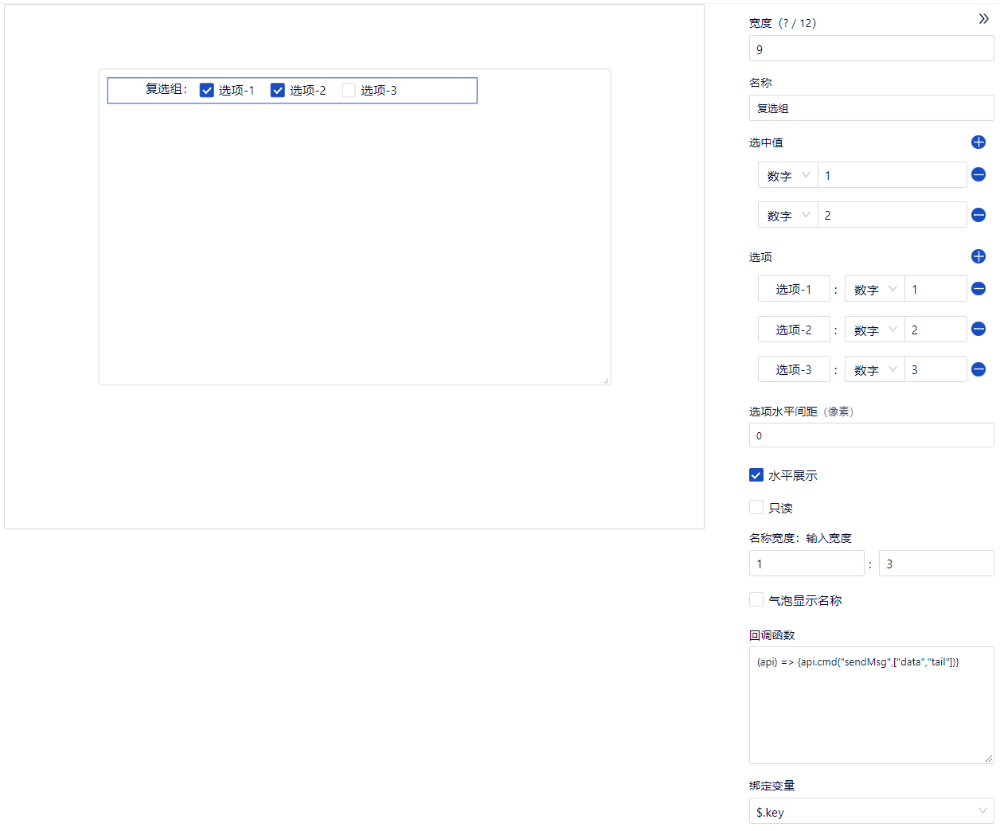

- 单选组
    - 名称：输入内容，显示单选组的名称。
    - 选中项：选中项是与选项相关联，按照选项设置的内容，选中项修改对应的类型和内容。选中项设置内容后，单选按钮对应项显示已选中状态。
    - 选项：选项设置的是单选按钮里的选择项目，可以新增或删除。
    - 选项水平间距（像素）：可以修改选项之间的距离。
    - 水平展示：默认水平展示；取消勾选后变为垂直展示。
    - 只读：不勾选时，选项内容可以编辑；勾选后，选项内容不能进行编辑。
    - 名称宽度：输入宽度：修改占比值，可以调整名称和选项的显示区域范围。
    - 气泡显示名称：默认不勾选，鼠标移动到名称位置后，不显示气泡名称；勾选后，鼠标移动到名称位置后，显示气泡名称。
    - 绑定变量：绑定“字符串”和“数字”类型的网络变量。
      注意：“选项”里的类型要和“绑定变量”的类型一致。即，“选项”里的类型选“数字”，那么“绑定变量”的类型要求是“数字”，否则无法执行时无法选中选项。

      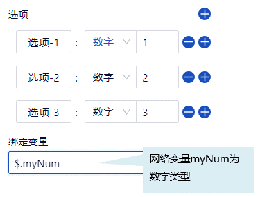

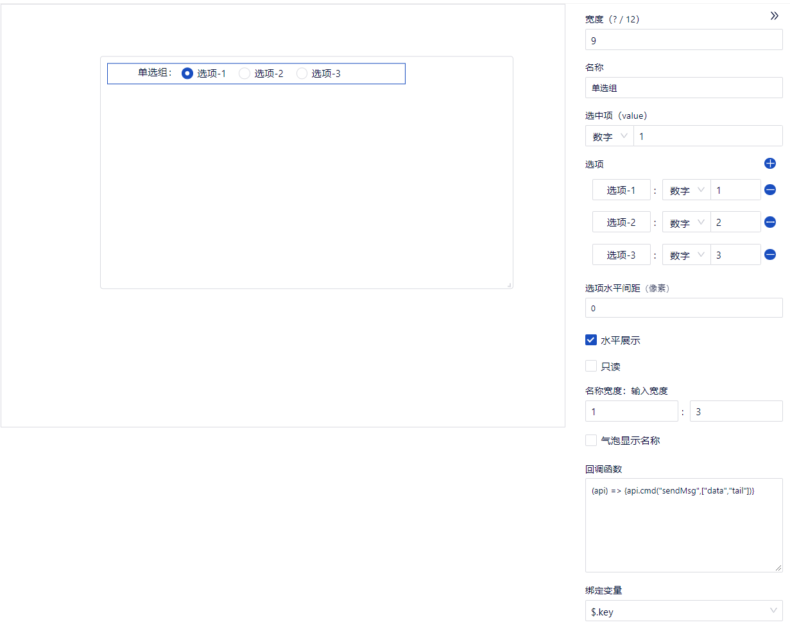

- 数字输入
    - 功能：输入十进制的实数。不能超过8字节（byte）。
    - 名称：输入内容，显示输入框的名称。
    - 数值：可以输入数值，默认是0。
    - 步长：可以输入步长，默认步长是1。设置步长后，点击数字输入框的向上或向下箭头，根据步长的设置，切换显示对应步长的数值。
    - 数值精度：输入数值精度，输入数值后按设置的数值精度进行展示。默认精度是2。
    - 最小值：设置输入的最小值限制。点击数字输入框的向下箭头，数字切换到最小值时，不能继续减小。
    - 最大值：设置输入的最大值限制。点击数字输入框的向上箭头，数字切换到最大值时，不能继续增加。
    - 名称宽度：输入宽度：修改占比值，可以调整输入框名称和数值的显示区域范围。
    - 前缀：可以输入要表示的数值的前缀。
    - 后缀：可以输入要表示的数值的后缀。
    - 提示语：数值输入框里显示的默认内容。当输入框里没有输入数据时，输入框会显示提示语内容。
    - 只读：默认不勾选，可以进行编辑；勾选后，选项变为只读状态，不能编辑。
    - 气泡显示名称：默认不勾选，鼠标移动到输入框名称位置后，不显示气泡名称；勾选后，鼠标移动到输入框名称位置后，显示气泡名称。
    - 验证函数：使用JS语法，验证内容。
    - 绑定变量：绑定“数字”和“字符串”类型的网络变量。
      注意：其中“字符串”必须是数字字符串，如‘11’

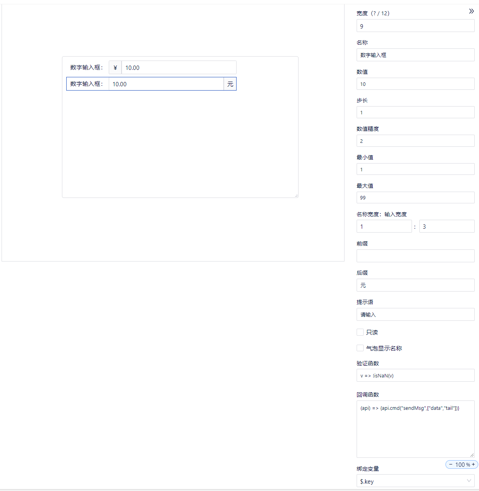

- 数字输入(HEX)
  - 功能：输入HEX。该组件的值会自动转化成十进制。
  - 注意：执行时，数字输入框内输入十六进制数字。0~9，A~F（大小写均可）
  - 绑定变量：绑定数字。

- 文本输入(单行)
    - 功能：单行输入汉字等文本内容。
    - 名称：输入内容，显示输入框的名称。
    - 输入文本：输入文本的内容。
    - 名称宽度：输入宽度：修改占比值，可以调整输入框名称和文本内容的显示区域范围。
    - 提示语：文本输入框里显示的默认内容。当输入框里没有输入内容时，输入框会显示提示语内容。
    - 前缀：可以输入要表示的内容的前缀。
    - 后缀：可以输入要表示的内容的后缀。
    - 只读：默认不勾选，可以进行编辑；勾选后，变为只读状态，不能编辑。
    - 气泡显示名称：默认不勾选，鼠标移动到输入框名称位置后，不显示气泡名称；勾选后，鼠标移动到输入框名称位置后，显示气泡名称。
    - 验证函数：使用JS语法，验证内容。
    - 绑定变量：绑定“数字”和“字符串”类型的网络变量。

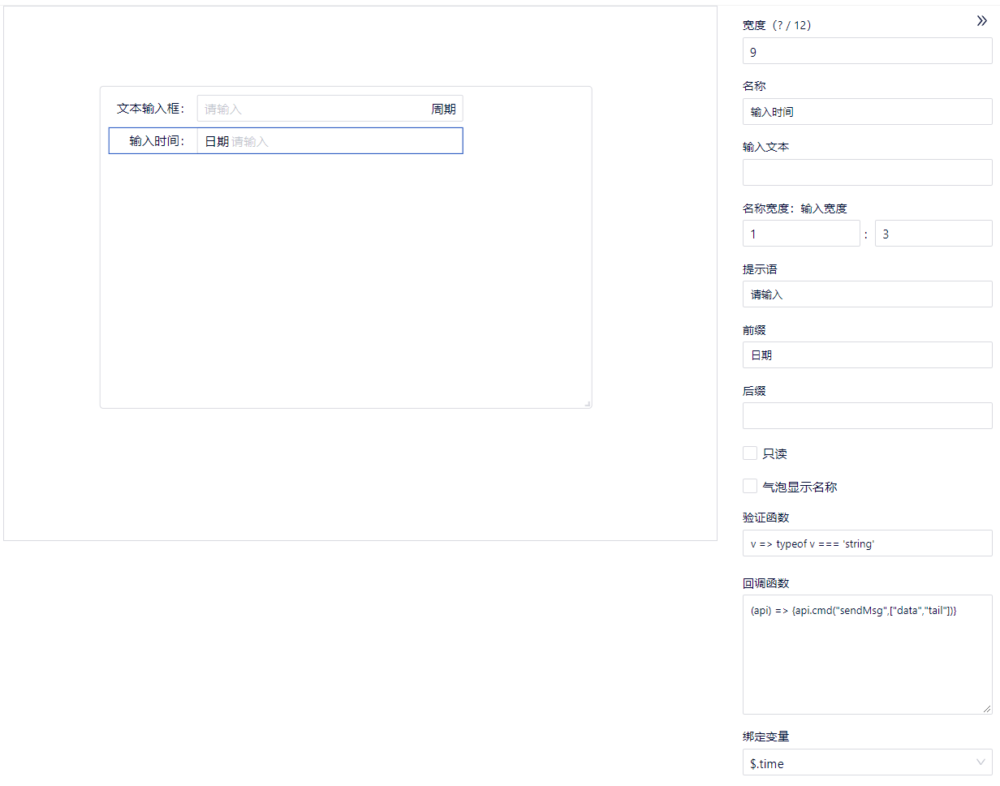

- 文本输入(多行)
    - 功能：多行输入汉字等文本内容。
    - 名称：输入内容，显示输入框的名称。
    - 输入内容：输入要显示的内容。
    - 可视高度（行）：限制输入数据的行数，默认是3行。
    - 只读：默认不勾选，可以进行编辑；勾选后，变为只读状态，不能编辑。
    - 显示计数：默认勾选，输入内容进行计数；取消勾选后，输入内容不进行计数。
    - 最大字数：限制输入的最大字数，默认是100。
    - 名称宽度：输入宽度：修改占比值，可以调整输入框名称和内容的显示区域。
    - 提示语：输入框里显示的默认内容。当输入框里没有输入内容时，输入框会显示提示语内容。
    - 气泡显示名称：默认不勾选，鼠标移动到输入框名称位置后，不显示气泡名称；勾选后，鼠标移动到输入框名称位置后，显示气泡名称。
    - 验证函数：使用JS语法，验证内容。
    - 绑定变量：绑定“数字”和“字符串”类型的网络变量。

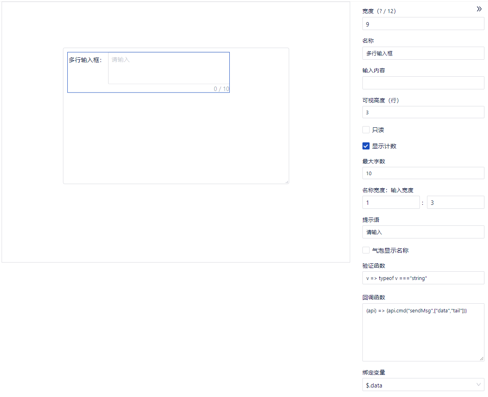

- 文本输入(单行HEX)
    - 功能：单行输入HEX内容。
    - 名称：输入内容，显示输入框的名称。
    - 输入内容：限制只能输入16进制的数值。
    - 最大字节数：限制的最大字节数。
    - 分段显示：默认勾选，输入的16进制数，以每个字节中间加一个空格的方式进行显示；取消勾选，每个字节中间没有空格显示。
    - 名称宽度：输入宽度：修改占比值，可以调整输入框名称和内容的显示区域。
    - 提示语：输入框里显示的默认内容。当输入框里没有输入内容时，输入框会显示提示语内容。
    - 前缀：可以输入要表示的内容的前缀。
    - 后缀：可以输入要表示的内容的后缀。
    - 只读：默认不勾选，可以进行编辑；勾选后，变为只读状态，不能编辑。
    - 气泡显示名称：默认不勾选，鼠标移动到输入框名称位置后，不显示气泡名称；勾选后，鼠标移动到输入框名称位置后，显示气泡名称。
    - 验证函数：使用JS语法，验证内容。
    - 绑定变量：绑定“数字”和“字符串”类型的网络变量。
      注意：“数字”和“字符串”类型：都只能输入16进制字符串。例：AA55

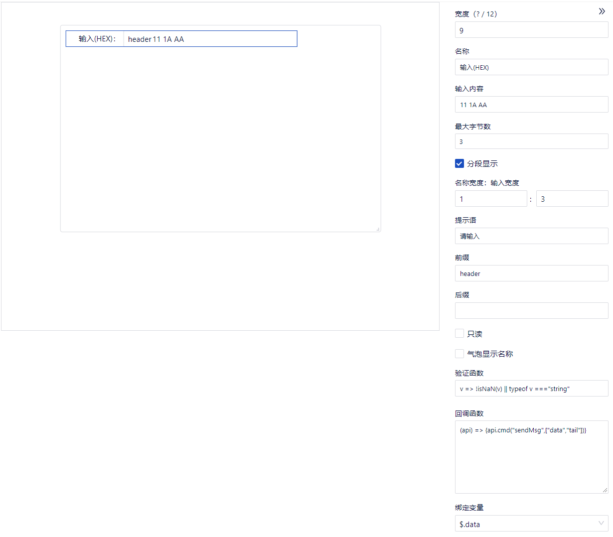

- 文本输入(多行HEX)
    - 功能：多行输入HEX内容。
    - 名称：输入内容，显示输入框的名称。
    - 输入内容：限制只能输入16进制的数值。
    - 可视高度（行）：限制输入数据的行数，默认是3行。
    - 只读：默认不勾选，可以进行编辑；勾选后，变为只读状态，不能编辑。
    - 分段显示：默认勾选，输入的16进制数，以每个字节中间加一个空格的方式进行显示；取消勾选，每个字节中间没有空格显示。
    - 显示计数：默认勾选，输入内容进行计数；取消勾选后，输入内容不进行计数。
    - 最大字数：限制输入的最大字数，默认是100。
    - 名称宽度：输入宽度：修改占比值，可以调整输入框名称和内容的显示区域。
    - 提示语：输入框里显示的默认内容。当输入框里没有输入内容时，输入框会显示提示语内容。
    - 气泡显示名称：默认不勾选，鼠标移动到输入框名称位置后，不显示气泡名称；勾选后，鼠标移动到输入框名称位置后，显示气泡名称。
    - 验证函数：使用JS语法，验证内容。
    - 绑定变量：绑定“数字”和“字符串”类型的网络变量。
      注意：
        - “字符串”类型：只能输入16进制字符串。
        - “数字”类型：该类型网络变量只能识别0~9的数字。不能是“AA55”
        - 综上，建议绑定16进制“字符串”类型。

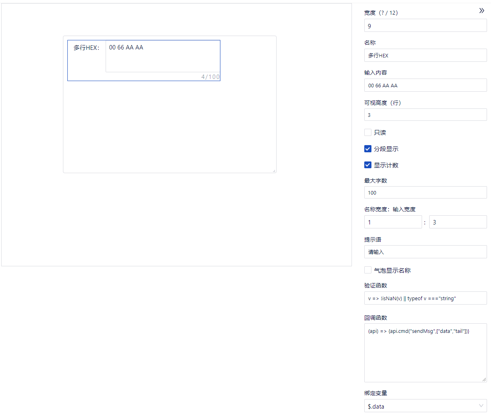

- 下拉框(普通)
    + 下拉列表框只能显示下拉列表中的选项,用户只能从中选择一个选项,而不能直接在下拉列表框中输入文本。
    - 名称：输入内容，显示下拉框的名称。
    - 选中项：选中项是与选项相关联，按照选项设置的内容，选中项修改对应的类型和内容。选中项设置内容后，对应的选项显示已选中状态。
    - 选项：选项设置的是下拉列表里的选择项目，可以新增或删除。
    - 下拉弹窗高度：限制下拉列表显示的高度。
    - 名称宽度：输入宽度：修改占比值，可以调整下拉框名称和内容的显示区域。
    - 提示语：输入框里显示的默认内容。当输入框里没有输入内容时，输入框会显示提示语内容。
    - 只读：默认不勾选，可以进行编辑；勾选后，变为只读状态，不能编辑。
    - 气泡显示名称：默认不勾选，鼠标移动到下拉框名称位置后，不显示气泡名称；勾选后，鼠标移动到下拉框名称位置后，显示气泡名称。
    - 验证函数：使用JS语法，验证内容。
    - 绑定变量：绑定“数字”和“字符串”类型的网络变量。

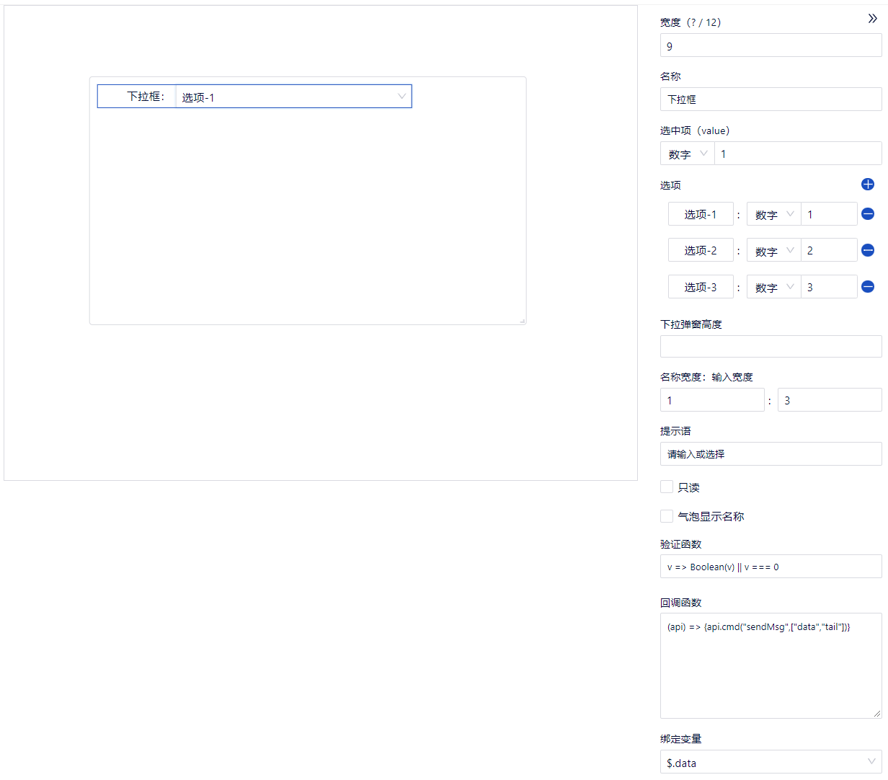

- 下拉框(联动)
    + 下拉列表框只能显示下拉列表中的选项，选项最多为两级。用户只能选择,不能输入文本。
    - 名称：输入内容，显示下拉框的名称。
    - 选中项：选中项是与选项相关联，填写选项的值（例：“1,2”代表一级选项值为1，二级选项值为2）。选中项设置内容后，对应的选项显示已选中状态。

      - 选中项

        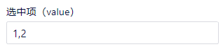
      - 编辑状态的下拉框(联动)

        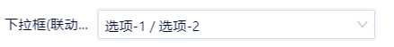
    - 选项：选项设置的是下拉列表里的选择项目，可以新增或删除，最多为两级。

    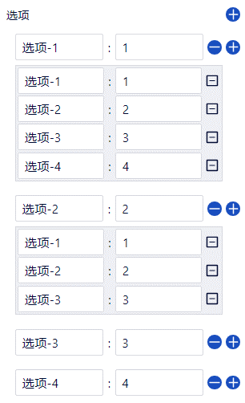
    - 下拉弹窗高度：限制下拉列表显示的高度。
    - 名称宽度:输入宽度：修改占比值，可以调整下拉框名称和内容的显示区域。
    - 提示语：输入框里显示的默认内容。当输入框里没有输入内容时，输入框会显示提示语内容。
    - 只读：默认不勾选，可以进行编辑；勾选后，变为只读状态，不能编辑。
    - 气泡显示名称：默认不勾选，鼠标移动到下拉框名称位置后，不显示气泡名称；勾选后，鼠标移动到下拉框名称位置后，显示气泡名称。
    - 验证函数：使用JS语法，验证内容。
    - 绑定变量：绑定“字符串型数组”和“数字型数组”类型的网络变量。

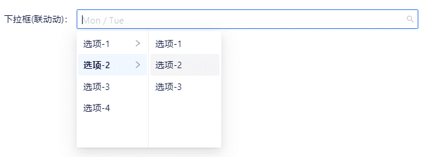

- 组合框
    + 组合框同时具有下拉列表的功能，同时还允许用户在组合框中直接输入文本，并且组合框中的文本不一定是下拉列表中的选项。
    - 名称：输入内容，显示组合框的名称。
    - 选中项：选中项是与选项相关联，按照选项设置的内容，选中项修改对应的类型和内容。选中项设置内容后，组合框显示对应的选项内容。
    - 选项：选项设置的是下拉列表里的选择项目，可以新增或删除。
    - 名称宽度：输入宽度：修改占比值，可以调整组合框名称和内容的显示区域。
    - 提示语：输入框里显示的默认内容。当输入框里没有设置内容时，输入框会显示提示语内容。
    - 只读：默认不勾选，可以进行编辑；勾选后，变为只读状态，不能编辑。
    - 气泡显示名称：默认不勾选，鼠标移动到组合框名称位置后，不显示气泡名称；勾选后，鼠标移动到组合框名称位置后，显示气泡名称。
    - 验证函数：使用JS语法，验证内容。
    - 绑定变量：绑定“数字”和“字符串”类型的网络变量。

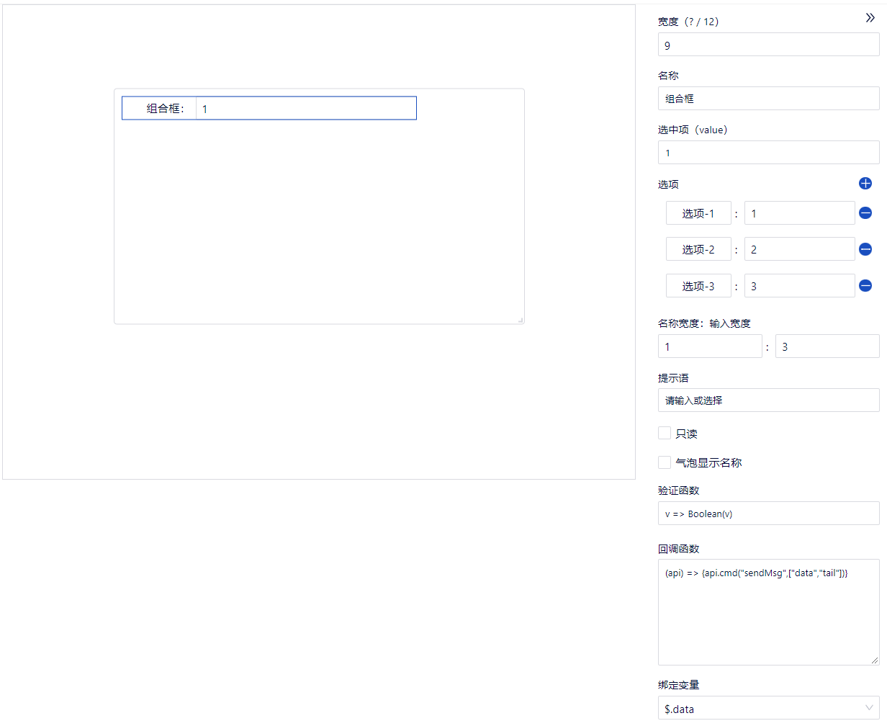

- 数字滑块
    - 名称：输入内容，显示数字滑块的名称。
    - 默认进度：默认进度10，可以修改默认进度。
    - 最大值：默认100，可以修改滑块的最大值。
    - 最小值：默认0，可以修改滑块的最小值。
    - 精度：限制数值的精度范围。默认精度是2。
    - 黄色刻度：用黄色标识刻度值。
    - 红色刻度：用红色标识刻度值。
    - 单位：设置滑块数值的单位。
    - 名称宽度：输入宽度：修改占比值，可以调整数字滑块名称和内容的显示区域。
    - 只读：默认不勾选，可以进行编辑；勾选后，选项变为只读状态，不能编辑。
    - 气泡显示名称：默认不勾选，鼠标移动到数字滑块名称位置后，不显示气泡名称；勾选后，鼠标移动到数字滑块名称位置后，显示气泡名称。
    - 绑定变量：绑定“数字”类型的网络变量。

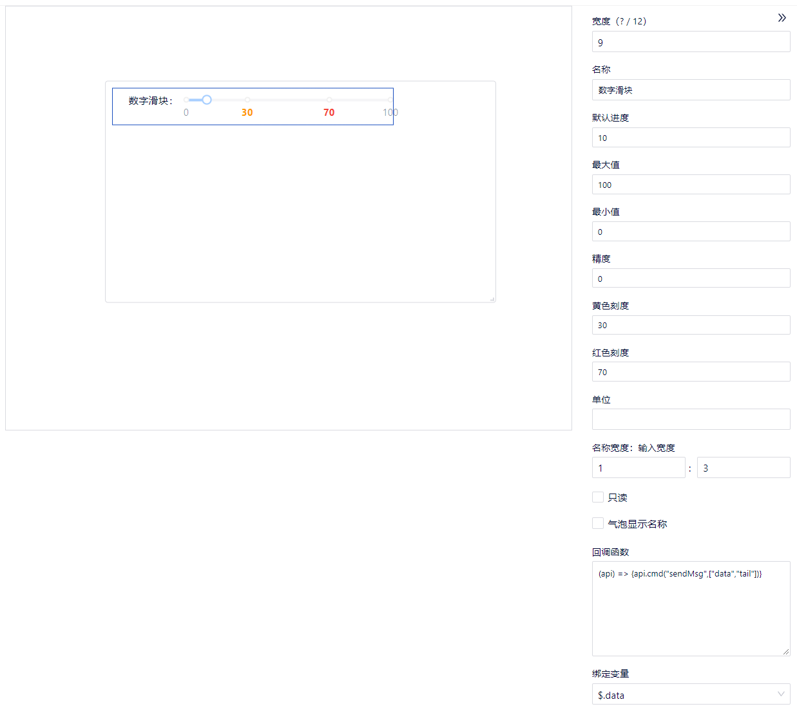

- 树
  - 容器最大高度：显示该树的窗口大小
  - 展示边框：勾选有边框，不勾选没边框
  - 子节点：自定义树结构，可以多层，没限制。
  - 选中回调：填写点击树的子节点后调用的函数。参数为id。例如：(api, {id}) => {api.cmd("send3",[id])}
  - 绑定变量：绑定数组结构的网络变量。
  
  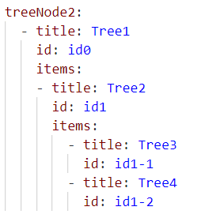

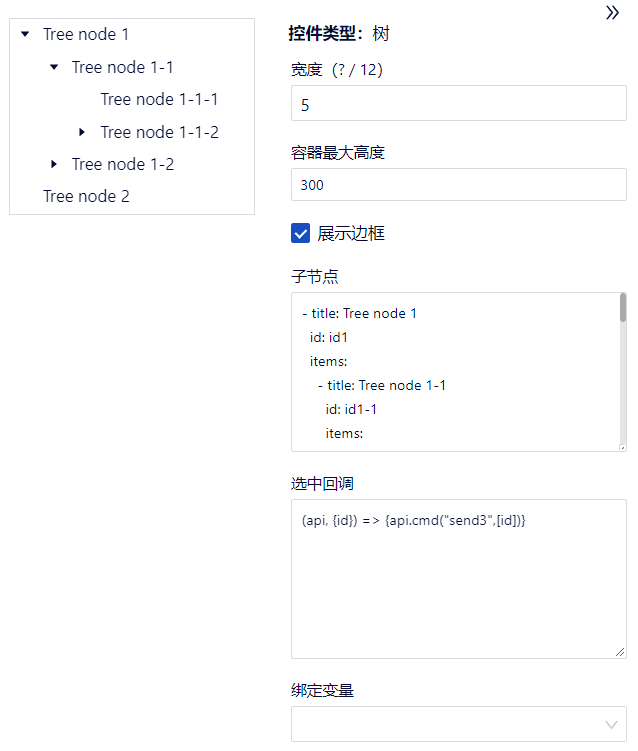