### 输出组件

输出组件常用于数据的输出显示。

- 标题
    - 标题：输入内容，显示在标题处。
    - 格式化脚本：进行格式化操作。需要使用JS语法，符合JS语法的格式化脚本都支持。
    - 对齐方式：对齐方式有居左、居中、居右。设置后标题名称会根据设置展示在标题区域的左侧、中间、右侧。
    - 绑定变量：绑定“字符串”和“数字”类型的网络变量。

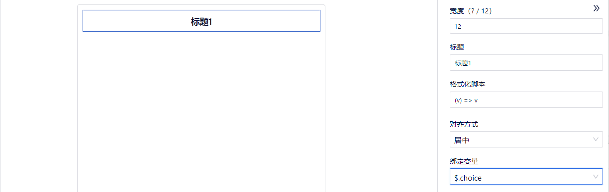

- 文本输出(普通)
    - 功能：用于单次输出文本，即只输出最后一次的文本。
    - 文本：输入内容，显示在文本输出(普通)处。
    - 格式化脚本：进行格式化操作。需要使用JS语法，符合JS语法的格式化脚本都支持。
    - 对齐方式：对齐方式有居左、居中、居右。设置后文本输出(普通)名称会根据设置展示在文本输出(普通)区域的左侧、中间、右侧。
    - 是否超出一行隐藏：默认勾选，文本内容超出一行时，多出的内容...显示；如果取消勾选，当文本内容超出一行时，换行显示全部内容。
    - 绑定变量：绑定“字符串”和“数字”类型的网络变量。

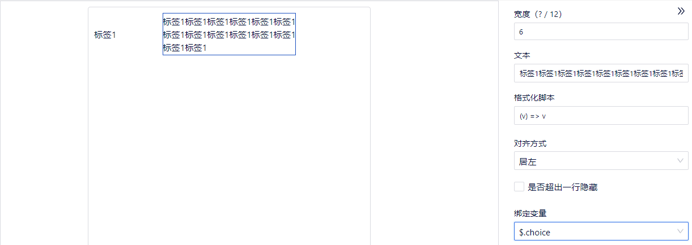

- 文本输出(KV)
    + 功能：用于输出标签和内容。
    - 文本：编辑标签和内容后，对应显示在文本的标签和内容处。
    - 格式化脚本：进行格式化操作。需要使用JS语法，符合JS语法的格式化脚本都支持。
    - 对齐方式：对齐方式有居左、居中、居右。设置后文本输出(KV)名称会根据设置展示在文本输出(KV)区域的左侧、中间、右侧。
    - 绑定变量：绑定“字符串”和“数字”类型的网络变量。


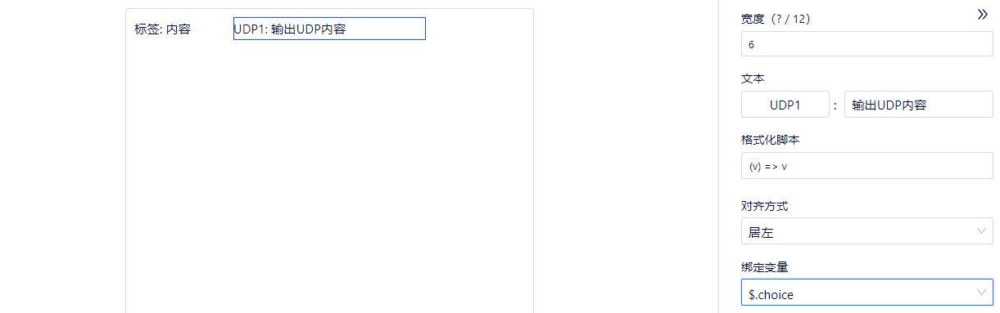

- 文本输出(连续)
    - 功能：用于多次输出文本，即前一次接收的文本不会被下一次的文本覆盖。
    - 文本：输入内容后，文本处显示该内容，用于连续输出。
    - 最大数据量：设置文本内容输入的最大数据量限制，默认最大数据量是100。
    - 格式化脚本：进行格式化操作。需要使用JS语法，符合JS语法的格式化脚本都支持。
    - 对齐方式：对齐方式有居左、居中、居右。设置后文本输出(连续)名称会根据设置展示在文本输出(连续)区域的左侧、中间、右侧。
    - 最大高度(像素)：设置输出区域的最大高度，默认是100像素。
    - 绑定变量：绑定“字符串”，“数字”，“字符串型数组”和“数字型数组”和类型的网络变量。


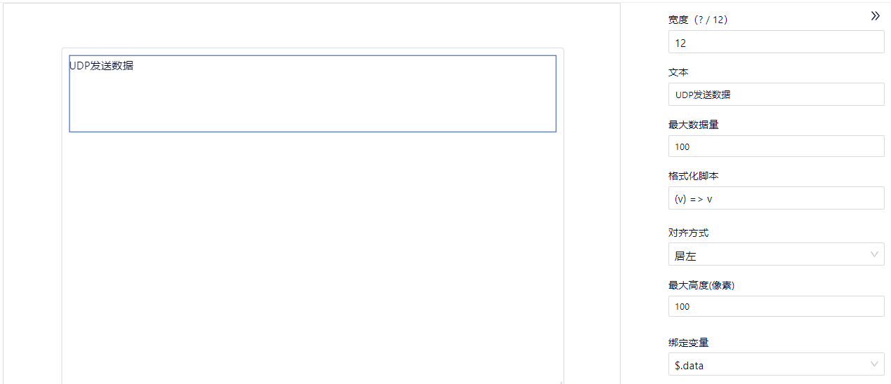
        
- 指示灯
    - 选中值：选中值与选项关联，是选项中的value对应的值，设置不同的value，会显示不同的指示灯。
    - 图标大小：默认24，修改后图标显示会跟随变大或变小。
    - 对齐方式：对齐方式有居左、居中、居右。设置后指示灯会根据设置展示在区域的左侧、中间、右侧。
    - 选项：选项是对指示灯进行配置，修改对应的属性内容后，指示灯的显示会跟随变化。（icon对应的名称必须是 https://ant.design/components/icon-cn 该地址里提供的图标名称，否则不支持。提供了方向性图标、提示建议图标、编辑类图标、数据类图标、品牌和标识、网站通用图标。）。
    - 格式化脚本：进行格式化操作。需要使用JS语法，符合JS语法的格式化脚本都支持。
    - 绑定变量：绑定“字符串”和“数字”类型的网络变量。

      注意：“字符串”和“数字”：只能取value的值，比如value只能取0，1，2的情况，网络变量的值也只设置成这些值。

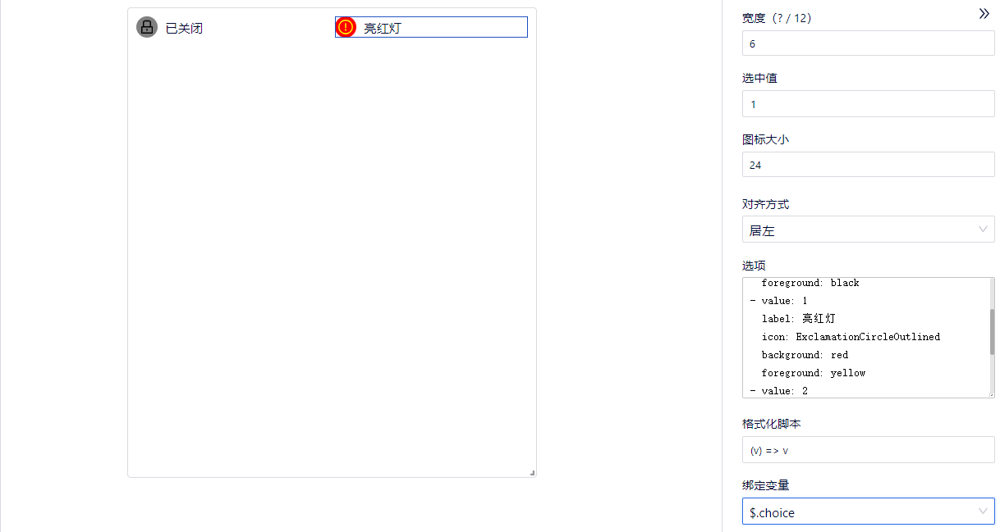

- 进度环
    - 名称：输入内容，显示进度环的名称。
    - 默认值：进度环默认初始进度是30，可以修改默认值的范围是0到100，修改后进度环的进度会跟随变化。
    - 圆环尺寸：默认100，修改后圆环尺寸显示会跟随变大或变小。
    - 开始角度：默认是0，可以修改开始角度的范围是从0到360，修改后进度的开始位置会根据设置进行变化。
    - 圆环颜色：点击颜色设置，出现颜色设置区域，可以点击任意区域的颜色进行设置；也可以选择“HEX”、“HSB”、“RGB”，修改数值，进行颜色设置；点击“使用品牌色”，颜色恢复为默认值颜色。
    - 圆环宽度：默认15，修改后圆环尺寸显示会跟随变宽或变窄。
    - 单位：默认是%，可以修改为其他的单位。
    - 格式化脚本：进行格式化操作。需要使用JS语法，符合JS语法的格式化脚本都支持。
    - 绑定变量：绑定“字符串”和“数字”类型的网络变量。

      注意：“字符串”和“数字”：只能取0~100的值。


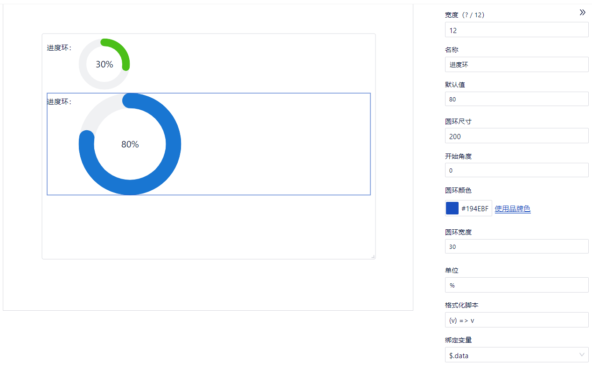

- 仪表盘
    - 独占面板：一个组件使用一个面板
    - 名称：显示在仪表盘中央的名字
    - 默认值：仪表盘指针的默认数值，最小值为1
    - 单位：略
    - 分段段数：仪表盘数字显示的段数，最小为2
    - 最小刻度值：略
    - 最大刻度值：略
    - 每段颜色结束位置：颜色最多三种，最少一种。点击色块改变颜色。可设置每种颜色的百分比。
    - 绑定变量：任何类型的网络变量。

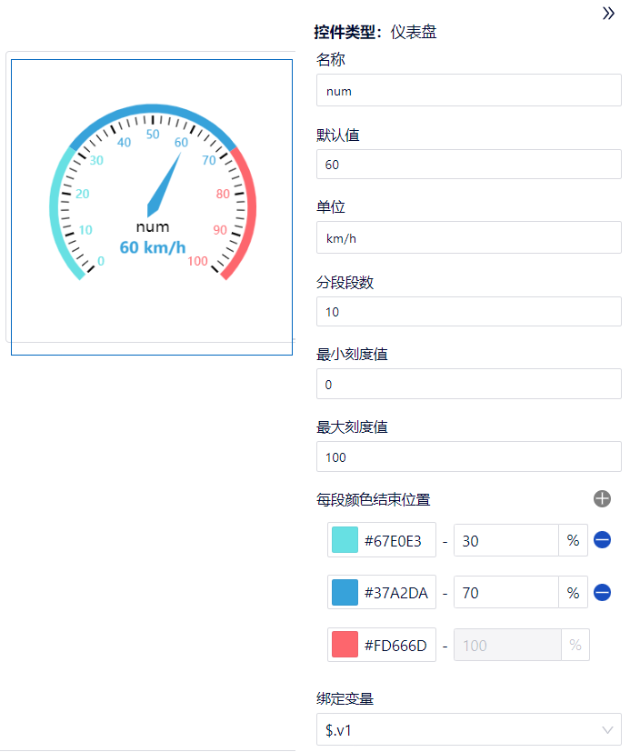

- 图表
    - 名称：输入内容，显示图表的名称。
    - 类型：可以修改图表的类型，类型可以选择折线图、柱状图、饼图、散点图。
    - 水平坐标名称：输入水平坐标名称。
    - 垂直坐标名称：输入垂直坐标名称。
    - x轴取值默认值：输入数字内容，设置x轴取值的默认值。数据用半角逗号隔开。
    - 副标题：输入内容，显示图表的副标题
    - 最大数据量：默认30000，限制坐标点的数量。
    - 选项：选项可以增加和删除，增加一个选项，即增加了一组数据。选项配置网络变量，触发该网络变量时内容会跟随变化。
      
      注意：绑定“数字”，“字符串”，“数字型数组”和“字符串型数组”类型的网络变量。其中“字符串”必须是数字字符串，如‘11’
    - 颜色：点击颜色设置，出现颜色设置区域，可以点击任意区域的颜色进行设置；也可以选择“HEX”、“HSB”、“RGB”，修改数值，进行颜色设置。
    - 绑定变量：绑定“字符串”，“数字”，“字符串型数组”和“数字型数组”和类型的网络变量。
    - 注意：
      - 折线图、柱状图、散点图的场合：
        - “选项”绑定的网络变量和y轴相关。
        - “绑定变量”绑定的网络变量和x轴相关。
      - 饼图的场合：
        - “选项”绑定的网络变量和饼图的相关。
        - "绑定变量"绑定和不绑定网络变量的饼图是一样的。

    - eCharts配置项：按照eCharts配置标准进行图表的配置，使得图标变得美观，易懂。
      - 参考ECHARTS官网代码：
        - ECHARTS示列：[https://echarts.apache.org/examples/zh/index.html](https://echarts.apache.org/examples/zh/index.html)
        - ECHARTS配置项手册：[https://echarts.apache.org/zh/option.html](https://echarts.apache.org/zh/option.html)
        - 拷贝的代码不能和下面关键字冲突（例：xAxis的name不能在echart重新设置，设置后会冲突导致，echart配置内容不生效，但是xAxis的nameGap在下面关键字里，所以可以设置echarts配置项为：{"xAxis":{"nameGap":50}}）
            ```lua
            animation,
            color,
            grid: {
              left,
              right,
            },
            title,
            xAxis: {
              name,
              type,
              splitLine: {
                show,
              },
              axisLabel,
              data,
              show,
            },
            yAxis: {
              name,
              type,
              splitLine: {
                show,
              },
              show,
            },
            series
            ```
        - 使用时需要转换成JSON格式使用
      - 案例：折线图横坐标添加坐标点的气泡显示。
        - 步骤1：现有一个折线图

        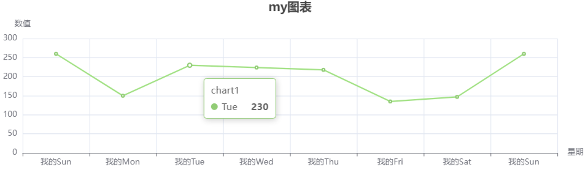

        - 步骤2：根据需要复制ECHARTS官网代码代码，并转换成JSON格式：{"tooltip":{"formatter":"y = 0.5 * x + 3"}}

        - 步骤3：将转换后的代码粘贴到界面文件的eCharts配置项里。

        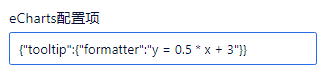
        
        - 步骤4：配置echarts后：

        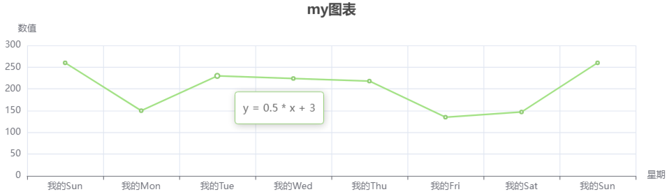

    - 格式化脚本：进行格式化操作，增加图表的可读性。需要使用JS语法，符合JS语法的格式化脚本都支持。
    
      例：(v) => '我的'+v

      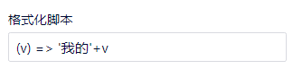

      配置后，每个x轴点的前面统一添加了“我的”两个字。

      

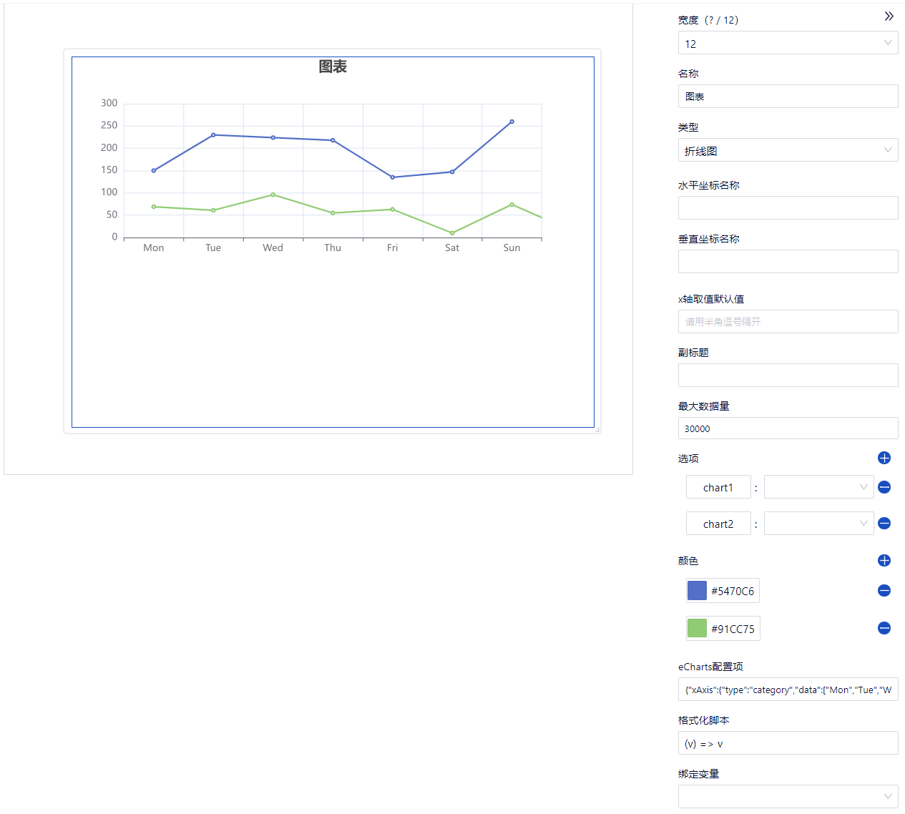