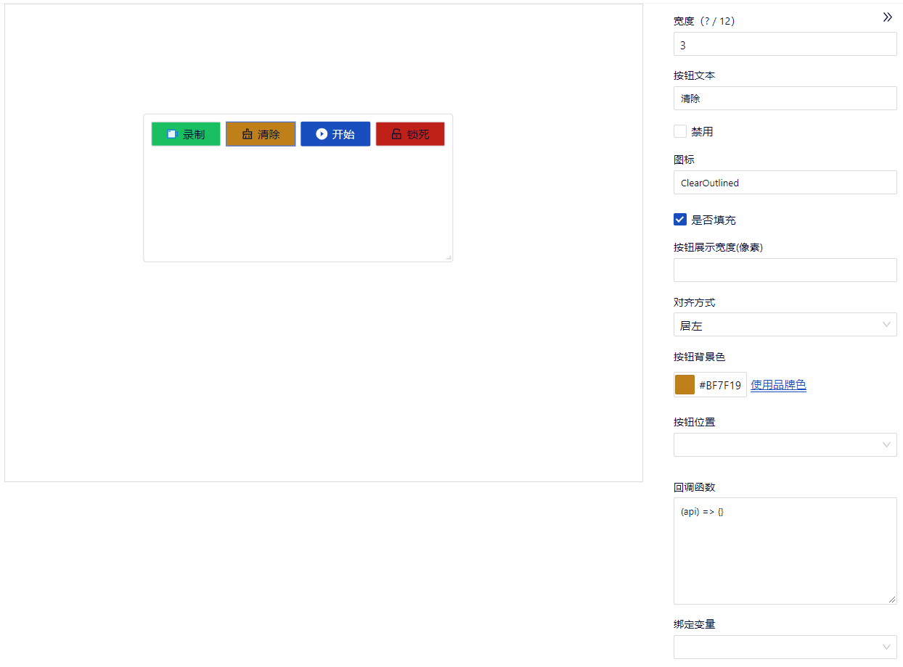
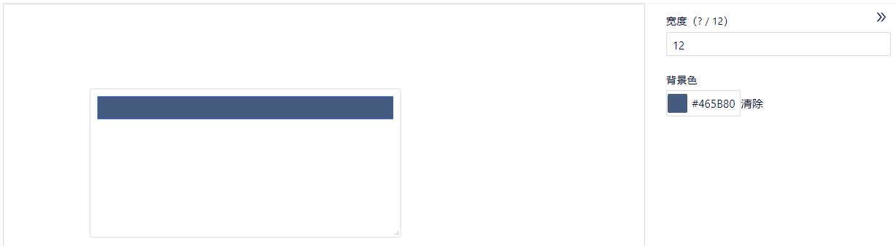
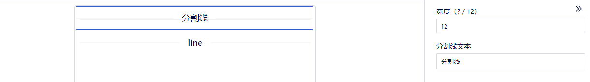
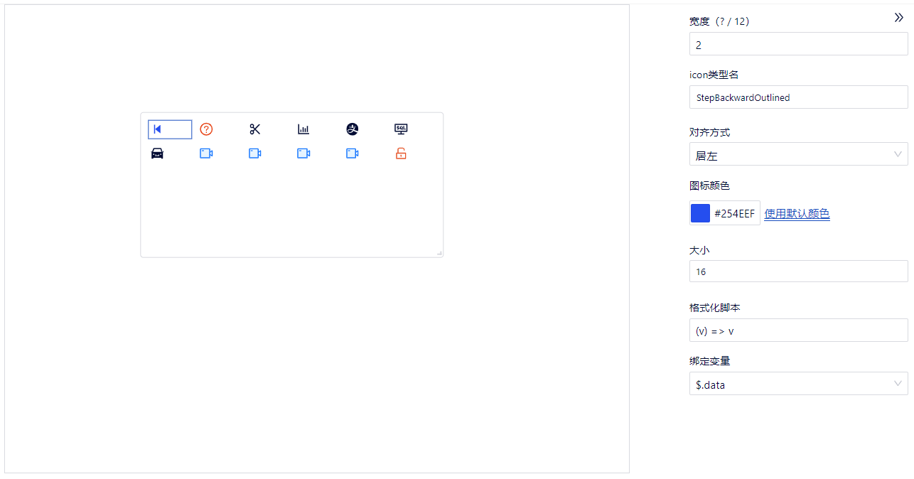
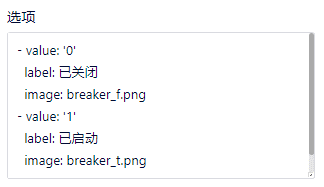
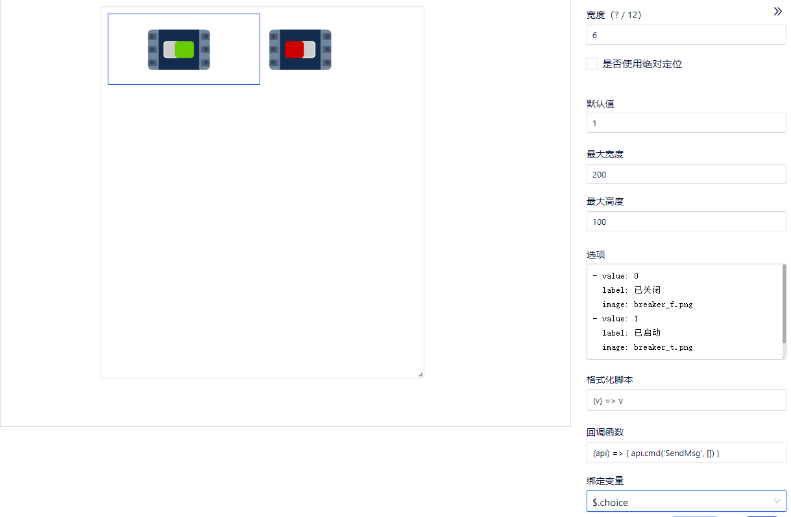
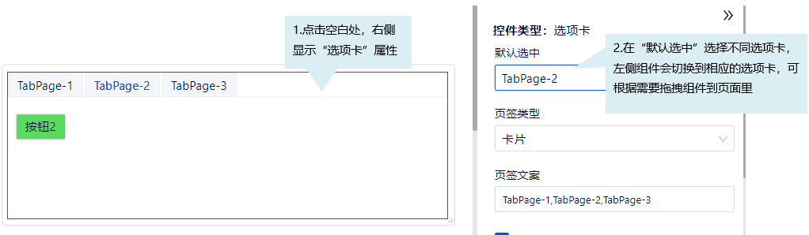
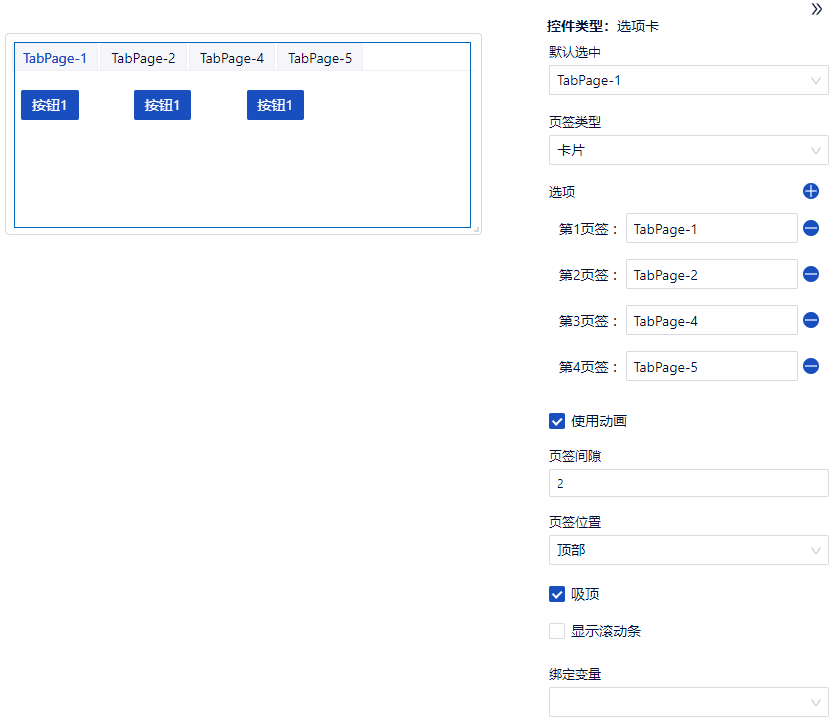
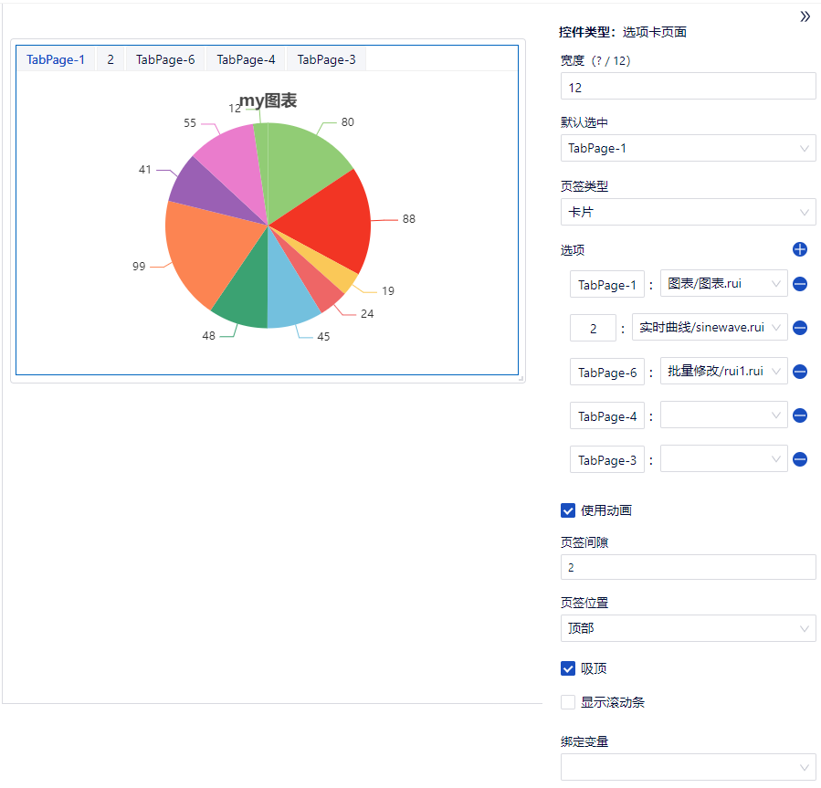

### 通用组件

通用组件常用于界面的排版。

- 按钮
    - 按钮文本：输入内容后，在按钮上显示按钮的名称。
    - 禁用：默认为不勾选，按钮可以点击；如果勾选禁用，则按钮不可以点击。
    - 图标：输入图标名称后，会在按钮上显示出对应的图标（图标名称必须是 https://ant.design/components/icon-cn 该地址里提供的图标名称，否则不支持。提供了方向性图标、提示建议图标、编辑类图标、数据类图标、品牌和标识、网站通用图标。）。
    - 是否填充：默认不勾选，背景色不会填充整个按钮的区域；如果勾选上，则背景色会填充到按钮的全部区域。
    - 按钮展示宽度(像素)：输入数值后，按钮名称会按照设置的像素大小进行展示。该项设置的优先级高于（？/12）。
    - 对齐方式：对齐方式有居左、居中、居右。设置后按钮名称会根据设置展示在按钮区域的左侧、中间、右侧。
    - 按钮背景色：点击颜色设置，出现颜色设置区域，可以点击任意区域的颜色进行设置；也可以选择“HEX”、“HSB”、“RGB”，修改数值，进行背景色设置；点击“使用品牌色”，颜色恢复为默认值颜色。
    - 按钮位置：按钮位置有左上角、右上角、左下角、右下角，设置后按钮会显示在面板的左上角、右上角、左下角、右下角。设置按钮位置后，该按钮悬浮显示其他没设置【按钮位置】的组件之上，不占位。
    - 回调函数触发条件：点击按钮
    - 绑定变量：绑定“字符串”和“数字”类型的网络变量。

- 空
    - 背景色：点击颜色设置，出现颜色设置区域，可以点击任意区域的颜色进行设置；也可以选择“HEX”、“HSB”、“RGB”，修改数值，进行背景色设置；点击“清除”，颜色为空。

- 分割线
    - 分割线文本：输入内容后，会在分割线区域显示该内容。

- 图标
    - icon类型名：输入类型名后，会更新为新的图标（图标名称必须是 https://ant.design/components/icon-cn 该地址里提供的图标名称，否则不支持。提供了方向性图标、提示建议图标、编辑类图标、数据类图标、品牌和标识、网站通用图标。）。
    - 对齐方式：对齐方式有居左、居中、居右。设置后图标会根据设置展示在图标区域的左侧、中间、右侧。
    - 图标颜色：点击颜色设置，出现颜色设置区域，可以点击任意区域的颜色进行设置；也可以选择“HEX”、“HSB”、“RGB”，修改数值，进行颜色设置；点击“使用默认颜色”，颜色恢复为默认值颜色。
    - 大小：默认16，修改后图标显示会跟随变大或变小。
    - 格式化脚本：使用JS语法对脚本里的值进行格式化。符合JS语法的格式化脚本都支持。
      例：(v) => v=== "UnlockOutlined" ? "CheckOutlined" : "ExclamationOutlined"（引号里面放icon类型）
    - 绑定变量：绑定“字符串”类型的网络变量。
    - 回调函数：可给绑定网络变量赋值为其他图标名称。
      - 触发条件：点击图标
      - 例：
        - icon名称：UnlockOutlined
        - 回调函数：(api) => api.set_value('$.myString', 'BorderOuterOutlined')
        - 执行：点击图标后图标变化了

- 图片
    - 是否使用绝对定位：默认不勾选，不使用绝对定位；如果勾选上，设置定位左侧距离和定位顶部距离，图片位置会相应发生变化。
    - 默认值：默认值与选项关联，是选项中的value对应的值，设置不同的默认值，会显示不同的图片。
    - 最大宽度：设置图片显示的最大宽度。
    - 最大高度：设置图片显示的最大高度。
    - 选项：选项是对图片进行配置，源图片是放在“安装包\bin\web\et_rui\resource”路径下，用户可以新建JPG、JPEG、PNG、GIF格式的图片。然后按照默认的格式进行修改。
    - 格式化脚本：进行格式化操作。需要使用JS语法，符合JS语法的格式化脚本都支持。
    - 回调函数触发条件：点击图片。
    - 绑定变量：绑定“字符串”和“数字”类型的网络变量。

      注意：string类型的场合，对应的“选项”的“value”值，需要添加单引号变成‘0’，‘1’

      

- 选项卡
    - 功能：默认包含三个选项卡，在每个选项卡里可随意添加组件。
    - 独占面板：一个组件使用一个面板。
    - 编辑选项卡内容：

      

    - 默认选中：设置默认选中的页签，即是打开界面时首先显示的页签页面。
    - 页签类型：默认显示卡片类型，也可以设置为线性类型。
    - 选项：点击“+”新增页签、点击“-”删除任意页签。还可修改页签名称。
    - 使用动画：默认为选中状态，页签切换过程中，页签内容会有一个渐变的效果；取消勾选后，页签切换时，会直接改变页签的内容。
    - 页签间隙：可以修改页签之间的距离。
    - 页签位置：可以修改页签的位置为“顶部”、“底部”、“左侧”、“右侧”。
    - 吸顶：固定页签行，滚动后始终置顶显示。默认为选中状态，页签吸顶显示；取消勾选后，页面可以不吸顶显示。
    - 显示滚动条：页签添加过多时，可以勾选显示滚动条，滚动显示全部页签。
    - 绑定变量：绑定“字符串”和“数字”类型的网络变量。

- 选项卡页面
    - 功能：默认包含三个选项卡，每个选项卡绑定一个*.rui文件。
    - 独占面板：一个组件使用一个面板。
    - 默认选中：设置默认选中的页签，即是打开界面时首先显示的页签页面。
    - 页签类型：默认显示卡片类型，也可以设置为线性类型。
    - 选项：点击“+”新增页签、点击“-”删除任意页签。每个选项可以修改页签名称，绑定rui界面。
    - 使用动画：默认为选中状态，页签切换过程中，页签内容会有一个渐变的效果；取消勾选后，页签切换时，会直接改变页签的内容。
    - 页签间隙：可以修改页签之间的距离。
    - 页签位置：可以修改页签的位置为“顶部”、“底部”、“左侧”、“右侧”。
    - 吸顶：默认为选中状态，当子页签里的控件超出一屏幕的时候，上下滚动的时候，页签一直在顶部显示；取消勾选后，上下滚动页面的时候，页签也跟着滚动。
    - 显示滚动条：页签添加过多时，可以勾选显示滚动条，滚动显示全部页签。
    - 绑定变量：绑定“字符串”和“数字”类型的网络变量。

