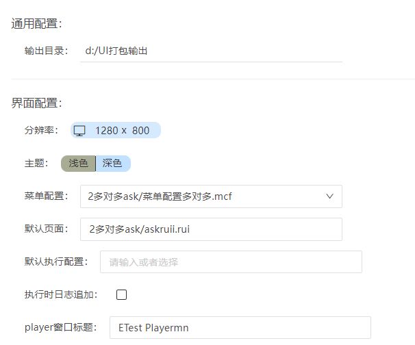
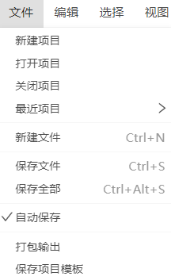
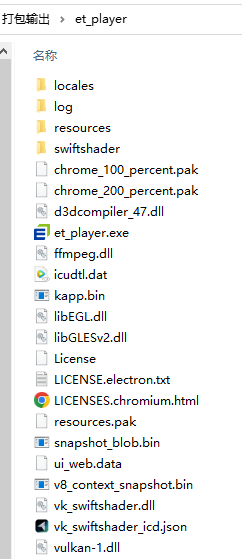
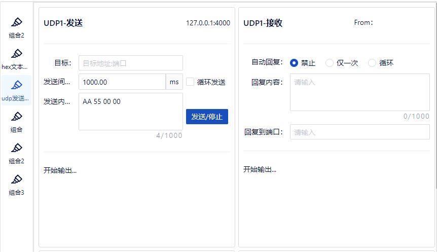
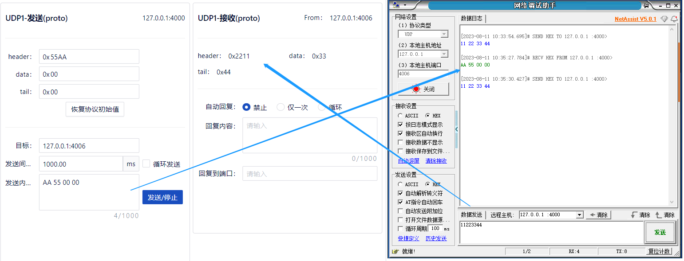

## 打包输出

当界面和界面交互相关的脚本都设计、编辑完成后，可以将整个项目进行打包，输出成一个可独立运行的程序。

### 前提条件

- 界面和界面交互相关的脚本都设计、编辑完成。
- 菜单配置(player)里已经配置了界面文件。
- index.prj文件里配置了输出目录。
  - 默认页面：选择*.rui文件。
  - 默认执行配置：选择*.run文件。
  - 注意：此处rui文件绑定的run优先于菜单配置的，菜单配置rui绑定的run，优先于rui本身绑定的run。
  
  

### 打包输出

点击“文件”-“打包输出”，开始打包。

打包成功后提示“打包成功”，生成et_player文件夹。

### 启动程序

找到打包输出的文件夹，进入et_player文件夹，双击“et_player.exe”，启动程序。et_player主要分2部分，菜单和界面区域。点击不同的UI界面入口菜单名称，就启动对应的界面，打开界面后可以进行界面的交换测试。

### 测试执行

1. 启动et_player。

2. 点击菜单，启动界面。

3. 界面上进行交互操作。（例如：点击“发送/停止”按钮，发送数据；成功接收到网络调试助手发送的数据。）

