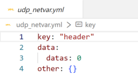

## 网络变量

系统中的网络变量是运行时的上位机界面和下位机脚本之间共享的变量。

### 网络变量使用的注意事项

- 网络变量要先定义后使用。  

- 网络变量类型一经定义不可改变。

- 网络变量支持的数据类型包括整数、浮点数、数组、字符串、key：value键值对。

- 网络变量的传值、绑定需要加前缀($.)。

- 网络变量的值设置为`null`时，以第一个set_value的数据类型为网络变量的类型

### 网络变量定义

- 网络变量在yaml文件里定义。

### 网络变量绑定

- 在执行配置文件和界面文件里进行网络变量的绑定。
详细使用参考[执行配置](#/document?catalogId=52&id=51&type=doc)
和[界面](lib/catalog/document/ui/内置界面.md)内容。

