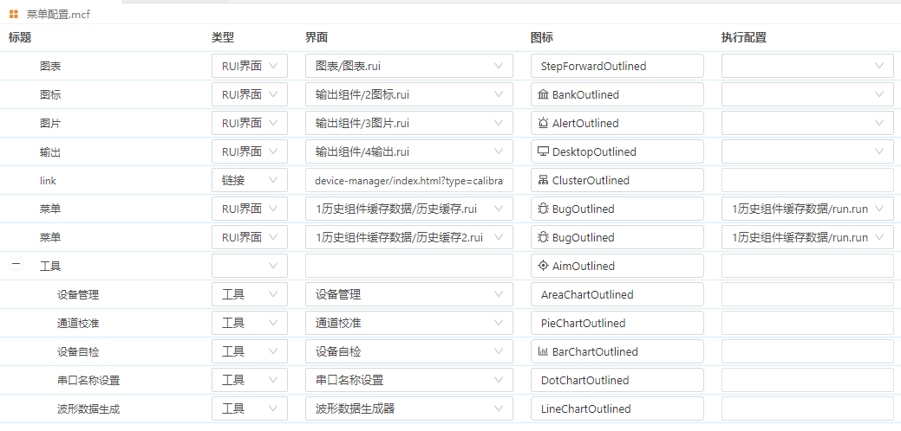
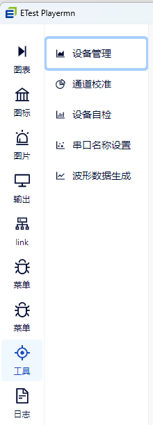
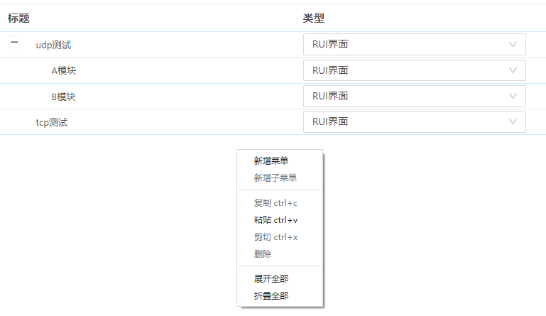

## 菜单配置(player)

- 当我们要开发一个带UI界面的工装时，需要使用该配置文件。
- 界面设计完成后，需要将界面文件配置在菜单配置文件里，配置后再打包输出，生成的et_player才会有UI界面显示。

### 菜单配置文件新建

- 界面文件以".mcf"为扩展名结尾的文件，名称不能重复。
- 鼠标选中对应的文件夹->鼠标右键选择【新建文件】->选择【菜单配置(player)】

### 配置文件内容

- 标题：标题内容会显示在et_player的菜单上；可以修改标题。
- 类型：类型选择RUI界面，界面，工具。
- 界面：通过下拉列表选择界面文件。
- 图标：图标会显示在et_player的菜单上；可以通过下拉列表选择已经提供的图标，或者输入图标名称。（图标名称必须是 https://ant.design/components/icon-cn 该地址里提供的图标名称，否则不支持。提供了方向性图标、提示建议图标、编辑类图标、数据类图标、品牌和标识、网站通用图标。）。
- 执行配置：通过下拉列表选择*.run文件。
- 注意：支持相同rui文件绑定不同run文件。该绑定优先于rui文件本身绑定的run文件。

打包输出后显示如下。

### 其他操作：

- 新增菜单：鼠标右键，选择“新增菜单”,可以添加菜单项。
- 新增子菜单：鼠标右键，选择“新增子菜单”,可以在当前菜单下添加子菜单项；可以添加多层子菜单。
- 复制：鼠标右键，选择“复制”,可以复制菜单；也可以操作快捷键Ctrl+C复制菜单。
- 粘贴：鼠标右键，选择“粘贴”,可以粘贴菜单；也可以操作快捷键Ctrl+V粘贴菜单。
- 剪切：鼠标右键，选择“剪切”,可以剪切菜单；也可以操作快捷键Ctrl+X剪切菜单。
- 删除：鼠标右键，选择“删除”,可以删除菜单；也可以操作快捷键Del删除菜单。
- 展开全部：鼠标右键，选择“展开全部”,折叠的子菜单会展开显示。
- 折叠全部：鼠标右键，选择“折叠全部”,会将子菜单折叠起来。
- 移动菜单：鼠标选中菜单，可以通过拖拽的方式移动菜单的位置。

