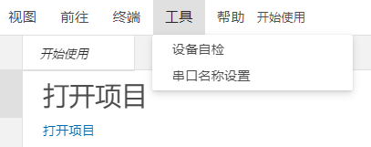
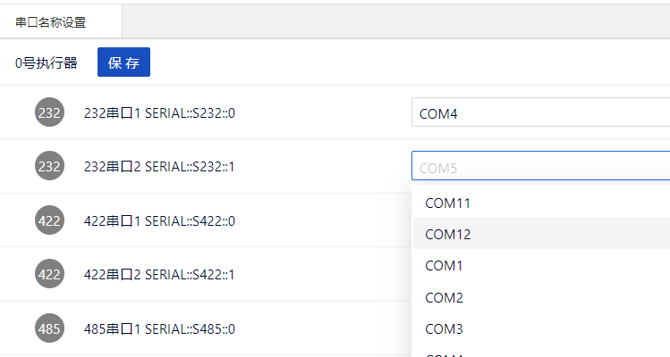

## 串口名称设置

该功能主要用于将虚拟板卡“串口”的通道对应到操作系统管理的串口上。（在Windows系统上，可以从“设备管理器”中对串口进行查看和管理，串口名称一般类似于“COM1”。）ETest软件如果要使用Windows系统上的串口，就需要使用本工具，将虚拟板卡“串口”的通道对应到某个串口（如“COM1”）上，从而实现同其他主机上的程序，或者本机上的其他程序（如串口调试助手）进行通信。

### 打开

未打开项目时，可以进行串口名称设置，如图所示

打开项目后，可以进行串口名称设置，如图所示

### 串口名称修改

设置串口名称后点击保存，串口名称修改成功。

  

