## 主题数据

- 主题数据是使用多种专业的数据分析方法，对大量数据进行分析和挖掘，通过图形化方式展现数据的分析结果。

- 采集被测件的电压、电流等数据后，通过调用主题数据分析相关的API，进行数据分析。

- 既可以进行实时数据分析，也可以在运行结束后进行数据分析。

- 展现内容主要包括数据浏览（数据表格，可视化视图）、数据统计（基本统计，分布统计，聚类统计）、数据分析（回归分析）。

### 主题数据入口

点击工具-历史版本，弹出历史版本选择列表，选择历史版本。点击主题数据的名称（例如点击“polynomia”），进入主题数据界面。

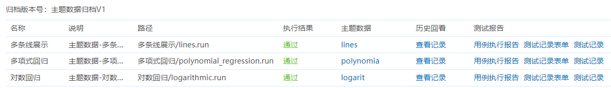

### 数据表格

数据表格是把运行过程中产生的数据以数据表格的形式进行展示。

可以进行排序，设置窗口大小，支持分页查看数据。

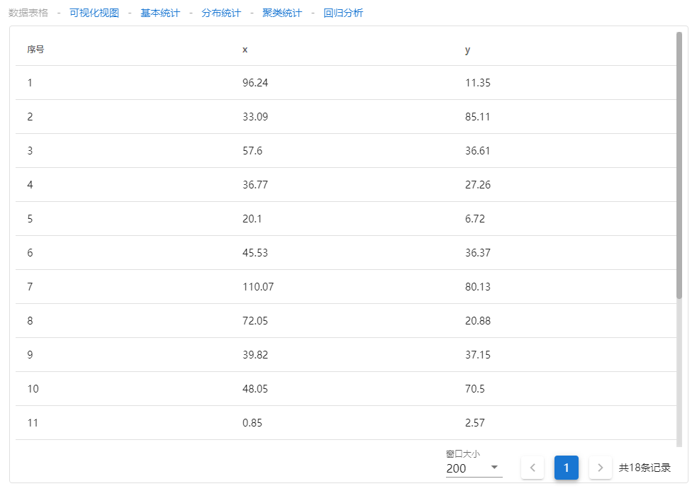

### 可视化视图

可视化视图是把数据以坐标轴的方式进行可视化展示，默认为散点图，支持折线图、直方图等，需要在主题数据 API 中进行设置。

数据显示/不显示切换：点击“Y”，取消Y对应数据的展示。

数据显示范围调整：移动底部的区别，修改视图的数据显示范围。

设置窗口大小，可以进行分页查看数据。

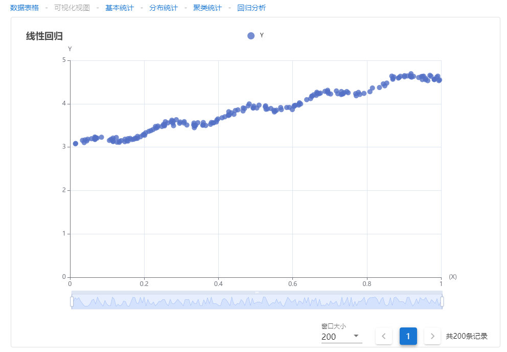
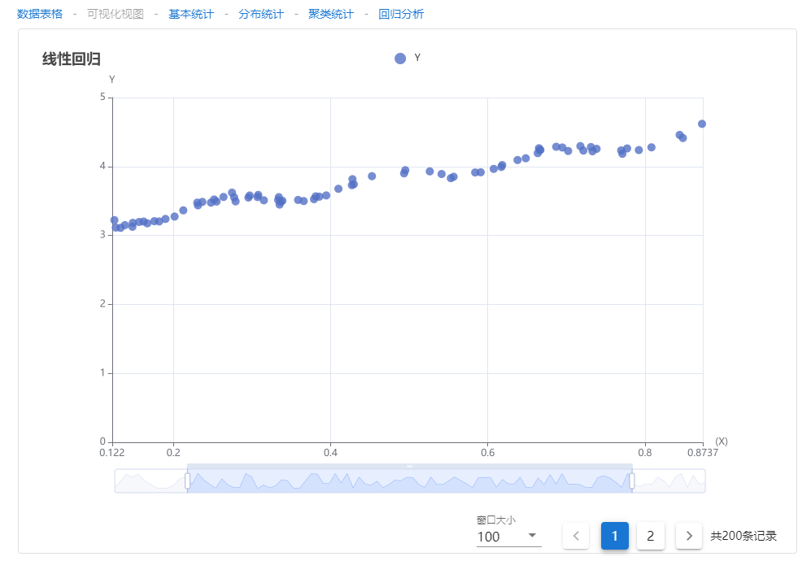

### 基本统计

基本统计是对运行过程中产生的数据做最基本的统计分析。包括最小值、最大值、平均值、中位数、分布区间。

默认最小值、最大值、平均值、中位数、分布区间为全部勾选状态，显示对应的数据。当取消某一项勾选时，则该项数据不显示。如下图所示，取消了最小值、中位数、分布区间的勾选，则这三项数据不显示。

数据显示/不显示切换：点击“Y”，取消Y对应数据的展示。

区域放大：选中区域后，选中的区域放大显示。

区域缩放还原：部分区域放大显示后，可以进行还原。

矩形选择：可以画一个矩形范围选中区域。

圈选：可以画一个圈形范围选中区域。

清除选择：矩形选择操作后或圈选操作后，可以取消对应的操作。

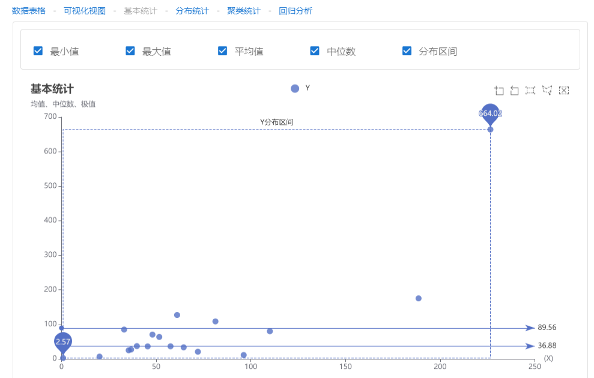
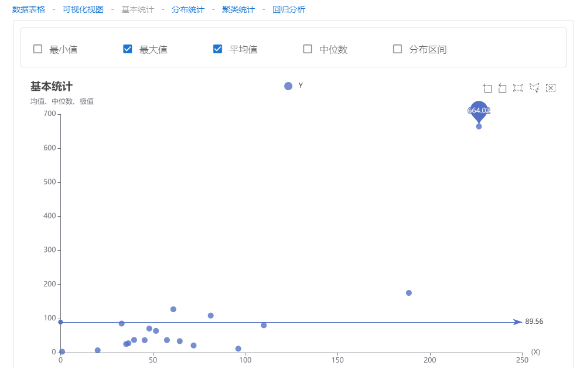

### 分布统计

分布统计主要是以直方图的形式进行表示。直方图主要用来可视化数值型数据的分布情况。用以直观判断数值型数据的概率分布，是一种特殊类型的柱状图。构建直方图的第一步是将总的数值区间切割成一个个小的区间间隔，然后统计落入每个区间间隔中的数值样本个数，并且每个小区间间隔都是连续的、大小相等的、相互不重叠的，即 [[x0, x1), [x1, x2), [x2, x3]]。直方图提供了四种计算小区间间隔个数的方法，分别是 squareRoot, scott, freedmanDiaconis 和 sturges。这里的每个小区间间隔又称为 bin，所有的小区间间隔组成的数组称为 bins。当然，对于一个直方图来说，没有所谓的最佳区间间隔个数，不同的区间间隔大小会揭示数据样本不同的数值特性。平方根(squareRoot)，默认方法，Excel 的直方图中也是使用这个方法计算 bins；scott依照 Scott's normal reference Rule 返回 bins 的个数；freedmanDiaconis依照 The Freedman-Diaconis rule 返回 bins 的个数；sturges依照 Sturges' formula 返回 bins 的个数。

#### 平方根

平方根是一个数学运算，表示一个数的平方根。在统计学中，平方根常用于计算方差和标准差。方差是一组数据离其平均值的距离的平方的平均值，而标准差是方差的平方根。平方根在统计学中的应用包括：1. 方差和标准差的计算，方差和标准差是衡量数据分散程度的指标，通过计算数据的平方根来获得。2. 正态分布的标准化，在正态分布中，平方根的运算常用于将原始数据转化为标准正态分布，便于进行统计推断和比较。3. 离散数据的平滑处理，在某些情况下，对离散数据进行平方根变换可以减小数据的离散性，使其更接近正态分布。

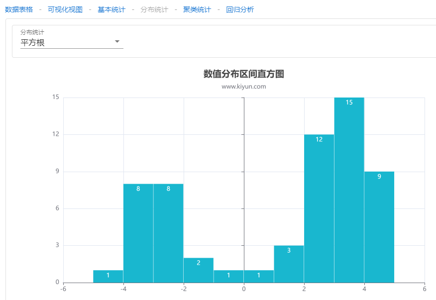

#### Scott规则

Scott's rule（斯科特规则）是一种用于确定连续数据的合适分组数目的经验法则。根据斯科特规则，可以使用以下公式来计算分组数目：k = 3.322 * log(n)。其中，k是分组数目，n是数据点的数量。斯科特规则的目的是在不失去太多信息的情况下，将数据分组为合适的区间。这样可以更好地理解数据的分布和特征。

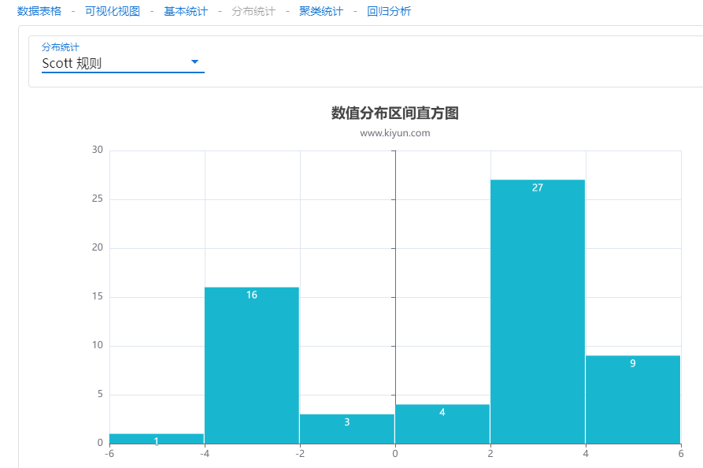

#### Freedman-Diaconis 规则

Freedman-Diaconis规则是一种用于确定连续数据的合适分组数目的经验法则。根据Freedman-Diaconis规则，可以使用以下公式来计算分组数目：h = 2 * IQR * n^(-1/3)。其中，h是分组宽度，IQR是数据的四分位距，n是数据点的数量。
Freedman-Diaconis规则的目的是根据数据的分布特征来确定合适的分组宽度。它使用了四分位距作为数据的离散度度量，并结合了样本量的平方根来调整分组宽度。这样可以在一定程度上平衡了数据的分布特征和样本量的影响。

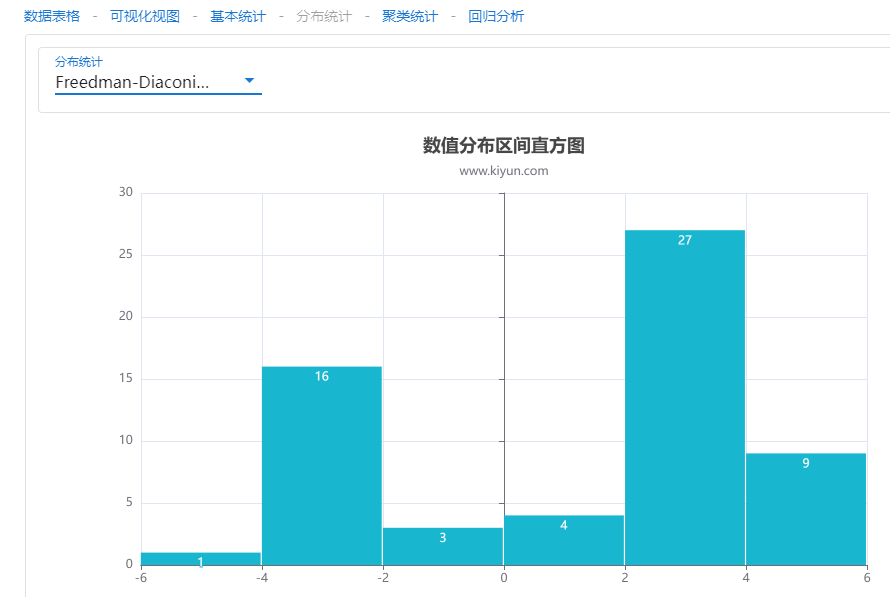

#### Sturges 规则

Sturges规则是一种常用的统计方法，用于确定直方图的分组个数。直方图是一种图形表示方式，用于展示数据的分布情况。Sturges规则的基本思想是根据数据的样本量来确定直方图的分组个数。根据Sturges规则，直方图的分组个数可以通过以下公式确定：k = 1 + log2(n)。其中，k表示直方图的分组个数，n表示数据的样本量。Sturges规则的理论依据是，样本量越大，数据的分布情况越能够准确地反映总体的分布情况。因此，直方图的分组个数应该随着样本量的增加而增加，以便更好地展示数据的分布特征。

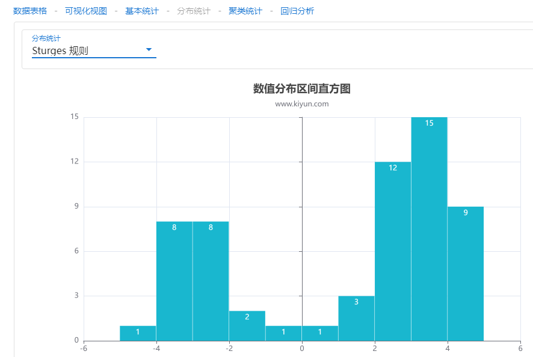

### 聚类统计

聚类统计是一种将数据分组为具有相似特征的集合的统计方法。它是一种无监督学习方法，不需要事先标记的训练数据，而是根据数据的内部结构和相似性进行分组。聚类统计的目标是将相似的数据点归为一类，而不同类之间的数据点具有较大的差异。通过聚类统计，可以发现数据中的潜在模式、群组或聚集，并用于数据探索、数据挖掘和模式识别等领域。将原始输入数据分割成多个具有不同特征的数据簇，并且通过 ECharts 既可以可视化聚类的结果，也可以可视化聚类的分割过程。如下图所示，聚类分析输入要生成数据簇的个数，该数值必须大于 1，点击右侧播放按钮后以动画的方式展现出了分割的过程。

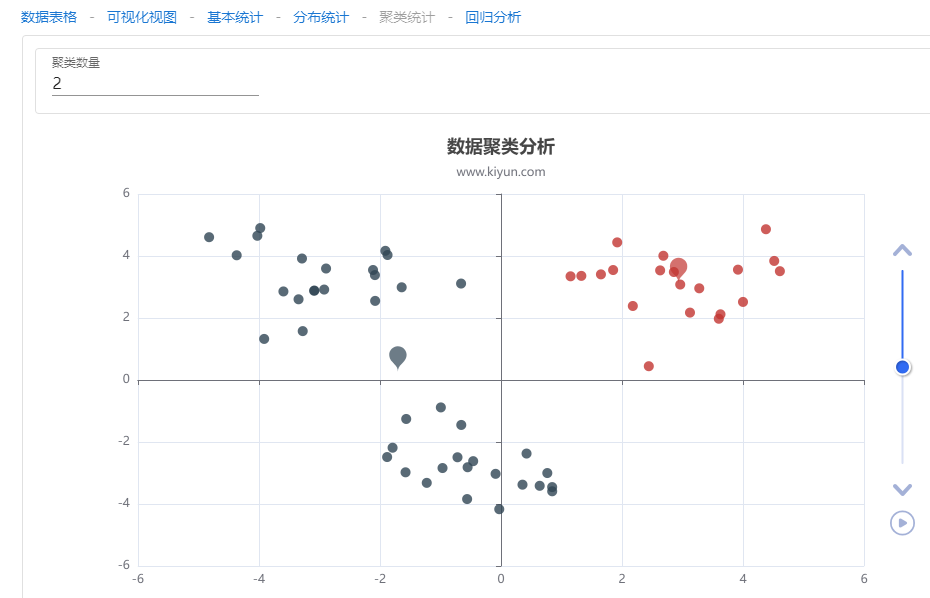
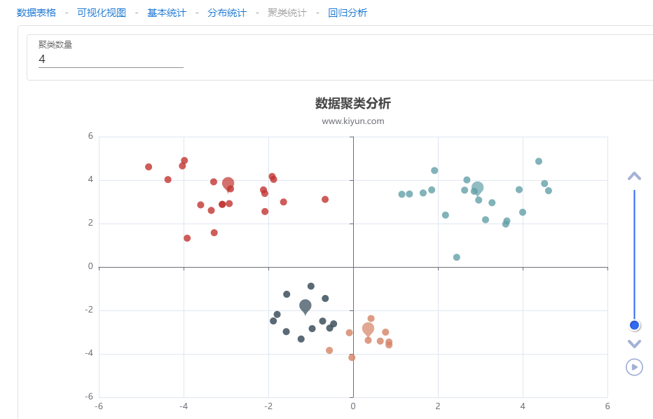

### 回归分析

回归分析根据原始输入数据集中自变量和因变量的值拟合出一条曲线，以反映它们的变化趋势。目前只支持单个自变量的回归分析，包括线性回归、指数回归、对数回归、多项式回归，多项式回归系统会自动找到最符合的多项式次数。

#### 线性回归

线性回归是回归分析中最常见和基础的方法之一，用于建立自变量和因变量之间的线性关系模型。线性回归模型的一般形式可以表示为：Y = β0 + β1X1 + β2X2 + ... + βpXp + ε 。其中，Y是因变量，X1、X2、...、Xp是自变量，β0、β1、β2、...、βp是模型的系数，ε是误差项。线性回归模型的目标是通过最小化观测值与模型预测值之间的差异来估计模型的系数。最常用的估计方法是最小二乘法，它通过最小化残差平方和来找到最佳拟合的模型。

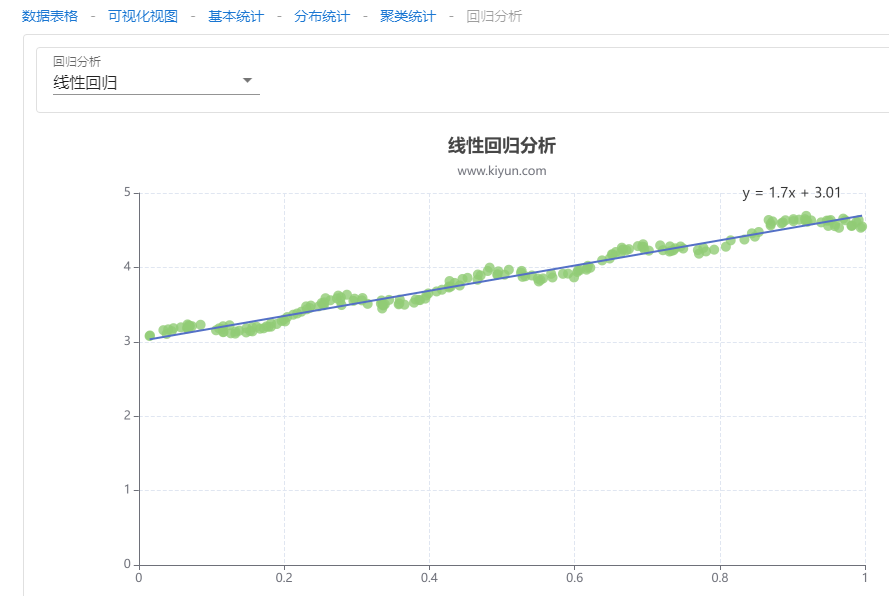

#### 指数回归

指数回归是一种回归分析方法，用于建立自变量和因变量之间的指数关系模型。指数回归模型的一般形式可以表示为：
Y = β0 * X1^β1 * X2^β2 * ... * Xp^βp * ε。其中，Y是因变量，X1、X2、...、Xp是自变量，β0、β1、β2、...、βp是模型的系数，ε是误差项。指数回归模型假设自变量和因变量之间存在一个指数关系，即自变量的指数幂对因变量的影响。指数回归模型常用于描述自变量和因变量之间的非线性关系，特别是当因变量的增长速度随着自变量的变化而变化时。
指数回归模型的估计方法可以采用最小二乘法或最大似然法。通过估计模型的系数，可以确定自变量对因变量的指数影响程度，并进行预测和推断。

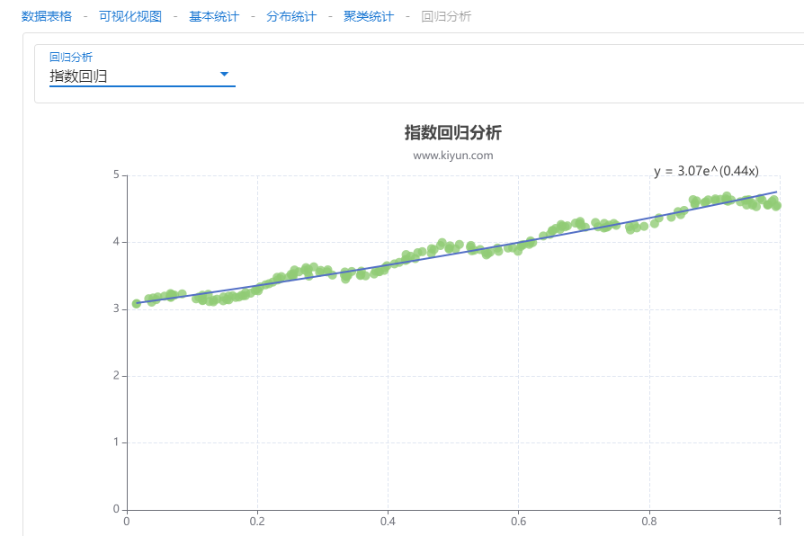

#### 对数回归

对数回归是一种回归分析方法，用于建立自变量和因变量之间的对数关系模型。对数回归模型的一般形式可以表示为：
ln(Y) = β0 + β1X1 + β2X2 + ... + βpXp + ε。其中，ln(Y)是因变量的自然对数，X1、X2、...、Xp是自变量，β0、β1、β2、...、βp是模型的系数，ε是误差项。对数回归模型假设自变量和因变量之间存在一个对数关系，即因变量的对数对自变量的线性组合有影响。对数回归模型常用于描述自变量和因变量之间的非线性关系，特别是当因变量的增长速度随着自变量的变化而变化时。对数回归模型的估计方法可以采用最小二乘法或最大似然法。通过估计模型的系数，可以确定自变量对因变量的对数影响程度，并进行预测和推断。

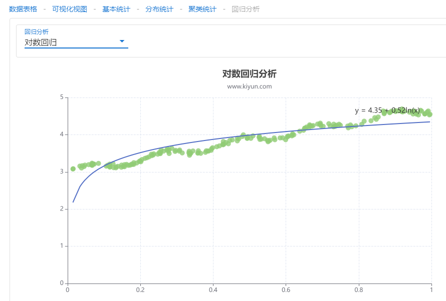

#### 多项式回归

多项式回归是一种回归分析方法，用于建立自变量和因变量之间的多项式关系模型。多项式回归模型的一般形式可以表示为：Y = β0 + β1X + β2X2 + ... + βpXp + ε。其中，Y是因变量，X是自变量，β0、β1、β2、...、βp是模型的系数，ε是误差项。多项式回归模型假设自变量和因变量之间存在一个多项式关系，即因变量可以通过自变量的多项式函数来预测。多项式回归模型常用于描述自变量和因变量之间的非线性关系，特别是当因变量的变化不符合线性模型假设时。多项式回归模型的估计方法可以采用最小二乘法或最大似然法。通过估计模型的系数，可以确定自变量对因变量的多项式影响程度，并进行预测和推断。

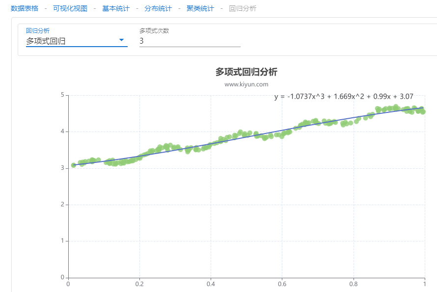
  

