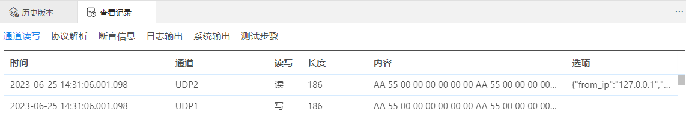

## 历史版本

历史测试执行结果归档在历史版本里。在执行与报告页面，选择项目进行批量执行，执行结束后对本次的执行结果进行归档，归档的执行结果可以在历史版本里查看。

### 入口：工具-历史版本

### 查看历史测试报告

如果已经在执行与报告页面进行过批量执行与归档的操作，则点击工具-历史版本，会显示出历史版本列表，选择任意版本进入该版本的执行结果记录页面；如果没有归档记录，则提示“当前项目不存在历史版本”。

- 归档版本号：执行与报告页面归档时填写的版本信息。
- 名称：是该项目执行配置文件里输入的名称。
- 说明：是该项目执行配置文件里输入的说明。
- 路径：是执行配置文件在该项目下的相对路径。
- 执行结果：是该项目的执行结果。
- 主题数据：显示主题数据名称，点击该名称后，进入主题数据的详细展示界面。
- 历史回看：点击查看记录后，会分页显示不同数据内容：通道读写、协议解析、断言信息、日志输出、系统输出、测试步骤。

- 测试报告：显示3种测试报告：用例执行报告、测试记录表单、测试记录。分别点击后可以查看详细内容，该内容与执行与报告功能页面执行后的报告内容一致。报告内容可以根据不同用户的要求进行定制。
- 项目报告：点击项目报告，选择报告模板类型后，展示该项目的测试报告内容。项目报告模板可以根据不同用户的要求进行定制。

  

