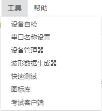
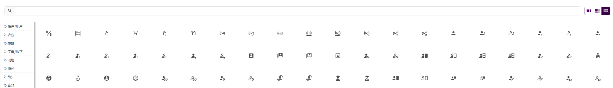
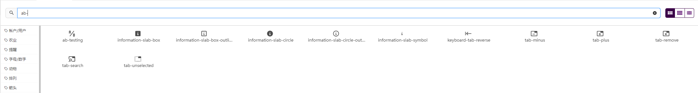
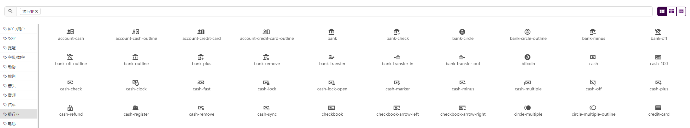
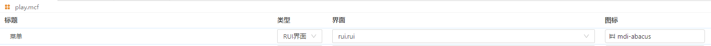

## 图标库

图标库提供了丰富的图标，在界面文件和菜单配置文件里使用。

### 入口：工具-图标库

### 基本功能

#### 展示切换

点击搜索框右侧的展示切换按钮，分别是默认展示、紧凑展示、图标展示。

#### 图标搜索

搜索框输入图标的名称，展示搜索结果。

#### 分类查找

点击左侧分类菜单，可以进行分类图标查询。

#### 图标名称复制

鼠标点击图标名称后，名称就复制成功。

### 图标使用

#### 在菜单配置文件中使用

1.图标库页面，选择所要使用的图标，鼠标点击该图标，图标名称复制成功。    
2.进入菜单配置文件内，在图标输入框粘贴已复制的名称。

#### 在rui界面文件中使用

1.图标库页面，选择所要使用的图标，鼠标点击该图标，图标名称复制成功。    
2.进入rui界面内，在按钮、图标、指示灯组件，粘贴图标名称。对应组件的图标则显示为图标库里复制的图标。

  

