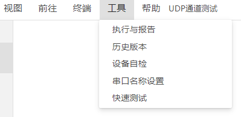
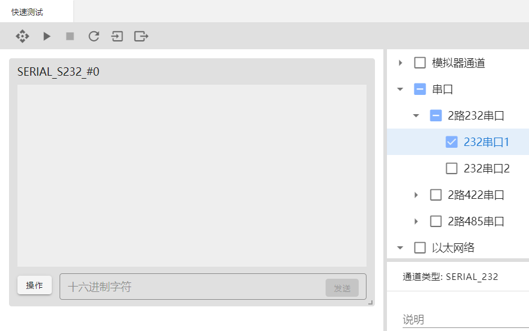
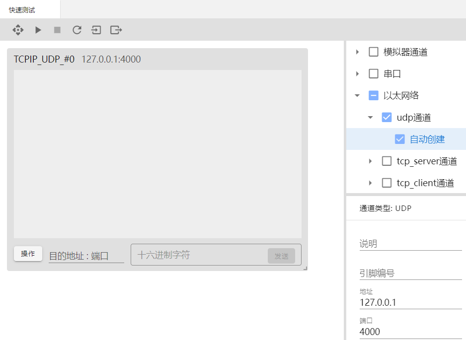
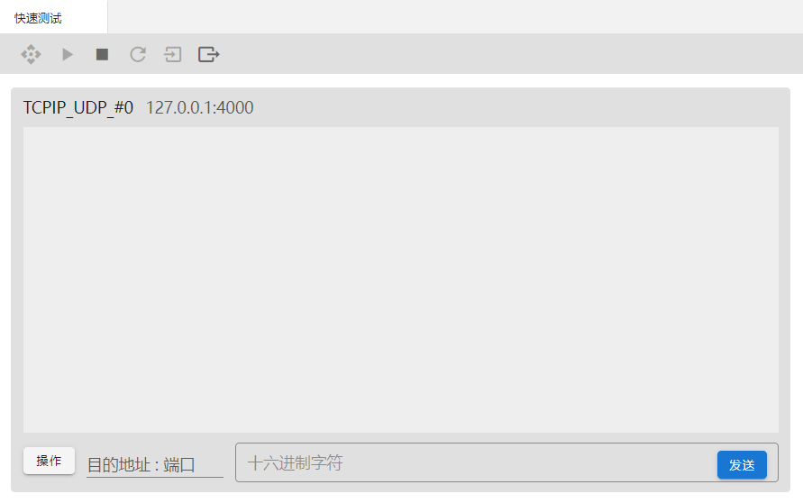
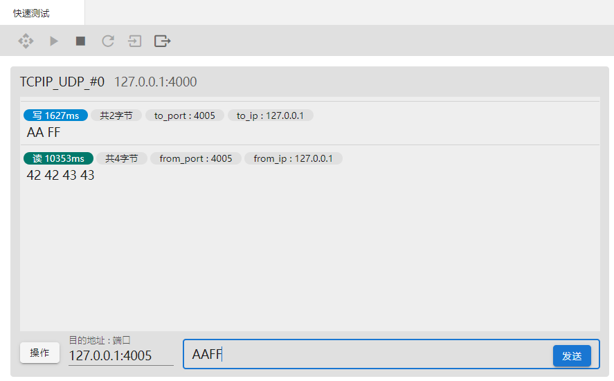
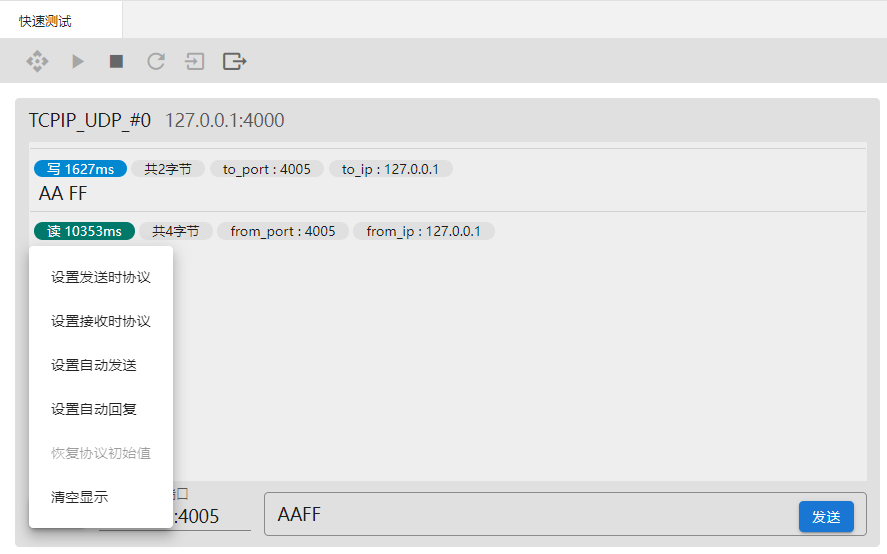

## 快速测试

快速测试多用于开发阶段，是研发人员的调试工具。对于简单的测试逻辑不需要编写代码，可以直接进行简单的人机交互测试。

### 入口：工具-快速测试

### 选择通道

选择需要调试的通道类型，勾选对应的复选框，通道选择成功，面板显示已勾选的通道。

### 切换编辑/预览模式

点击“切换编辑/预览模式”按钮，可以切换编辑和预览模式。编辑状态，可以选择调试的通道，编辑该通道的配置参数。

如下图设置udp通道，udp地址是127.0.0.1，端口是4000。

### 执行

点击执行按钮后，才能进行数据发送和数据接收。

### 停止

点击停止按钮后，不能进行数据发送和数据接收。

### 发送

以udp通道调试为例，使用“网络调试助手”工具进行配合测试，网络调试助手协议类型设置为UDP，地址为“127.0.0.1”，端口号“4005”，设置后打开，可以进行通信。

执行状态下，输入目的地址和端口“127.0.0.1:4005”，输入发送的内容“AAFF”，点击发送，数据发送成功。使用网络调试助手，发送数据，数据接收成功。界面显示时长、字节数、地址、端口、数据内容。

#### 操作

点击操作按钮弹出对话框，可以设置发送时协议、设置接收时协议、设置自动发送、设置自定回复、恢复协议初始值、清空显示。

#### 重置

重置作用是界面布局发生变化后，点击重置，会使布局进行重置到最开始的位置。

#### 导入

可以导入快速测试的json文件，导入完成后执行快速测试。

#### 导出

点击导出按钮，导出快速测试的json文件，保存成功后，可以再次导入使用。

  

