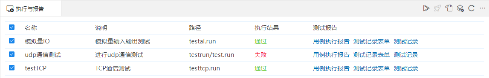
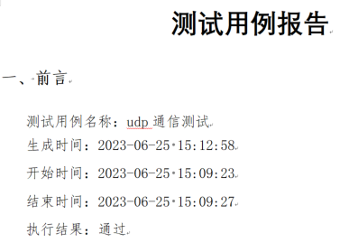
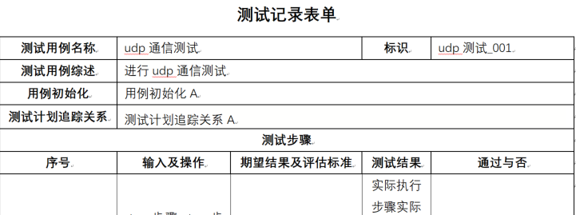
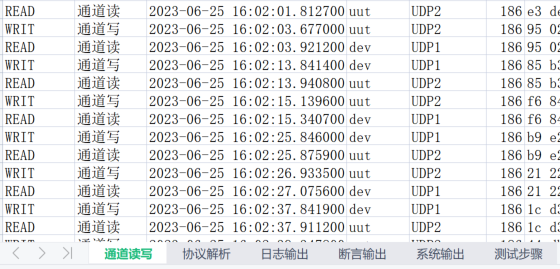
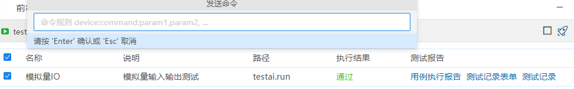
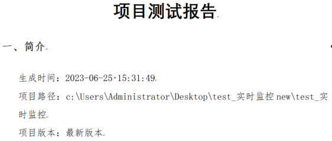
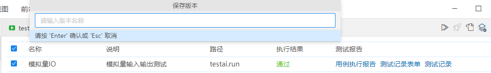

## 执行与报告

执行与报告页面会显示出该项目下的所有配置文件(run后缀结尾的文件)，选择单个或多个批量执行，执行结束后显示执行结果，生成测试报告。

### 入口：工具-执行与报告

### 批量执行

- 勾选要执行的项目，勾选后点击右上角的“批量执行”按钮。按顺序执行程序，执行结束后显示执行结果和测试报告。
- 开始执行后，执行输出区域会显示该项目的执行日志信息。
- 点击批量执行后，执行过程中可以点击停止按钮，停止执行。
- 批量执行可以重复操作，最新的测试结果会覆盖之前的测试结果。

- 名称：是该项目执行配置文件里输入的名称。
- 说明：是该项目执行配置文件里输入的说明。
- 路径：是执行配置文件在该项目下的相对路径。
- 执行结果：是该项目的执行结果。
- 测试报告：显示3种测试报告：用例执行报告、测试记录表单、测试记录。分别点击后可以查看详细内容。报告内容可以根据不同用户的要求进行定制。

### 发送命令：

执行中状态时，可以点击发送命令按钮发送命令，按照默认提示的命令规则，发送命令。

### 项目报告：

项目执行结束后，点击右上角的“项目报告”，选择报告模板类型后，展示该项目的测试报告内容。项目报告模板可以根据不同用户的要求进行定制。

### 保存版本
- 项目未执行时点击保存版本按钮，提示“请先执行项目”。
- 选择项目批量执行结束后，点击保存版本按钮，弹出输入框，输入已存在的版本号，提示“此版本已存在”。
- 选择项目批量执行结束后，点击保存版本按钮，弹出输入框，输入不存在的版本号，确认后归档成功，可以在历史版本里查看。

### 刷新

点击刷新按钮，刷新该界面内容。

  

