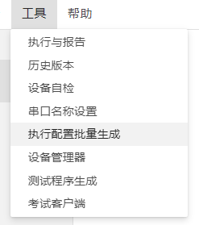
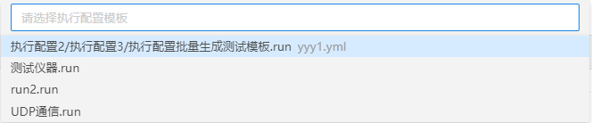
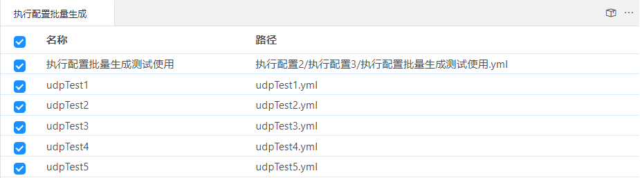
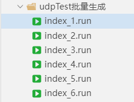

## 执行配置批量生成

将执行配置文件作为模板，选择不同的测试数据文件，自动生成多份执行配置文件。

### 使用场景

当接口和协议都一致，需要使用大量不同的测试数据进行测试、调试的时候，可以先完成一个执行配置文件的配置，然后将他作为一个模板，使用执行配置批量生成工具，可以快速的生成多份使用不同测试数据的执行配置文件。

### 工具入口

从工具栏中找到“工具”，找到“执行配置批量生成”。

### 功能详解

执行配置批量生成功能主要包括三个步骤：    
1）选择执行配置模板文件    
2）选择测试数据文件    
3）生成执行配置文件    

下面进行详细介绍。

### 选择执行配置模板

鼠标点击“执行配置批量生成”，弹出选择执行配置模板的列表窗口，选择一个执行配置模板后，进入执行配置批量生成的功能界面。

### 选择测试数据

执行配置批量生成的功能界面选择要使用的测试数据，测试数据可以任意选择多个。

### 生成执行配置文件

执行配置批量生成的功能界面点击右上角的“批量生成run”按钮，输入执行配置目录名称，生成一个带有多个执行配置文件的文件夹。可以使用该文件夹中的执行配置文件，执行测试。

