## 程序生成器

程序生成器能够根据接口和协议，经过简单的配置，自动生成可用于执行的测试程序和界面。

### 功能简介

程序生成器能够根据接口和协议，经过简单的配置，自动生成可用于执行的测试程序和界面。
在嵌入式设备开发的整个阶段，尤其是前期，非常需要这种方便的工具，能够根据设备的接口和协议，快速搭建起进行测试的工装，能够完成数据的收发和展示，进行基本的接口信号激励和反馈，非常方便快捷。
下面就介绍一下程序生成器的功能。

从工具栏中找到“工具”，找到“测试程序生成”。如图所示。鼠标点击“测试程序生成”，即可进入程序生成器的功能界面。

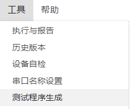
  

### 功能详解

程序生成器功能主要包括三个步骤：    
1）选择仿真环境中的设备    
2）配置测试程序    
3）生成程序    

下面进行详细介绍。

### 选择设备

使用程序生成器，第一步需要从仿真环境中选择一个设备，从而获取通道的信息。首先新建仿真环境，并且至少添加一个设备，然后在这个设备下面加上想要测试的通道。如图所示。

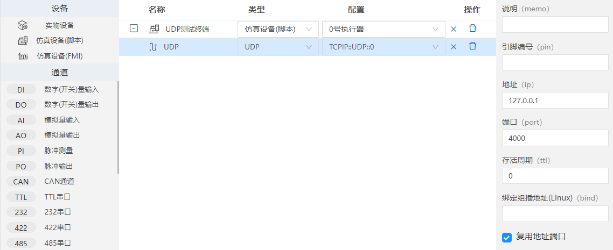

本例中，将演示一个UDP通道的测试，因此在仿真模型里面创建了一个“仿真设备（脚本）”，添加了一个通道“UDP”。通道的地址和端口号都在属性里面设置好了，方便后期使用。
（注意在列表中“配置”项也需要进行正常的选择，否则就无法正常执行收发操作。）

首先，我们打开程序生成器，并选择之前创建的设备“UDP测试终端”。如图所示。

进入程序生成器界面。显示了设备中包含的通道“UDP”。如图所示。

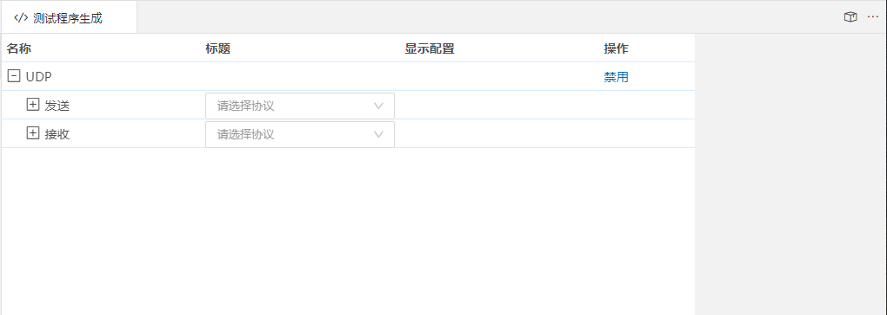

进行UDP通信时，是双向通信，因此界面显示“发送”和“接收”两个配置。可以在这里下拉选择协议，也可以不选择。
如果通道类型为非总线类型，如AD、DA、DI、DO，则不会分为“发送”和“接收”两个配置，而是只有一行配置。如，某个仿真环境下，创建了9个DI输入和10个DO输出，则程序生成器的界面如图所示。

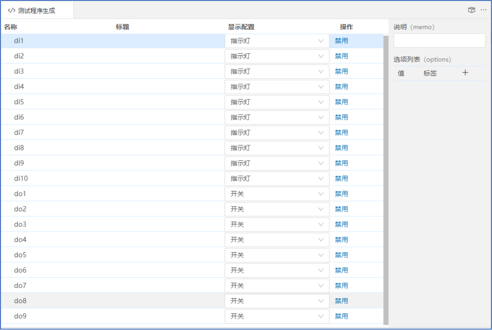

### 配置

在程序生成器界面进行配置，能够控制生成的程序。

一、协议配置

对于总线型的通道，数据的收发都要通过协议来完成。所以，我们需要首先编写进行数据收发的协议。协议是数据格式的描述，这一步是必不可少的。

我们创建了两个协议：prot1和prot2，其内容分别如下：
prot1：

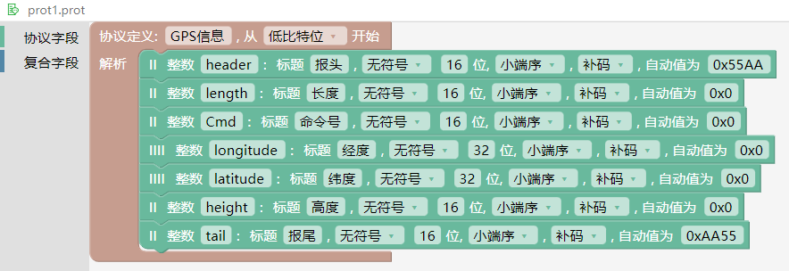

prot2：

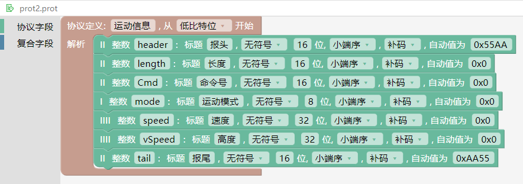

在总线通道的“发送”和“接收”配置后面，通过下拉框选择发送和接收使用的协议，软件将自动将协议内容读进来，显示在协议下方。如图所示。

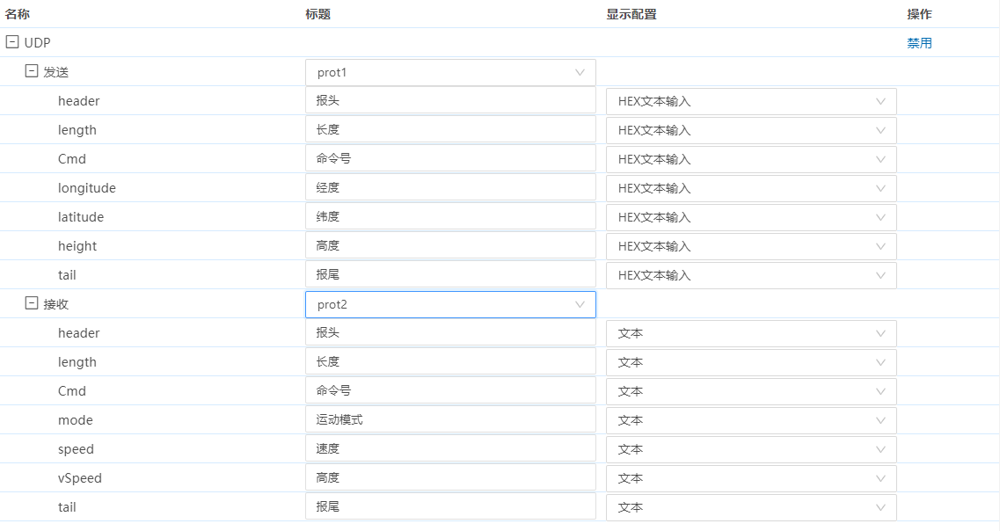

二、显示配置    
显示配置部分对每个输入或输出项都可以进行配置，每个输入或输出项的显示控件。具体包括（根据不同的通道类型，下拉框里的选项配置有所不同）：    
输入显示方式：    
1）开关       
2）单选按钮    
3）数字输入    
4）数字输入（HEX）   
5）下拉框    
6）组合框    
7）数字滑块    
8）不显示    

输出显示方式：    
1）文本    
2）指示灯    
3）进度环    
4）曲线图    
5）不显示    

三、取值范围配置

对取值可以设置取值范围。    
如果输入方式选择“下拉框”，并且输入取值输入“1,2,3”，（用枚举量表示，英文逗号分隔），则生成的下拉列表中会包含1,2,3选项。    
如果输入方式选择“数字滑块”，取值范围输入“1-10”，则生成的数字滑块范围在1到10之间。        
如果输出方式选择“指示灯”，且“选项列表”中添加了以下内容：    
--值“1”/标签“开”    
--值“2”/标签“关”    
    则生成的信号灯会有“开”和“关”两个状态，且对应的值为1和2。    

四、禁用通道

如果不需要某个通道，可以点击该通道右侧的“禁用”，则不会生成该通道的测试程序。    
已经禁用的通道，可以点击“取消禁用”，从而恢复该通道。    

### 生成程序

点击右上角的“生成”按钮，弹出“程序输出”对话框。（根据使用的通道不同或使用场景不同，可以选择是否设置协议。）

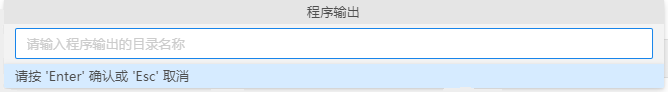

输入程序名称“UDP发送”，确认后，将生成名称为“UDP发送”的目录，其中包含多个程序。如图所示。

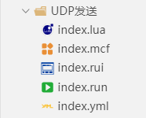

1）index.lua文件：测试执行程序文件，包括了执行需要的代码和程序。    
2）index.rui文件：界面文件，包括了测试程序的人机交互界面。    
3）index.yml文件：数据文件，包括了测试程序需要的网络变量的定义。    
4）index.run文件：执行配置文件，包括了执行配置信息。    
5）index.mcf文件：菜单配置文件，包括了执行程序的菜单信息。    

### 程序使用

一、调试模式下使用    

打开界面文件，点击界面右上角的“打开调试模式”按钮，进入调试模式，可以开始进行数据收发测试。

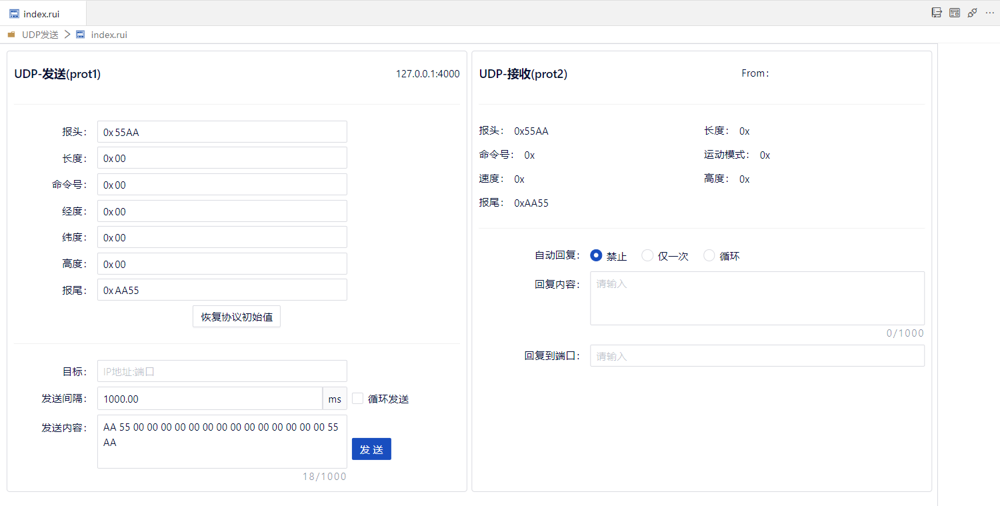

二、打包输出后使用    

index.prj文件内配置打包输出路径，选择菜单配置文件。点击“文件”->“打包输出”，打包输出成功。执行程序，可以看到执行界面。

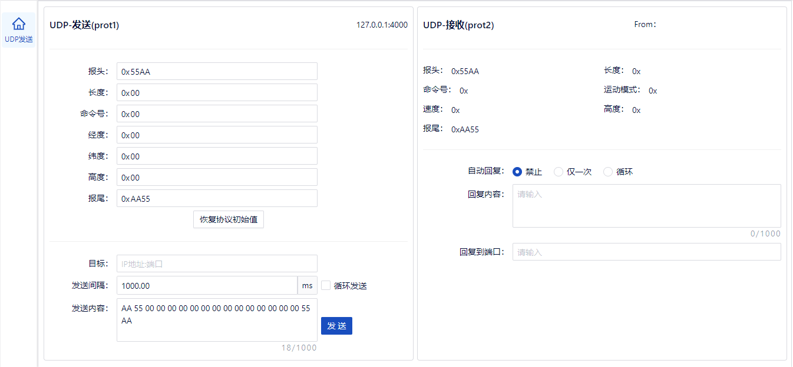

