## 设备管理器
“设备管理器”是管理驱动，以及驱动和板卡之间的绑定关系。通过界面操作，修改配置文件。另外，只有当驱动绑定了板卡后，“设备自检”才会检测板卡的相关功能是否正常。

### 打开
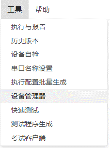

### 驱动相关操作

驱动刷新：点击“驱动刷新”会将ETestXXX\bin\drivers下所有驱动全部列表显示在界面左侧。

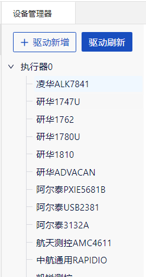

驱动新增：如果需要添加列表中没有板卡驱动，需要点击“驱动新增”，选择有效驱动目录。具体操作：新建文件夹改名为“drivers”，将新驱动添加到“drivers”下。点击“驱动新增”，选择刚刚新建的“drivers”文件夹。添加后，点击“驱动刷新”，看到有新的驱动添加进来了。

### 板卡相关操作
- 新增板卡：
  - 选中左侧任意驱动，然后点击“新增板卡”，就可以追加绑定对应驱动的对应板卡了。
  例如，选中驱动“凌华ALK7841”，点击“新增板卡”。

  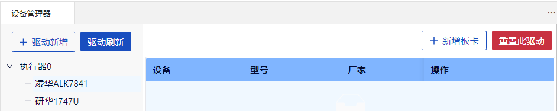

  - 标识：同型号板卡可以有多张，通过标识来区分板卡。不同板卡有不同的“提示”信息，这里输入“0”。

  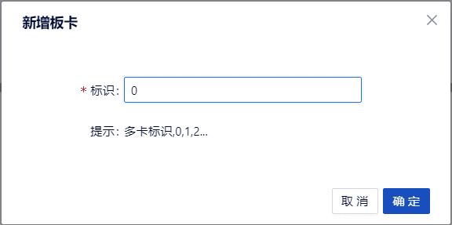

  - 可以看到“凌华ALK7841”下面出现了刚刚绑定的板卡的信息，信息包括设备，型号，厂家，操作。

  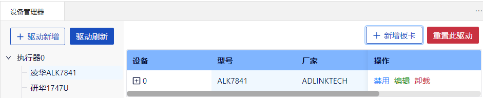
- 操作：
    - 启用：保持板卡活跃，“设备自检”的时候，可以检测到该板卡。
    - 禁用：“设备自检”的时候，检测不到该板卡。
    - 卸载：解绑该板卡。

- 重置此驱动：若想删除该驱动下的所有已绑的板卡，点击“重置此驱动”。弹出对话框，选择“确定”。刚刚绑定的板卡已经被消除了。

  

  

- 校准：
  - 功能：针对真实物理硬件（非MOCKER）的模拟量输入（AI）输出（AO）通道，提供校准功能。AI或者AO通道在实际输入或者输出的电压值会有一定的偏差，通过对单个通道进行多组数据采集，使用算法得出系数和偏移，可以对单个通道的实际输入输出做出误差修正。
  - 原理：通过一定数量的标准值和实际值的数据样本，计算出误差公式。
  - 以“研华1747U”的AI通道为例，找到AI通道，点击“校准”。

    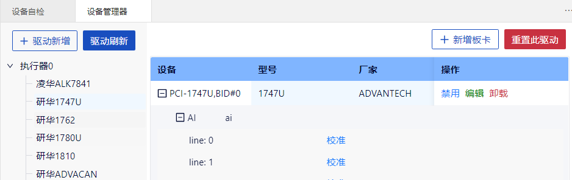

  - 测试数据配置：输入“测试数据个数”，“测试数据范围”的内容，然后点击“生成测试数据”，会在“2.测试数据调整”下面生成测试数据。“测试数据单位”是可选项，填写后会显示到“2.测试数据调整”的“技术要求”下。

    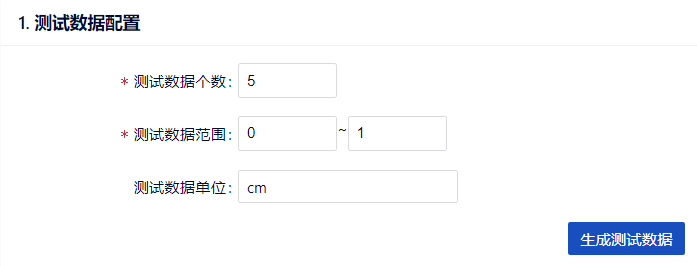
  - 测试数据调整：提供测试数据的增删改操作。需要手动输入“实际测量值”。

    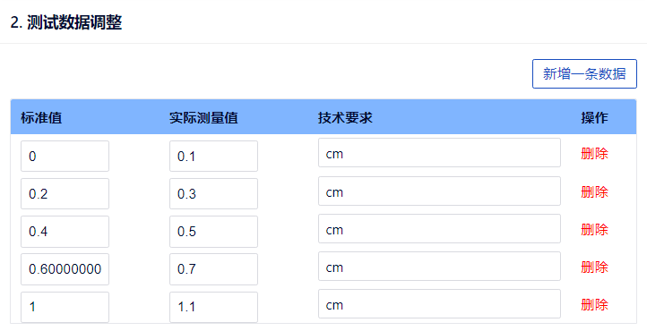
  - 计算：点击“校准计算”会根据“2.测试数据调整”下的“标准值”，“实际值”，自动计算出关系系数k，b的值，其中k是斜率，b是截距。
    也可手动填写k，b的值。有了k，b的值后，点击“校准写入”，退出“校准”界面，可以看到“ai”列出现校准公式“y=1x+-0.1”。

    

    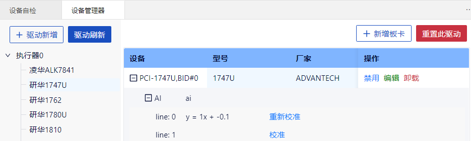

  - 重新校准：可点击重新校准页面，再次校准。

### 设备管理器与设备自检
- “凌华ALK7841”绑定板卡“0”后，打开“工具”-“设备自检”。勾选“凌华ALK7841”，点击“自检”，界面出现板卡“0”的检测信息。

  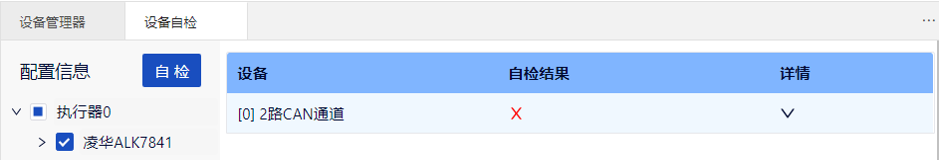
- 如果没有在“设备管理器”，为“凌华ALK7841”绑定板卡，那么点击“自检”的时候，界面是空白的。

  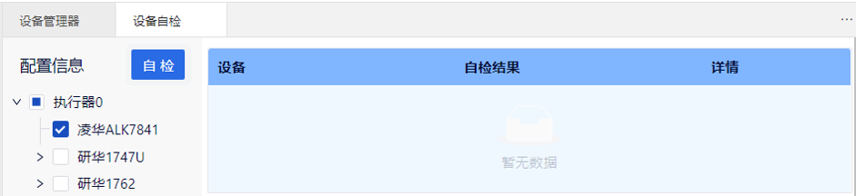

- 注意：如果在“设备管理器”更改绑定后，需重新打开“设备自检”，否则“设备管理器”的更改不会更新到“设备自检”。

  

