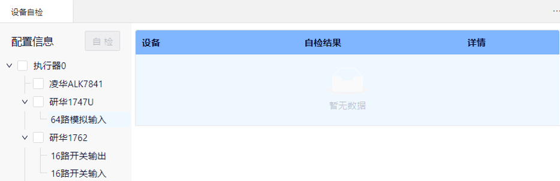
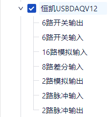
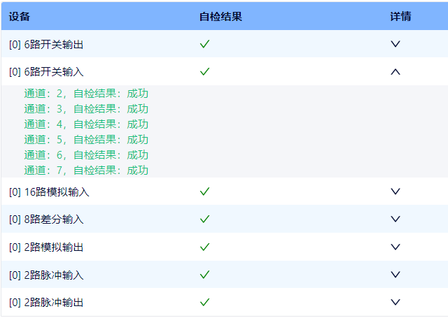
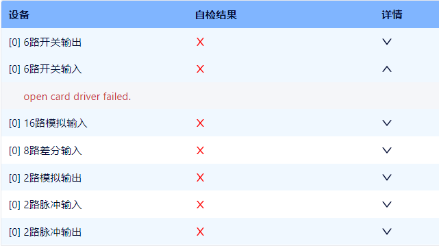
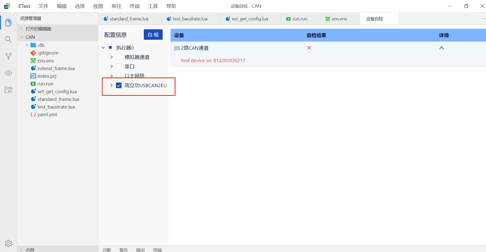
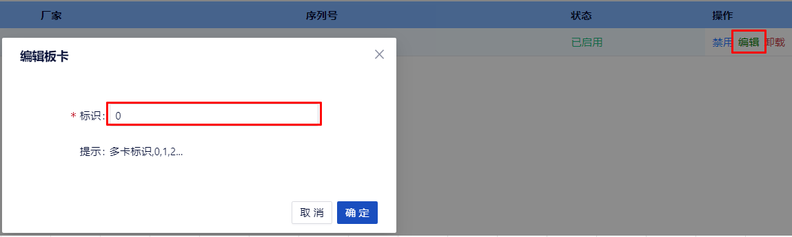

## 设备自检

设备自检是对使用的硬件设备（通信板卡）是否在位的检查，自检功能能够确定硬件设备是否处于可用状态。设备自检通过，可以进行对应设备的通信测试；如果设备自检不通过，要排查问题原因，解决问题。再次自检通过后，才能进行相应设备的测试。

### 打开

### 设备自检-配置信息

配置信息展示了系统中所有的硬件通道信息。

### 设备自检执行

- 勾选要进行自检的设备，点击"自检"按钮，执行自检。

- 自检完成后，显示自检结果：
  - √表示通过：该板卡就可以在仿真环境里进行绑定。
  - ×表示失败：查看板卡是否存在（通过windows的设备管理器查看），板卡配置是否正确（卡标识是否正确）。

- 点击详情按钮∨，显示具体的检测结果，展开可以看到通道、端口等具体的详细信息。

- 例：勾选“恒凯USBDAQV12”，点击“自检”：

  

  自检结果成功：
  
  
  
  自检结果失败：
  
  

- 常见问题：自检失败出现序列号，更新板卡序列号。
  - 自检失败，出现序列号

  

  - 复制该序列号，打开【设备管理器】，找到该驱动的板卡，点击【编辑】，输入刚才复制的板卡序列号。

  

  - 打开【设备自检】重新自检一下。

  

