## etl
### etl是什么
- etl，即"Embedded Test Language"嵌入式测试语言。
- etl程序是图形化的代码，可以通过拖拽图形化代码块进行测试代码的编写。
- 代码块分类：I/O、变量，任务，调度，断言，循环，逻辑，数据解析，主题数据，日志记录。

### 新建etl文件
- 右键-新建文件-执行程序(etl)。

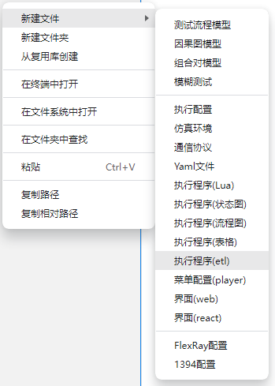
- 输入etl文件名。

- 生成etl文件。

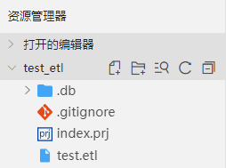

- 界面中的“测试程序”对应函数Entry()，是程序执行的入口函数。

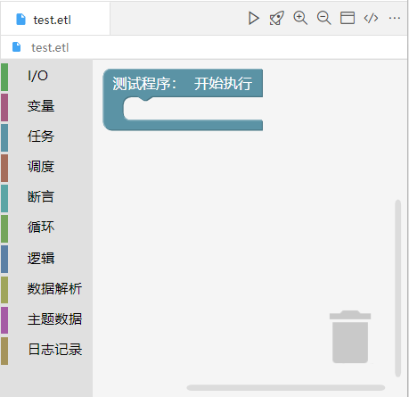

### 右上角功能说明

- 三角（执行）：执行程序。
- 火箭（发送命令）：发送命令。

  - 在etl中定义函数。

    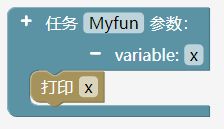
  - 在执行状态下，选择设备，命令(函数)，输入实参。
  - 点击“发送命令”按钮，可在控制台看到输出结果。

    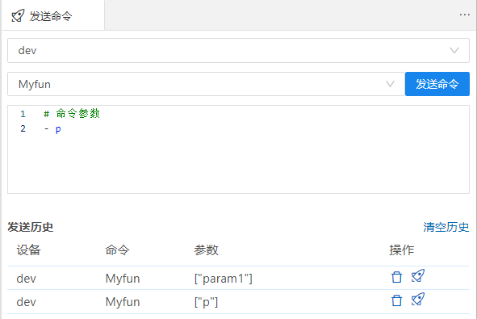

    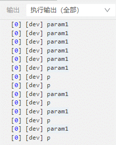

- 放大镜+（放大）：放大代码块和左侧工具栏。
- 放大镜-（缩小）：缩小代码块和左侧工具栏。
- 两分长方形（显示100%）：还原代码块和左侧工具栏大小，并使得代码块归位到左上角。
- “</>”（查看Lua代码）/（切换ETL视图）：用于切换etl和lua视图。 
  - 显示etl界面时，点“</>”：etl代码会转换成Lua代码，该代码只读不可编辑。图标变成。
  - 显示lua代码时，点：Lua代码变etl代码。图标变回“</>”。

### 删除代码块
- 方法1：将需要删除的代码块拖拽到右下角的垃圾桶即可。
- 方法2：快捷键del。

### 通道相关的代码块说明
对于涉及到通道的代码块，编辑使用*.etl文件前，需要做一些准备：
- 新建仿真环境（*.env）：设置好仿真设备和通道。
- 新建etl（*.etl）
- 新建执行配置（*.run）：绑定仿真环境和etl文件。
- 新建协议（*.prot）
- *.etl文件：
  - 代码块拖拽到界面之前：需要点击“重载窗口”（帮助->重载窗口）从而确保代码块里的设备，通道，协议都是最新的。
  - 已经拖拽到界面里的代码块：更新设备，通道，协议后，除了要重载窗口，还需重新选择对应的设备，通道，协议。

### 代码块说明
#### I/O
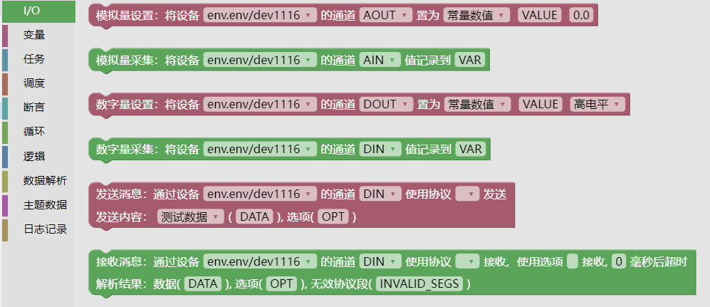
- 模拟量设置
  - 对应API：write_analog()
  - 置为：
    - 常量数值：填写number类型的数字即可，例：5.01。
    - 测试数据：需要事先新建一个*.yml文件，写好内容。例：testdataA: 6.4。然后etl里填写变量名testdataA。

    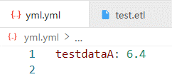

  - 执行输出

  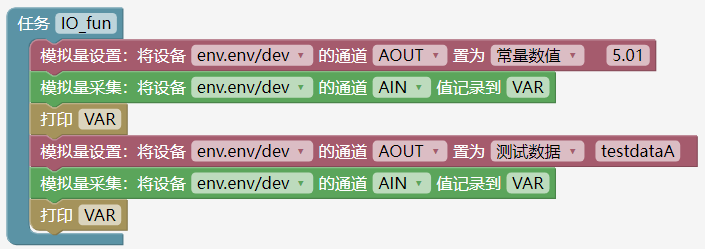

  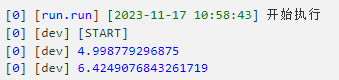
- 模拟量采集
  - 对应API：read_analog()
  - 值记录到：填写local变量的名称，采集到的数据会赋值给该local变量。

- 数字量设置
  - 对应API：write_digital()
  - 置为：
    - 常量数值：可选高电平，低电平。
    - 测试数据：需要事先新建一个*.yml文件，写好内容。例：testdataD: 1，然后etl里填写变量名testdataD。
  - 执行输出：

  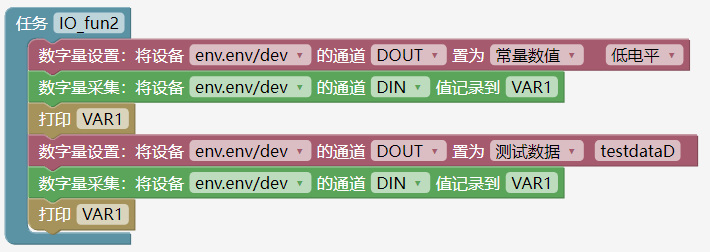

  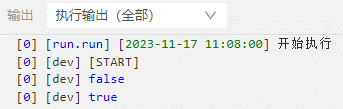

- 数字量采集
  - 对应API：read_digital()
  - 值记录到：填写local变量的名称，采集到的数据会赋值给该local变量。

- 发送消息

  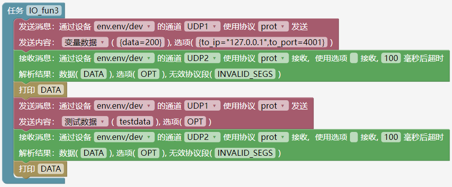
  - 对应API：write_msg()
  - 绑定设备，通道，协议。
  - 发送内容：
    - 变量数据：输入协议字段名并赋值。例：{data=200}。
    - 测试数据：需要事先新建一个*.yml文件，写好内容（*.yml内容见下图）。然后在括号里填写变量名称testdata。

      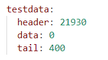

  - 选项：对应参数option，不同通道对应option的值不同，需要到对应通道的write_msg()查看option的内容。
    例：对于UDP通道，填写：{to_ip="127.0.0.1",to_port=4001}。对于仿真设备的UDP通道来说，连接拓扑结构后，“选项”这里可空。
  - 执行输出：

  

  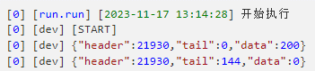
- 接收消息
  - 对应API：read_msg()
  - 绑定设备，通道，协议。
  - 使用选项：对应参数option。对于本例的UDP通道来说，这里为空。
  - 毫秒后：延迟时间。
  - 解析结果：对应的几个名称是local变量，是该函数的返回值的不同成员名称。

#### 变量
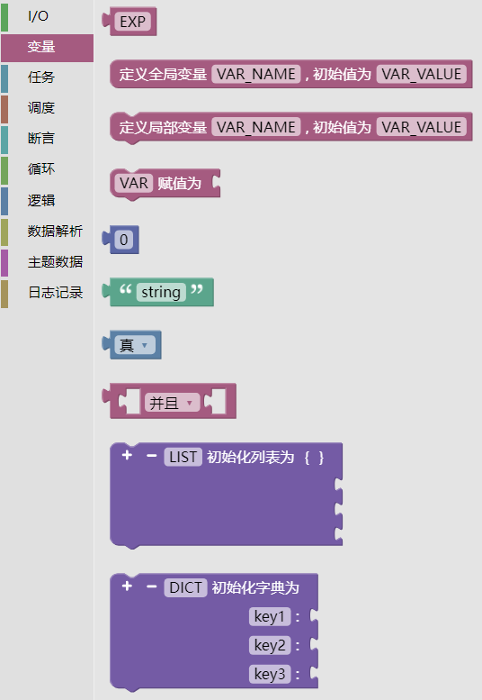
- ：EXP为初始变量名称，可将EXP，修改成任意代码（变量名，值，函数名称，条件表达式等），需和其他代码块搭配使用。
  
- 定义全局变量：定义全局变量，并赋初值，用于函数外部。
- 定义局部变量：定义局部变量，并赋初值，用于函数内部。
- 赋值为：对应赋值语句。需和其他代码块搭配使用，例：变量，值。
- 立即数：填写number类型的值。
- 字符串：填写string类型的值。
- 布尔值：可选真，假。需和条件表达式搭配使用。
- 并且：可切换为“或”。代表逻辑关系的与，或。需和变量，布尔值搭配使用。

  
- LIST：
  - 可定义LIST列表。
  - 点击“+”增加成员，“-”删除成员（从最下面一个删除）。
  - 需和变量，立即数等搭配使用。

  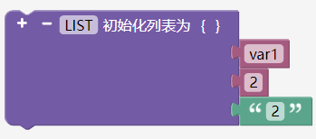
- DICK：
  - 可定义DICK列表。
  - 点击“+”增加成员，“-”删除成员（从最下面一个删除）。
  - 需和变量，立即数等搭配使用。

  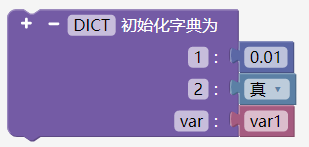

#### 任务
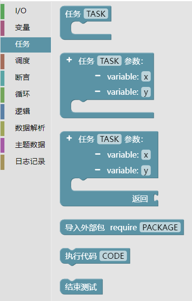
- 提供三种任务（函数）
  - 无参，无返回值。
  - 有参，无返回值。
  - 有参，有返回值。

  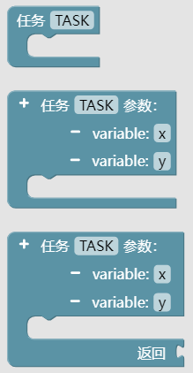
- 导入外部包
  - 对应API：require()
  - 填写要引用的lua脚本名称。
  - 例：a.lua填写a。

  
- 执行代码：可输入任意的lua代码。作为etl的开放式代码，满足更多需求。例：函数调用的时候，可用该代码块实现。
- 结束测试：exit()

#### 调度
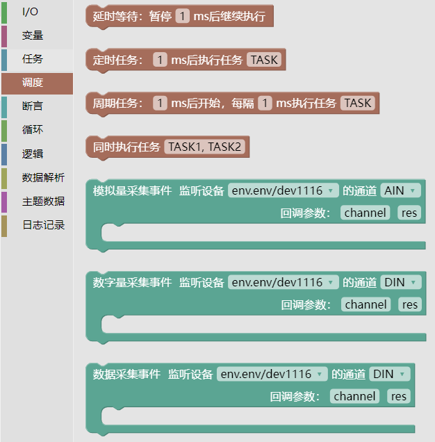
- 延时等待：
  - 对应API：etimer.delay()
  - 可更改延时时间。
- 定时任务：
  - 对应API：etimer.timeout()
  - 可更改延时时间和任务（函数）名称。
- 周期任务：
  - 对应API：etimer.interval()
  - 可更改延时时间，周期时间和任务（函数）名称（以及参数）。
- 同时执行任务：
  - 对应API：gather({TASK1},{TASK2})
  - 可更改并发执行的任务，可以填写多个任务（以及参数），用逗号隔开。
- 执行输出1：

  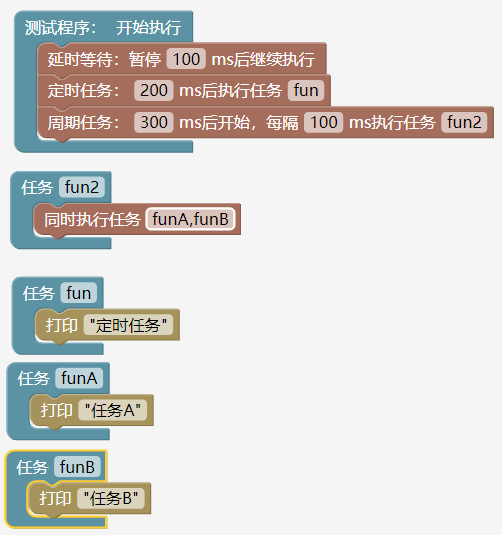

  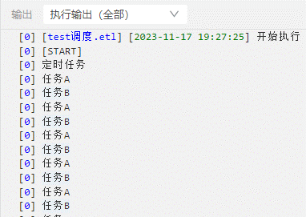
- 模拟量采集事件：
  - 对应API：on_analog_recv(channels.AIN, function(channel, res))
  - 当监听到模拟通道有数据输入的时候，就执行回调函数。
- 数字量采集事件：
  - 对应API：on_digital_recv(channels.DIN, function(channel, res))
  - 当监听到数字通道有数据输入的时候，就执行回调函数。
- 数据量采集事件：
  - 对应API：on_buff_recv(channels.XXX, function(channel, res))
  - 当监听到数据通道有数据输入的时候，就执行回调函数。
- 执行输出2：

  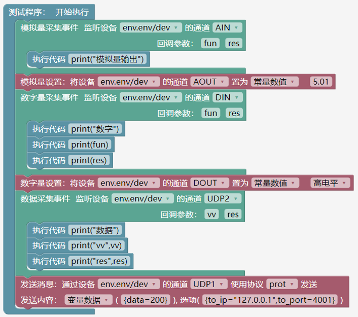

  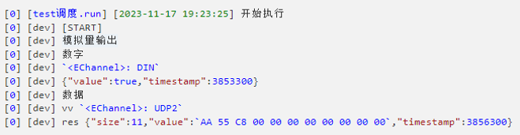

#### 断言
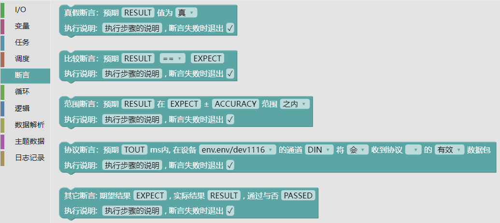
- 真假断言：
  - 勾选“断言失败时退出”
    - 对应API：e_step.assert_true(true,"真假断言")
    - 功能：断言为真, 执行步骤的预期结果为true, 断言失败时退出程序。
  - 不勾选“断言失败时退出”
    - 对应API：e_step.verify_true(true,"真假断言")
    - 功能：断言为真, 执行步骤的预期结果为true, 断言失败时不退出程序。
- 比较断言：
  - 勾选“断言失败时退出”
    - 对应API：e_step.assert_eq("name","name","比较断言")
    - 功能：断言相等, 执行步骤的预期结果等于某个值, 断言失败时退出程序。
  - 不勾选“断言失败时退出”
    - 对应API：e_step.verify_eq("name","name","比较断言")
    - 功能：断言相等, 执行步骤的预期结果等于某个值, 断言失败时不退出程序。
- 范围断言：
  - 勾选“断言失败时退出”
    - 对应API：e_step.assert_accuracy_eq(1,1.2,0.3,"范围断言")
    - 功能：指定比较精度, 断言执行步骤的预期结果等于某个值, 断言失败时退出程序。
  - 不勾选“断言失败时退出”
    - 对应API：e_step.verify_accuracy_eq(1,1.2,0.3,"范围断言")
    - 功能：指定比较精度, 断言执行步骤的预期结果等于某个值, 断言失败时不退出程序。
- 协议断言：
  - 勾选“断言失败时退出”
    - 对应API：e_step.assert_valid_ok(channels.UDP2,protocols.prot,100,"执行步骤的说明")
    - 功能：断言通道在指定时间内收到指定协议数据, 且全部字段的协议验证通过, 断言失败程序退出。
  - 不勾选“断言失败时退出”
    - 对应API：e_step.verify_valid_ok(channesl.UDP2,protocols.prot,100,"执行步骤的说明")
    - 功能：断言通道在指定时间内收到指定协议数据, 且全部字段的协议验证通过, 断言失败程序不退出。
- 其他断言：
  - 勾选“断言失败时退出”
    - 对应API：passed = step("对测试用例的描述", "期望结果", "实际结果", true)
    - 其他代码：if not “期望结果”==“实际结果” then exit() end
    - 功能：记录执行步骤信息，失败退出程序。
  - 不勾选“断言失败时退出”
    - 对应API：passed = step("对测试用例的描述", "期望结果", "实际结果", true)
    - 功能：记录执行步骤信息，始终不退出。
- 执行输出：
  - *.etl

  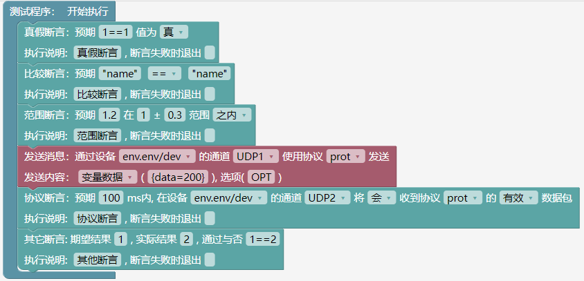
  - 执行输出

  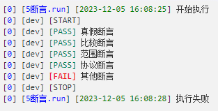
  - “实时监控”->"测试步骤"
  
  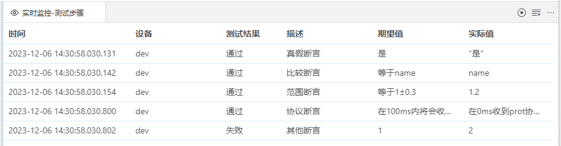

#### 循环
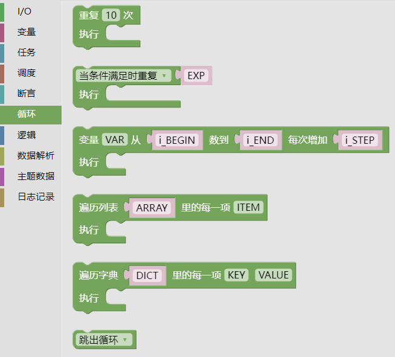
- 固定次数循环（for）

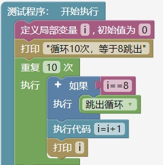

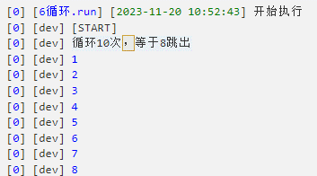

- 有条件循环（while...do）

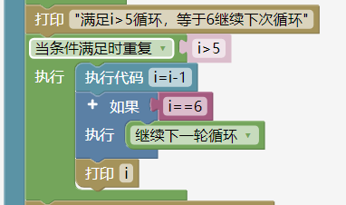

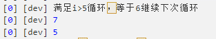

- 控制起始终止值和步长的循环(for)

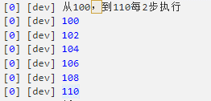

- 遍历列表
  - 对应API：ipairs()
  - 遍历列表，字典的值

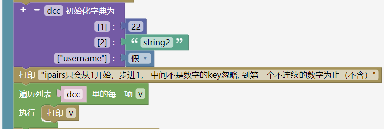

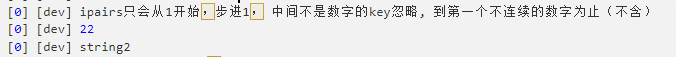

- 遍历字典
  - 对应API：pairs()
  - 遍历列表，字典的键和值

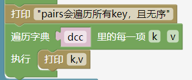

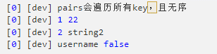

- 跳出循环
  - 对应：break

  

  
  - 可切换“继续下一轮循环”。
- 继续下一轮循环。
  - 对应goto continue

#### 逻辑
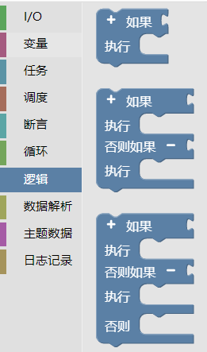
- 如果执行：
  - if..then..end
  - 可点+-号，添加删除判断层次。
- 如果执行，否则如果执行:
  - if..then..elseif..then..end
  - 可点+-号，添加删除判断层次
- 如果执行，否则执行:
  - if..then..elseif..then..else..end
  - 可点+-号，添加删除判断层次。
- 执行输出：
  - 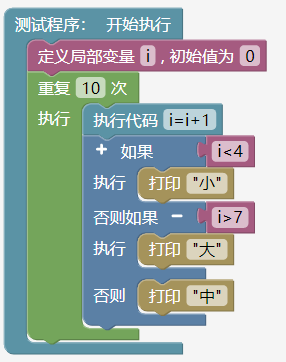
  - 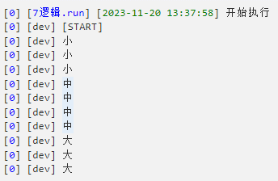

#### 数据解析
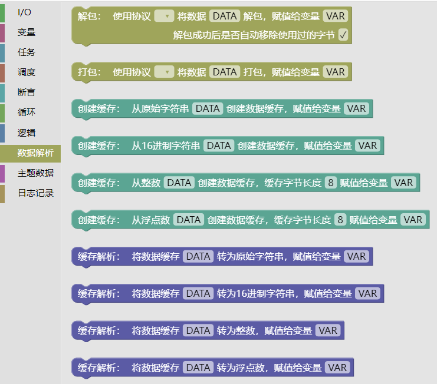
- 解包
  - 对应API：unpack()
- 打包
  - 对应API：pack()
- 创建缓存（从原始字符串）
  - 对应API：ebuff.from_bytes()
- 创建缓存（从16进制字符串）
  - 对应API：ebuff.from_hex()
  - 输入内容必须是字节（byte）的整数倍（例:"ABCD"）。如果输入"ABC"，C不会被读入。
- 创建缓存（从整数）
  - 对应API：ebuff.from_int()
- 创建缓存（从浮点数）
  - 对应API：ebuff.from_number()
- 缓存解析（转为原始字符串）
  - 对应API：ebuff.to_bytes()
- 缓存解析（转为整数）
  - 对应API：ebuff.to_hex()
- 缓存解析（转为16进制字符串）
  - 对应API：ebuff.to_int()
- 缓存解析（转为浮点数）
  - 对应API：ebuff.to_number()
- 执行输出：
  - 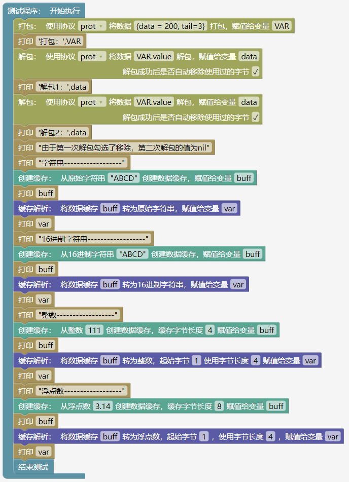
  - 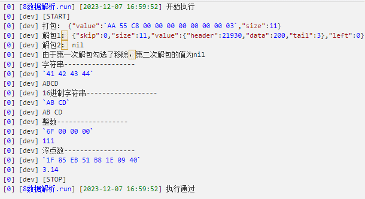

#### 主题数据
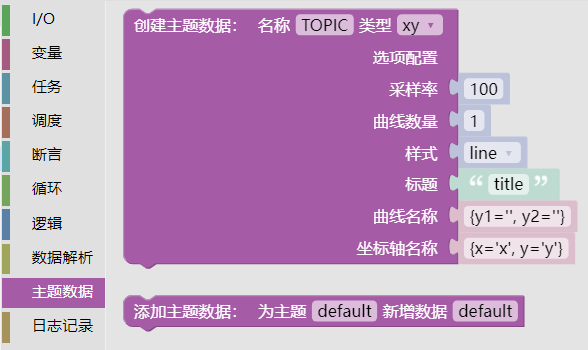
- 创建主题数据
  - etopic.create()
  - 类型可选：xy，yy，xyy。

  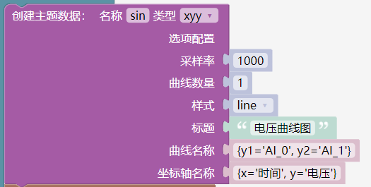

- 添加主题数据
  - etopic.push_many()
 
  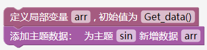

#### 日志记录
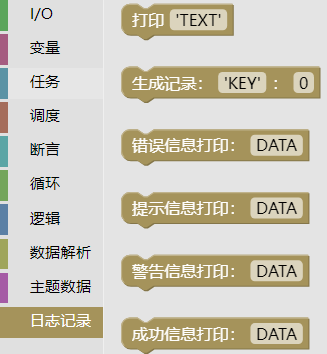
- 打印
  - 对应API：print()
- 生成记录
  - 对应API：set_value()
  - 第一个参数填写网络变量名称：'$.data'。
- 错误信息打印
  - 对应API：elog.error()
- 提示信息打印
  - 对应API：elog.info()
- 警告信息打印
  - 对应API：elog.warn()
- 成功信息打印
  - 对应API：elog.ok()
- 执行输出
  - 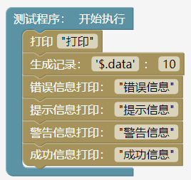
  - 