## 流程图搭建

### 案例说明
通过搭建下面的流程图，加深对流程图的认识。该流程图的上下两个路径并发同步执行，先【发送msg】，接下来，当接收到报文数据时，就会打印接收的报文msg。

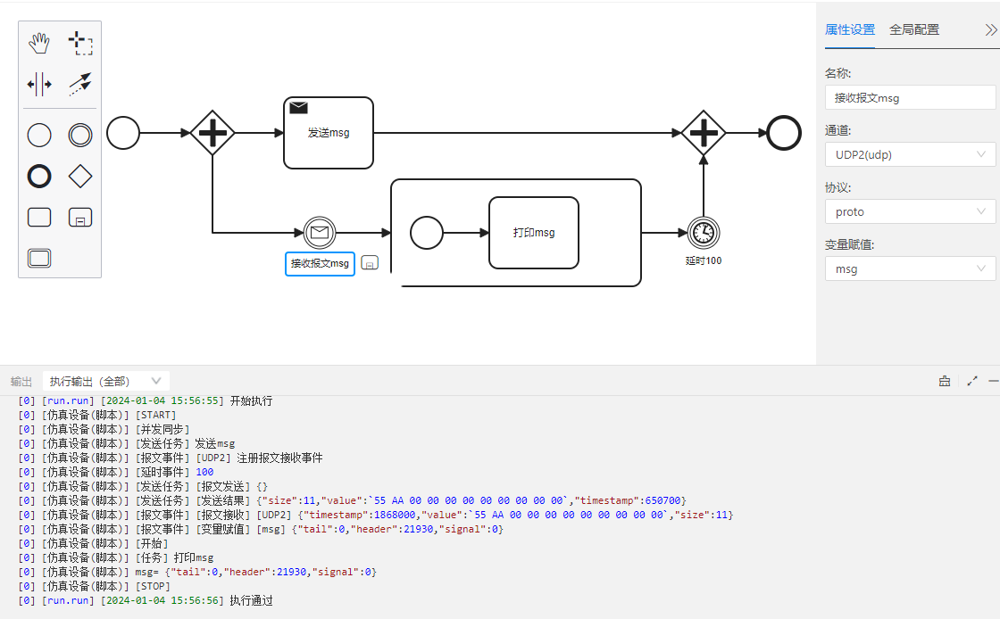

### 案例搭建步骤
1.绘制流程图前，需要准备好【仿真环境】【协议】
- 仿真环境：设备dev含有两个不同端口号的udp通道

     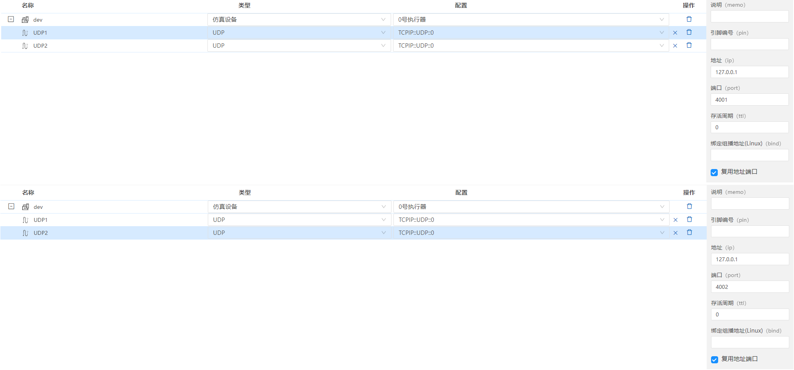

     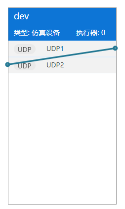

- 协议

    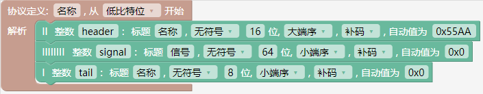

2.新建【流程图】
- 左侧菜单项目下->鼠标右键选择【新建文件】->选择【执行程序(流程图)】
 
  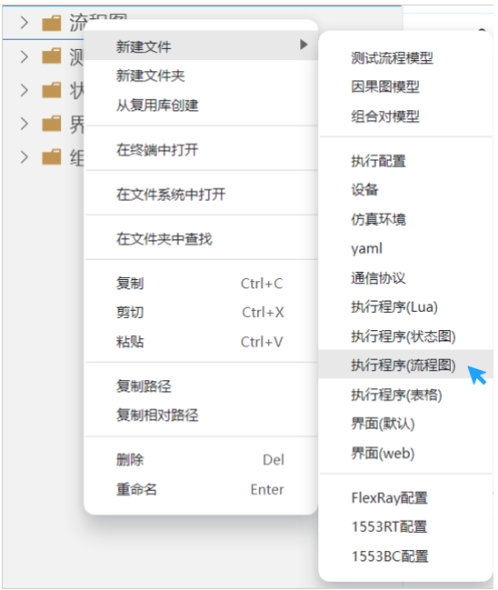

- 输入文件名->回车->生成以“.wfw”为扩展名结尾的流程图文件。

  文件名称支持中文、字母、数字及下划线。

  

3.拖动【开始】到空白处

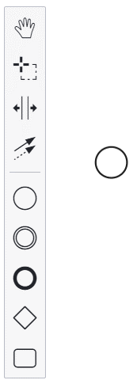

4.点击【开始】，右侧出现快速工具栏，点击网关

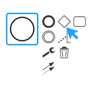

5.【开始】连接【网关】，点击扳手，将【互斥】改成【并发同步】

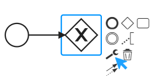

6.点击【任务】	

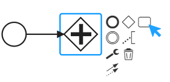

7.改变任务属性:点击【扳手】，选择【发送】

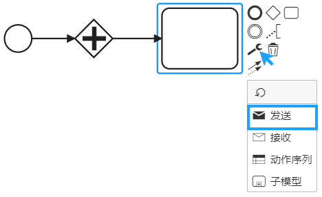

8.【全局配置】绑定设备，添加全局变量。

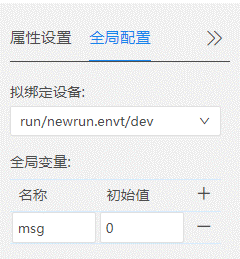

9.点击【发送】任务，【属性设置】填写【名称】【通道】【协议】【报文数据】。

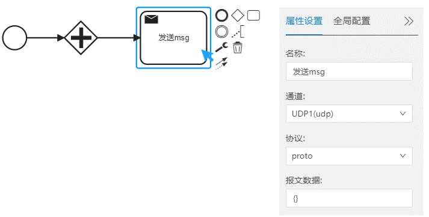

10.点【并发同步】网关的快捷工具【事件】

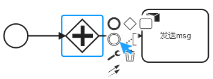

11.添加报文事件。

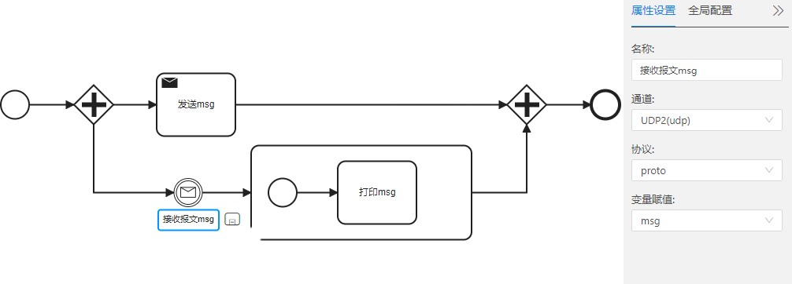

12.添加延时事件

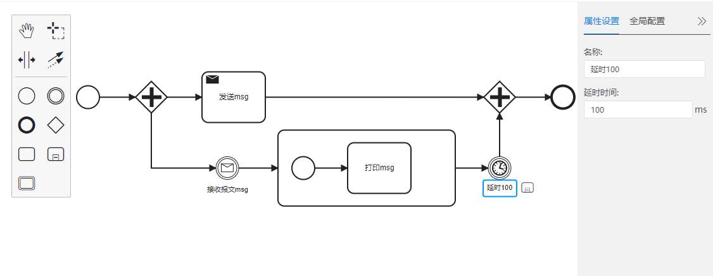

13.将【执行配置】(*.run)的【仿真环境】(*.env)和【执行程序】(*.wfw)填写好。

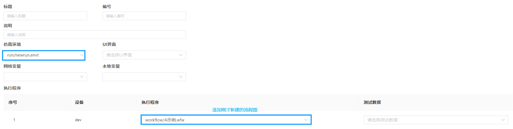

### 本章结束
[点击跳转下一章【表格简介】](#/document?catalogId=45&id=45&type=doc)