## 流程图相关术语
这里会详细介绍流程图的各个元素及其用法。

### 并发同步
对应的并发的API：gather(task1，task2，...)

【并发同步】元素后面的几条路径是同时执行的。
- 如下图，任务A，任务B同时执行。

  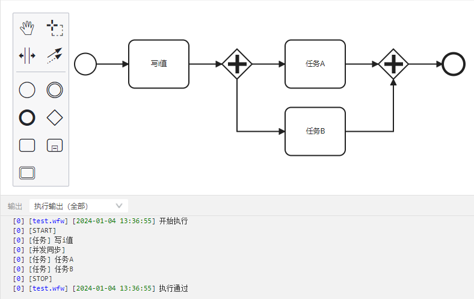

### 互斥
对应代码的if else，根据互斥元素后面线上的条件，决定走哪条路径。

如下图，i>=5时，执行【任务A】，i<5时，执行【任务B】。在互斥前面的【内联脚本】中，填写执行代码【i=10】，可以看到执行了【任务A】

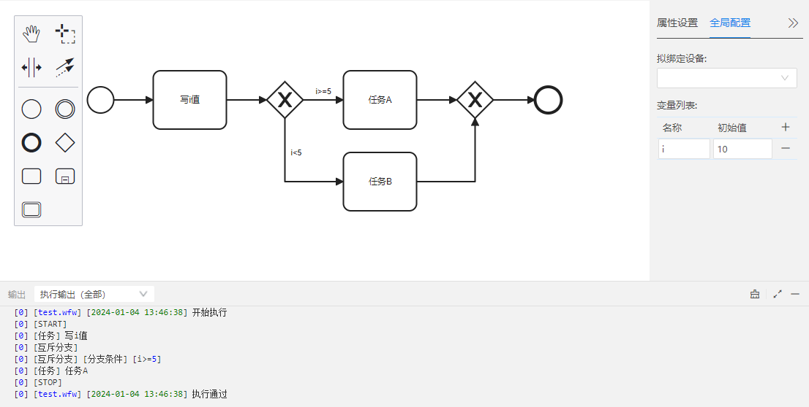

### 缺省
点【连线】快捷工具的扳手，可以更改为【缺省】，它是默认路径。

当有两条以上的路径时，如每条线上的条件均不成立，会执行该【缺省】路径。

下图，任务A那条路径为【缺省】，虽然i的值是7，上下两条路径条件都不成立，但是由于上路径为【缺省】，所以会执行【任务A】。

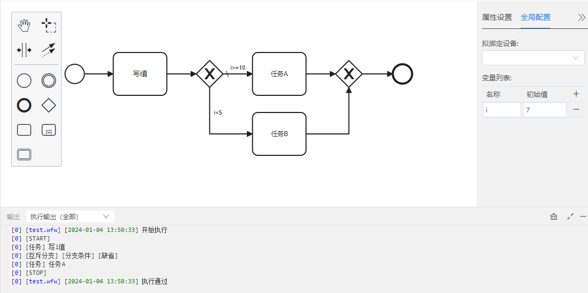

### 事件
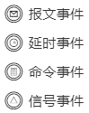

注意：
- 使用【报文事件】，【命令事件】，【信号事件】的时候，都要和并发同步搭配使用，代表回调函数（或定义的新函数）的函数体结束。
- 【报文事件】和【信号事件】，都要放在发送报文或信号的前面，并且不要添加结束符。
原因：比如先发送信号，信号事件还没有启动，所以就不会起监听到通道变化。如果有结束符，那么程序就结束了，信号事件就无法一直监听。

### 报文事件
对应API：on_buff_recv(channel，fn)

当通道内报文数据有变化，就按协议解包报文数据，将报文数据的值赋值给变量，并打印该变量。

如下图【报文事件】的【属性设置】，当设置的通道“UDP2”内检测到数据的时候，会根据协议“proto”解包数据，并将数据赋值给“msg”，并打印“msg”的内容。

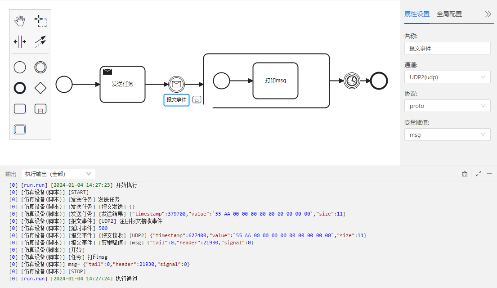

### 信号事件
对应API：
  - on_digital_recv(channel, callback)
  - on_analog_recv(channel, callback)

当通道内的信号（数字信号，模拟信号）有变化的时候，会打印该信号

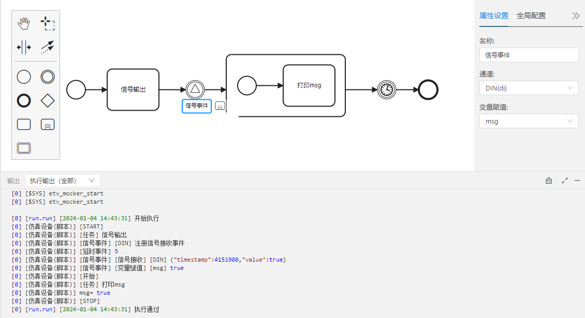

### 命令事件
- 功能：新建一个函数并定义参数名称
  - 命令名称：新建的函数名
  - 参数名称：新建函数的形参名称

- 命令事件后面的内容作为刚才新建函数的实体。
- 示例：新建一个叫myfun()的函数，形参是msg，函数myfun()实体是打印msg内容。在内联脚本【调用myfun函数】中，调用myfun()，并将100传给参数msg。实现打印【msg=100】的功能。

  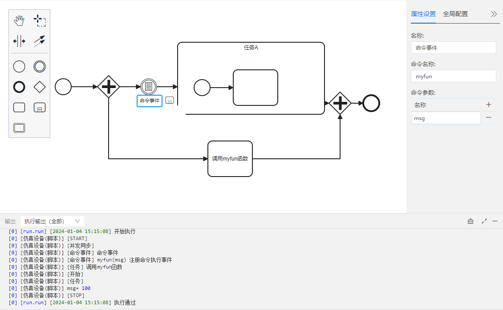

### 延时事件
对应API：etimer.delay()

暂停一定时间后继续

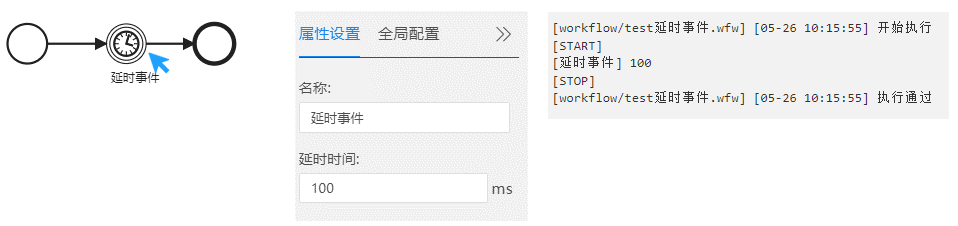

### 任务
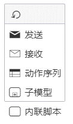

### 内联脚本
定义一段Lua执行脚本。该脚本会原封不动的，嵌入到代码中

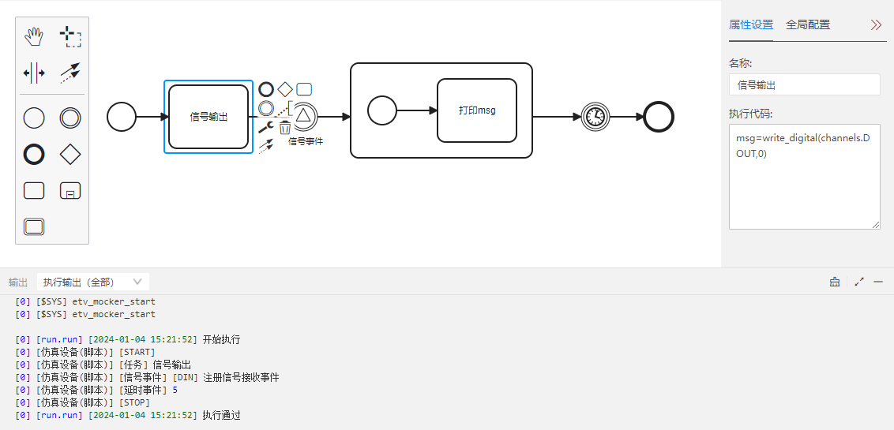

### 发送
使用协议打包报文数据，并在通信通道异步输出

对应API：result = write_msg(channel，prot，msg，is_strict，option)		

- 报文数据：
	- 根据【协议】内容填写【报文数据】。

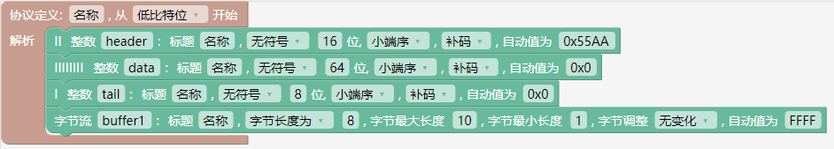

  - 填写内容：
     - 总则：					
       1. 空：{}（协议字段值为协议的【自动值】）				
       2. 仅指定协议中个别字段的值：{header=0xABCD}（未指定的协议字段值为协议的【自动值】）
       3. 指定所有协议字段的值：{header=0xABCD,data=11,tail=12,buffer1=ebuff.from_bytes("mystring")}
     - 协议字段为【整数】的场合：
       1. 十六进制数据：{header=0xABCD,data=0xB,tail=0xC} 				
       2. 十进制数据：{header=43981,data=11,tail=12}				
       3. 不支持字符串："mystring"	
     - 协议字段为【字节流】的场合：
       1. 原始字符串：{buffer1=ebuff.from_bytes("mystring"),header=0xABCD,data=11,tail=12}
       2. 16进制字符串：{buffer1=ebuff.from_hex("1122334455667788")}
       3. 整数：{buffer1=ebuff.from_int(1122334455667788,8)}
       4. 浮点数：{buffer1=ebuff.from_number(1.2345678,8)}

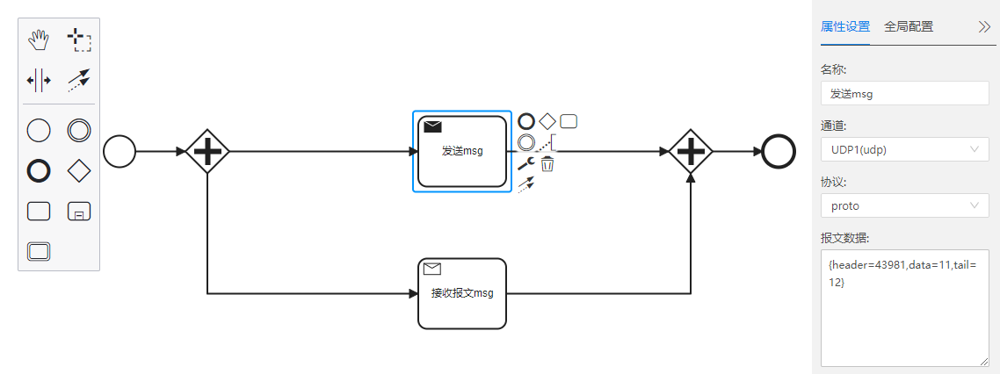

### 接收
异步读取通信通道的输入数据并解析，对应API：result = read_msg(channel，protocol，tout_ms，option)

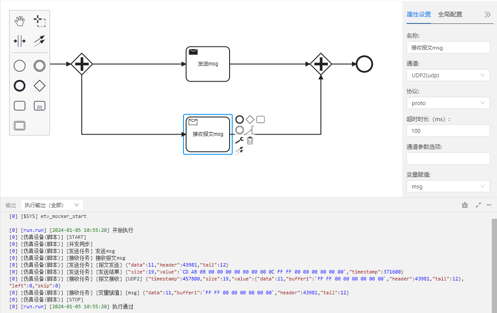

### 动作序列
提供动作列表，作用如下：
- 数据接收：异步读取通信通道的输入数据，对应的API是read_buff。    
- 数据发送：异步输出数据缓存，对应的API是write_buff。    
- 报文接收：异步读取通信通道的输入数据并解析，对应的API是read_msg。    
- 报文发送：使用协议打包报文数据，并在通信通道异步输出，对应的API是write_msg。
- 模拟量输出：异步设置模拟量通道输出值，对应的API是write_analog。
- 模拟量采集：异步读取模拟量输入通道的采集结果，对应的API是read_analog。
- 数字量输出：异步设置开关量输出通道状态，对应的API是write_digital。
- 数字量采集：异步读取开关量输入通道的采集结果，对应的API是read_digital。

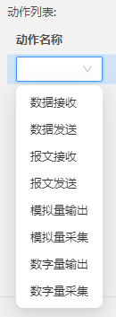

使用步骤：

1.添加一个任务，改成【动作序列】，【全局配置】绑定设备，点击加号【➕】添加变量。

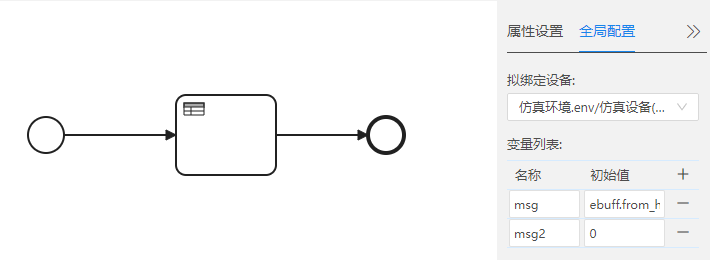

2.在【属性设置】，点击加号【➕】添加【数据发送】，并填写他们的属性设置内容。

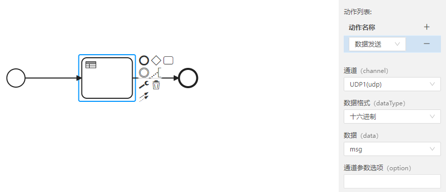

3.添加【数据接收】，并填写他们的属性设置内容。

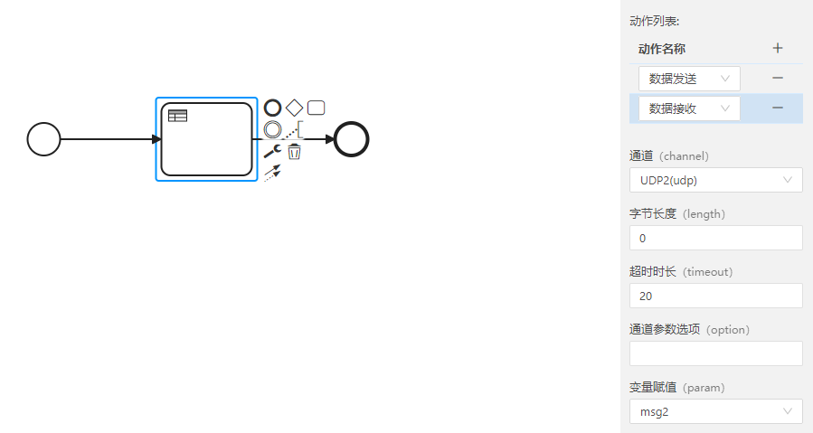

4.说明
- 【write_buff】功能：
  - 【缓存数据】选msg，在【全局配置】中msg的【初始值】为【ebuff.from_hex("11 22 33")】，所以写缓存就是把msg的值写进缓存通道UDP1。	

- 【read_buff】功能：
  - 读取通道UDP2的数据，并赋值给msg2。

- 【IO选项】
  - 【IO选项】是通道参数选项option
     
  - 是否需要填写【IO选项】?

    需根据API手册中【使用XXX通道】的【读数据】【写数据】是否有参数option，来判断是否需要记载【IO选项】。

    例如，udp通道，API手册里记载：
    - 写数据：local w_res = write_buff(channel，buff，option)
    - 读数据：local r_res = read_buff(channel，size，tout)
    
    这里只有【写数据】需要参数option，所以udp通道的write_buff的【IO选项】是需要记载的。read_buff的【IO选项】是不需要记载。
    
        如果无法确定是否需要填写【IO选项】，那就填写。

  - 需要记载哪些参数？

    不同通道，参数选项也不同，具体参考API手册中【通道的使用】，里面记载了各种通道的读写参数。
    例如：udp通道的【写数据】记载如下：
    - option：table 类型，可选参数选项
      - option.to_ip：string 类型，目标 ip 地址
      - option.to_port：number 类型，目标端口号
    所以udp通道的【write_buff】的【IO选项】这样写：{to_ip="127.0.0.1",to_port=4001}

  - 空着不填写的情况：
    仿真设备上的两个udp，有连线，此时，无论是写数据还是读数据，都是不需要设定IP地址和端口号的，所以这里可以空着不填写。
    
    （当然，这里也是可以填写的，信息会发送到你在这里填写的IP地址和端口号）
    
    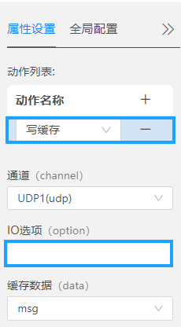
  

5.执行：

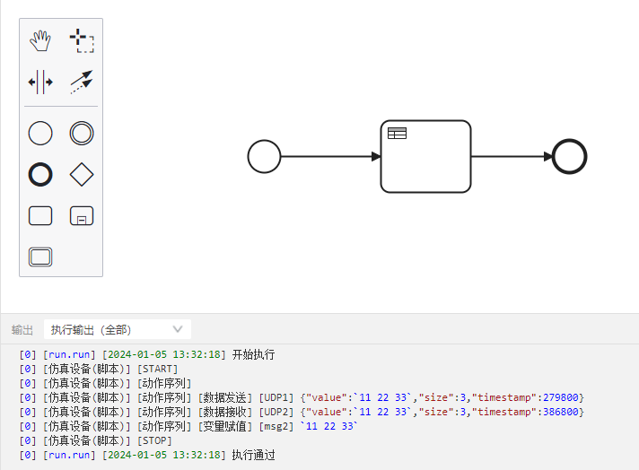

### 子模型
当流程复杂而庞大的时候，如果全部都在一个流程图里表示，结构会十分混乱，有了子模型就可以把小功能封装到子流程里，这样流程图看起来条理更清晰。

子流程定义在父流程里，可以展开显示他所包含的模型细节，也可以收起隐藏细节。

1.新建【任务】，点击扳手切换成【子模型】，点击标记【-】号的方框【展开子模型】

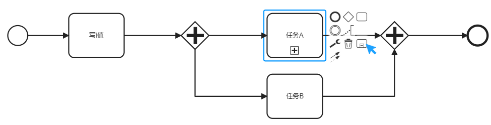

2.进入【子模型】后，搭建【子模型】内容，然后点击【子模型】的右上角的【Root】，返回主流程图。

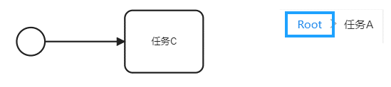

3.执行

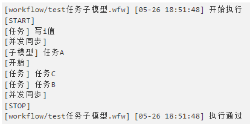

### 周期性
- 周期性的循环方式有两种：
  - 循环周期：Xms（X为整数），对应的API是etimer.interval。
  - 循环次数：X次（X为整数），对应的是Lua里的for循环。

- 循环周期：

  - 例：每20ms执行一次任务A，执行5次跳出循环。

    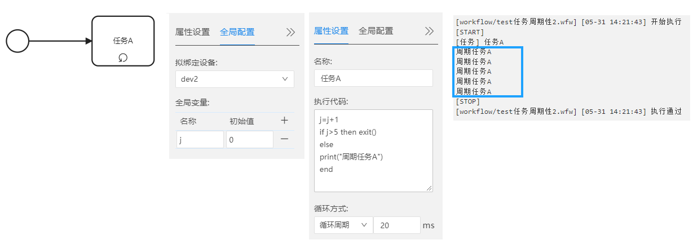

- 循环次数：
  - 例：下图任务A执行3次，任务B执行2次。

    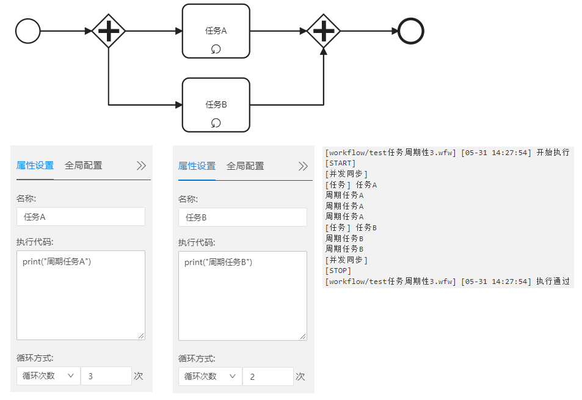

### 本章结束
[点击跳转下一章【流程图搭建】](#/document?catalogId=43&id=44&type=doc)