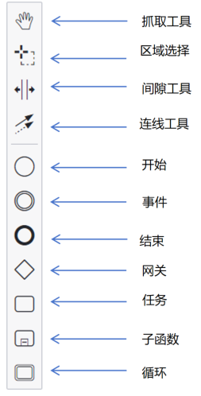
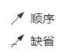
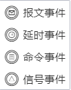
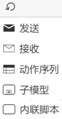
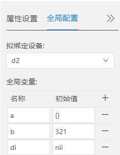
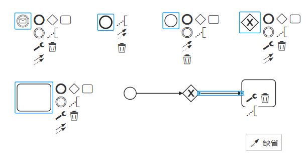

## 流程图简介

### 定义
- 将日常工作中相对固定的流程计算机化，即建立流程图模型。是可支持灵活变化的，可由计算机实现的流程。
- 图形化展示了程序的时序或流程关系。

### 优势
- 图形化的设计通俗易懂，不会编程的用户也可以轻松搭建执行流程。
- 解决了用户对流程灵活变化的需求，可以随用户需要更改。

### 工具介绍

先来看下工具栏：

说明：
- 流程图里面的每个【事件】，【任务】都有对应的API，其属性设置是和API的参数息息相关的，详情可以查看API手册的相关内容。
- 一个设备只能和一个流程图绑定，如果需要多个设备通信，需要多个流程图。

工具：
- 抓取工具：点击抓取图标后，可以整体移动页面。
- 区域选择：选择部分区域，可以对选择区域内的内容进行整体操作（删除或移动）。（快捷键【shift】+鼠标左键）
- 间隙工具：点击后会出现十字交叉线：上下移动时候，移动对象为横线下方内容。左右移动的时候，移动对象为竖线右侧的区域。
- 连线工具：用来连接各个内容（包括开始，结束，事件，网关，任务等），箭头指向的一方为流程的下一步方向。

     【可切换类型】：顺序、缺省
     + 顺序：顺序执行
     + 缺省：默认路径

     

- 开始：触发流程的执行

     【可切换类型】：结束（表明流程执行结束）

- 事件：发生在流程执行过程中的事件。在开始和结束之间发生的事件会影响流程的流转，但不会启动或直接终止流程的执行。
     
     【可切换类型】：报文事件、延时事件、命令事件、信号事件  
     + 延时事件：对应的api是etimer.delay,暂停一定时间后继续。
     + 报文事件：当通道接收报文数据的时候，执行后面内容；报文事件后必须连接一个“子函数”结点定义子函数。
     + 命令事件：定义一个新的函数和参数名称，函数体为命令事件到结束符之间的内容；命令事件后必须连接一个“子函数”结点定义子函数。
     + 信号事件：当接收到数字信号或模拟信号有变化的时候，执行后面内容；信号事件后必须连接一个“子函数”结点定义子函数。

     
 
- 结束：表明流程执行结束。

     【可切换类型】：开始（触发流程的执行）

- 网关：控制流程的分支和聚合。

     【可切换类型】：并发同步、互斥
     + 并发同步：多个路径同时执行；并发同步类型的网关要成对出现，有一个并发同步的开始节点，就必须要有一个并发同步的结束节点。
     + 互斥：只会选择一个符合条件的路径执行；互斥类型的网关要成对出现，有一个互斥的开始节点，就必须要有一个互斥的结束节点。

- 任务：在流程执行过程中执行的工作。可以定义多种类型的任务，同时该任务可以进行循环设置

     【可切换类型】：内联脚本、发送、接收、动作序列、子模型、周期性。
     + 内联脚本：默认任务类型，定义一段执行脚本。
     + 发送：给外部参与者发送消息，消息发送完毕则任务执行完毕。
     + 接收：等待并接收外部参与者发送过来的消息，消息接收完毕则任务执行完毕。
     + 动作序列：提供动作列表，动作包括读缓存，写缓存，读报文，写报文，模拟量输出，模拟量采集，数字量输出，数字量采集。
     + 子模型：子流程定义在父流程里，可以展开显示他所包含的模型细节，也可以收起隐藏细节。
     + 周期性：可以设定循环周期，或者循环次数。

     

- 全局配置  
     可以进行全局配置
     + 拟绑定设备：选择【拟绑定设备】的目的是配置【属性设置】的【通道】。
     + 设置全局变量：点击【+】添加全局变量，编辑名称和初始值(可添加多个)。点击【-】删除全局变量。

     

### 绘制方法
用鼠标将左侧工具拖拽到编辑面板内，鼠标点击不同工具图标后，会相应出现不同的内容面板，点击下一步要连接的内容，会自动进行连线。

### 本章结束
[点击跳转下一章【流程图术语】](#/document?catalogId=42&id=43&type=doc)
