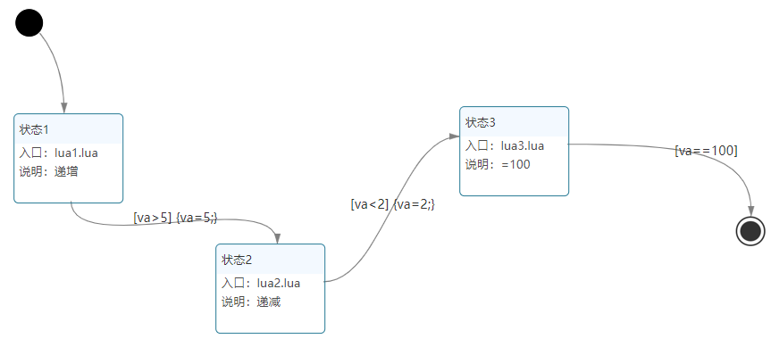
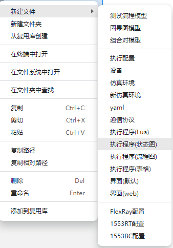
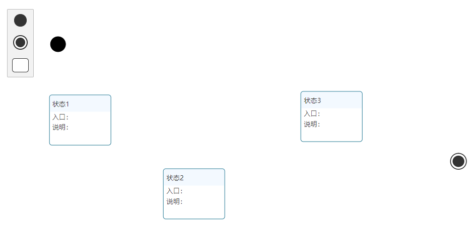
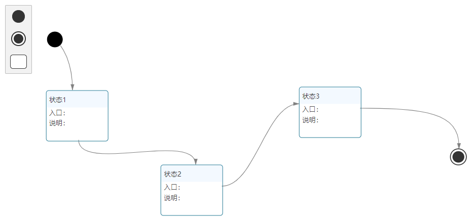
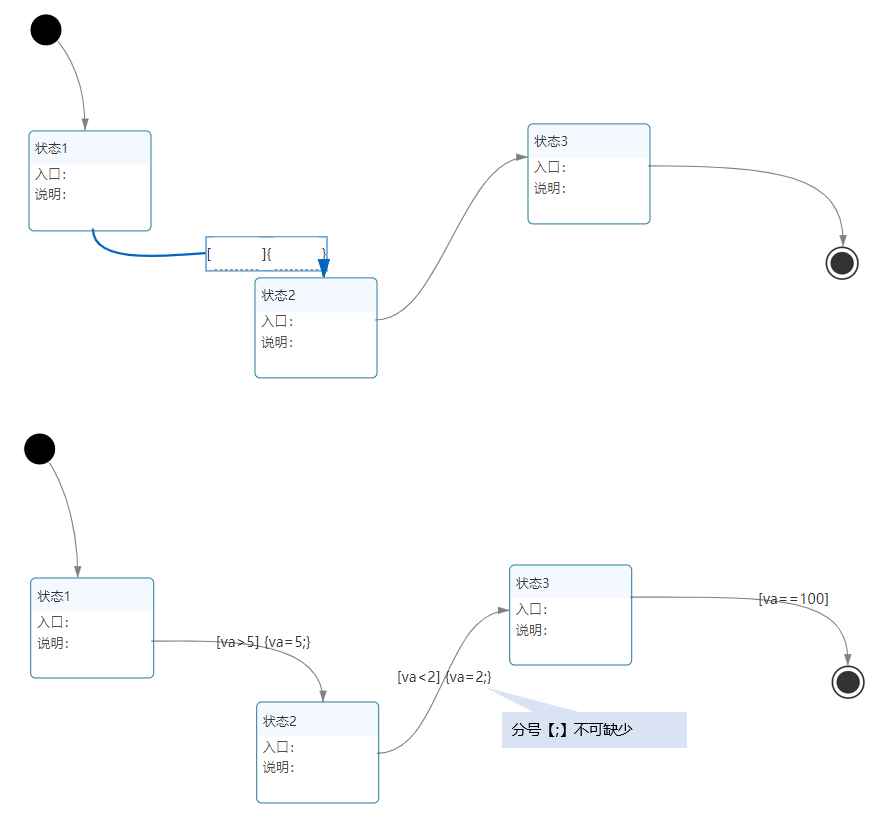
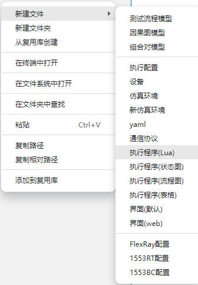
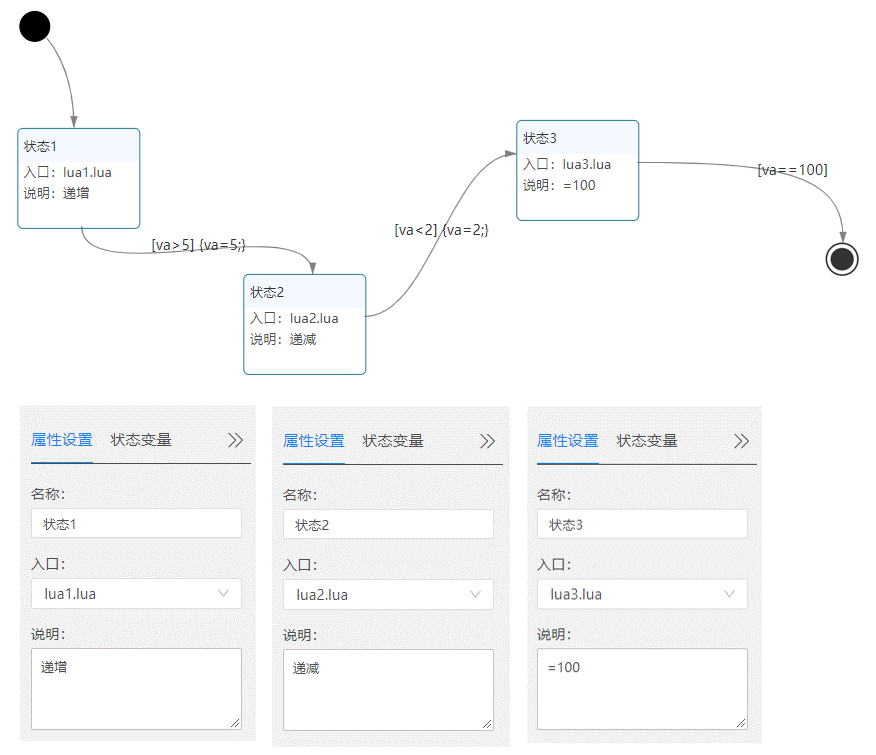
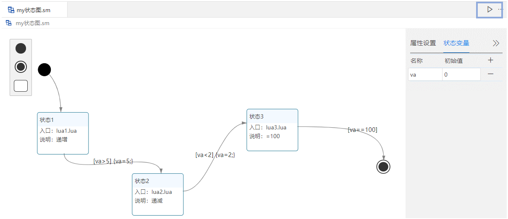
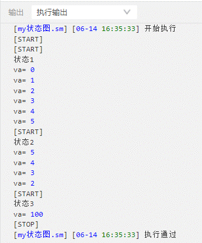

## 状态图搭建

### 案例说明
通过本章节，我们将搭建一个包括三个状态的简单状态图，通过更改状态变量va的值，在三个状态之间转换。



### 案例搭建步骤

1. 新建状态图文件：
   1. 左侧菜单的项目目录下->鼠标右键选择【新建文件】->选择【执行程序(状态图)】->输入名称->回车

      

   2. 输入文件名回车(文件名称支持中文、字母、数字及下划线。)

      

   3. 生成以“.sm”为扩展名结尾的状态图文件。

      

2. 依次拖动【开始】，【状态】(三次)，【结束】到空白处

   

3. 点击【+】添加状态变量va，初始值为0

   

4. 连线：
    
   鼠标放到【开始】边缘，当鼠标变成十字的时候，按住并拖动鼠标到【状态1】的边缘，松手即可连线成功。同理，添加其他连线。

   

5. 双击箭头线，添加表达式。
   
   注意：【开始】和【状态】之间的箭头线无法添加表达式）

   

6. 新建三个lua文件，分别取名为lua1.lua，lua2.lua，lua3.lua。

   

   - lua1.lua	
    ```lua
        local local1
        function entry()
          print(estate.current())           --打印当前状态的名称
          while true do                     --循环体↓
            local1 = estate.get_value('va') --取得va的值，赋值给local1
            print("va=", local1)            --打印local1的值   
            local1 = local1 + 1             --local1值加1 
            estate.set_value('va', local1)  --设定va的值为local1
          end                               --循环体↑
        end
    ```	
	
   - lua2.lua	
    ```lua
        local local1
        function entry()
          print(estate.current())
          while true do
            local1 = estate.get_value('va')
            print("va=", local1)
            local1 = local1 - 1             --local1值减1 
            estate.set_value('va', local1)
          end
        end
    ```	
	
   - lua3.lua	
    ```lua
        local local1
        function entry()
          print(estate.current())
          local1 = estate.get_value('va')
          local1 = 100                      --local1值等于100
          print("va=", local1)
          estate.set_value('va', local1)
        end
    ```	
						
7. 设置【状态】的【属性设置】

   

8. 执行：点击右上角的三角

    

    

9. 功能说明
   1. va的初始值是0，从【状态1】开始，
   2. 在【状态1】，执行lua1.lua文件，va的值循环递增，当va=6的时候，满足迁移条件【va>5】执行【va=5】，并迁移到【状态2】
   3. 在【状态2】，执行lua2.lua文件，va的值循环递减，当va=1的时候，满足迁移条件【va<2】执行【va=2】，并迁移到【状态3】
   4. 在【状态3】，执行lua3.lua文件，va=100，满足迁移条件【va==100】，迁移到【结束】


### 本章结束
[点击跳转下一章【流程图简介】](#/document?catalogId=41&id=42&type=doc)

