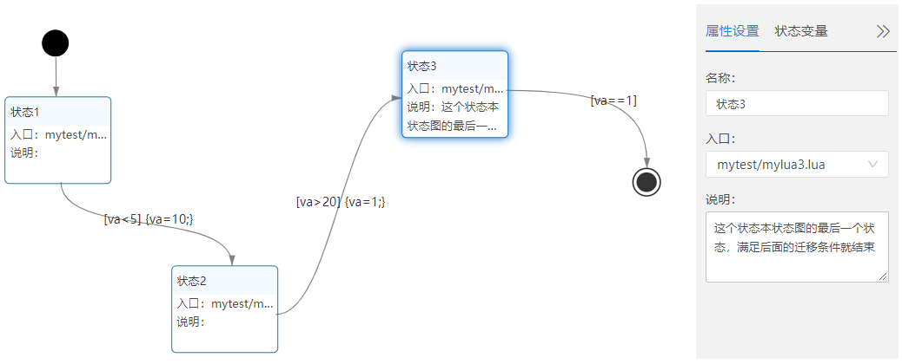
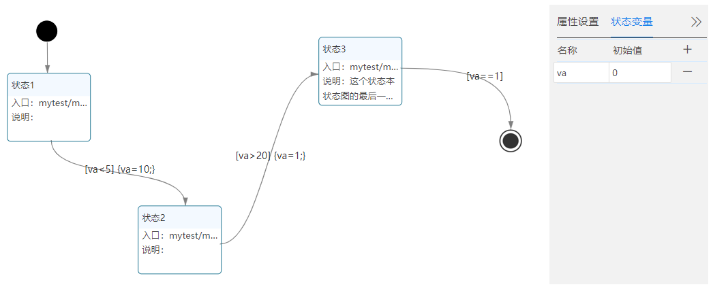
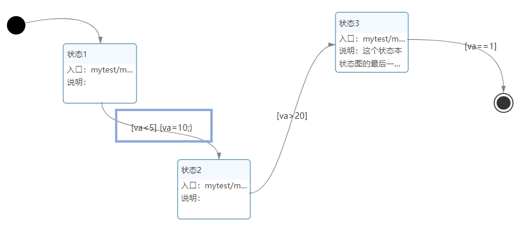
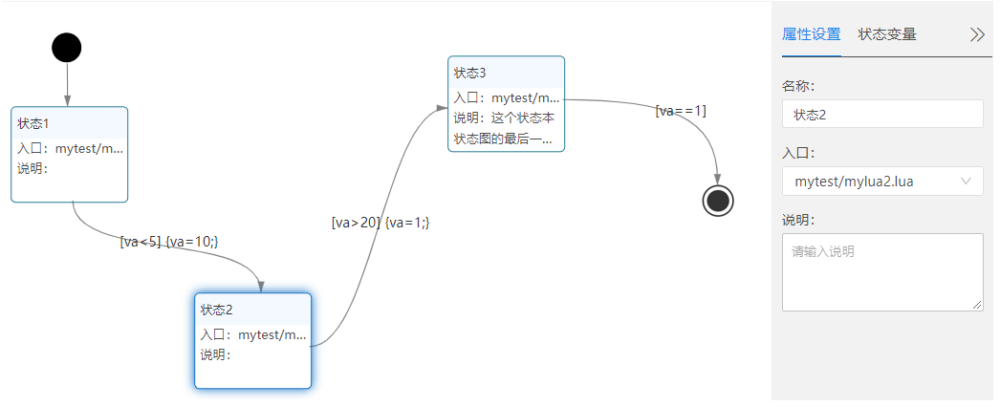
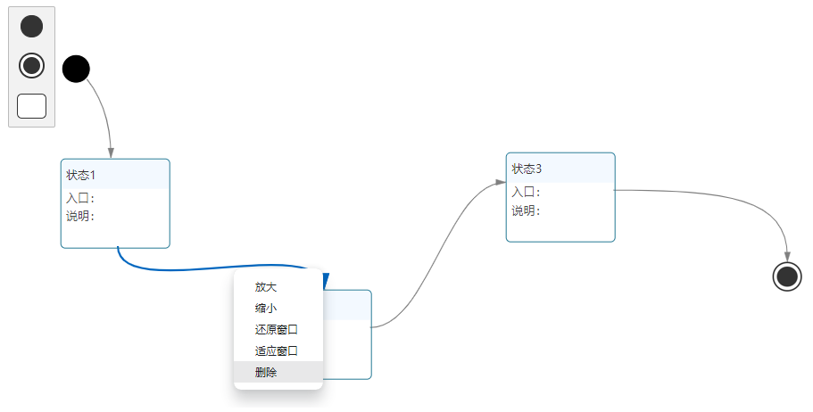
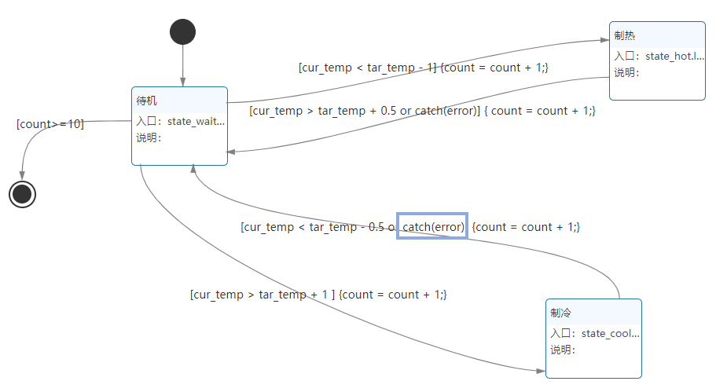

## 状态图相关术语

### 属性设置
- 操作：点击某【状态】，可对该【状态】进行【属性设置】。
- 【属性设置】包括设置名称、入口、说明。
  - 名称：填写当前状态的名称。
  - 入口：
    - 进入某一状态时执行的动作。
    - 填写内容：Lua文件名(\*.lua)，或流程图文件名(*.wfw)
  - 说明：填写对该状态的说明内容，增加可读性。

  

### 状态变量
- 定义：状态变量是在【状态图】中定义和使用的local变量。（在该【状态图】定义的变量，只能在该【状态图】使用。）
- 添加：
  - 点击【+】添加变量的【名称】和【初始值】。

  

  - 变量的初始值必须填写，否则报错。

    

- 删除：点击【-】删除。

  

- 使用场景：
  - 场景一：在箭头线上使用。
    - 例：下图状态1，2之间的[va<5]{va=10}

      

  - 场景二：在【入口】的lua文件里使用。
    - 例：【状态2】的入口文件是【mylua2.lua】:

      

      【mylua2.lua】的代码内容:
      ```lua
      local a
      function entry()
          print(estate.current())			    --输出当前状态的名称：状态2	
          a = estate.get_value("va")		    --取得va的值并赋值给a
          print("va=",a)					    --打印a的值
          a = 100
          estate.set_value('va',a)		    --使得va的值等于a(=100)
          print("va=",estate.get_value("va"))	--打印va的值
      end
      ```
    - result = estate.get_value(key)
      - 取key的值给变量result
      - key：string类型
    - estate.set_value(key, value)
      - 设key的值为value
      - key：string类型
      - value：any类型

### 状态迁移
- 箭头线：两个状态之间带箭头的连线，箭头指明了状态迁移的方向。
- 添加箭头线方法：把鼠标放到图标的边缘，此时鼠标变成加号，按住鼠标，拖动到另一个图标的边缘即可连线成功。
- 删除箭头线方法：点击箭头线->鼠标右键->删除。

  
- 箭头线上的表达式：
  - 状态迁移通常是由事件触发的，在这种情况下应在表示状态转换的箭头线上标出触发转换的事件表达式；如果在箭头线上未标明事件，则表示在源状态的内部活动执行完之后自动触发转换。
  - 语法如下：
    - [条件表达式]{执行语句;}

      中括号[]里放置条件表达式，大括号{}里放的是执行语句(四则运算，赋值语句)，注意执行语句后面要加分号【;】可以添加多个执行语句。
      - []例

        a>10

        a~=10

        a>10 or a~=15

      - {}例
      
        count = count + 1;

        a=10;b=10+a;c=10;
        
      当中括号里条件成立时就会执行大括号里的语句，然后发生状态迁移。
      
  - 编辑方法：双击连线，即可编辑内容。
- 例：
  状态1，2之间的[va<5]{va=10}，假设当前状态为【状态1】，当va的值满足迁移条件【va<5】的时候，执行【va=10】，并迁移到【状态2】执行【状态2】的【入口】文件【mylua2.lua】。

  

### 事件
- estate.throw("事件名")
  - 功能：抛出事件
  - 用法：将estate.throw("事件名")写在lua脚本中。
- catch(事件名)
  - 功能：当检测到该【事件名】的时候，会返回一个true，没检测到返回false。
  - 用法：作为状态迁移的条件，将catch(事件名)写在箭头线上。
  
- 示列：下图，在制冷状态的入口函数中，抛出一个叫error的事件。当检测到事件名error的时候，catch(error)会返回true，发生状态迁移，即由制冷迁移到待机状态。
    
    ```lua
    function entry()
      print('entry state_cool')
      estate.throw("error")      --抛出事件error
      --省略--
    end
    ```				

    

### 本章结束
[点击跳转下一章【状态图搭建】](#/document?catalogId=39&id=41&type=doc)