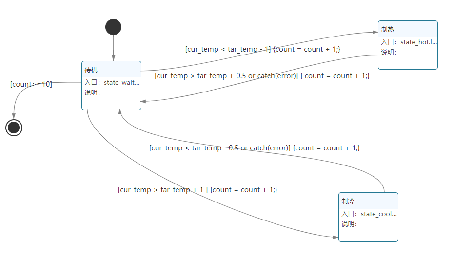
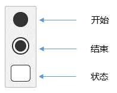
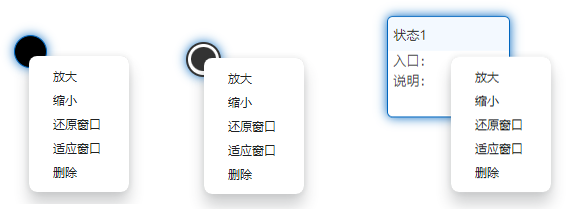

## 状态图简介

### 什么是状态图
- 状态图是描述状态变化的图形；描述了“一个对象”状态与状态的转变并且给出了状态变化序列的起点和终点。说明对象在它的生命期中响应事件所经历的状态序列，以及它们如何根据当前所处的状态对不同的事件做出响应。

### 使用场景
- 适合行为由其状态决定的对象，即根据模型元素所处的状态而有所变化的行为。
- 当设备存在多种工作模式时，设备的不同模式之间进行的切换，用状态图来表达。

### 优势
- 图形化的设计通俗易懂，不会编程的用户也可以轻松搭建。
- 指明对象在它的整个生命周期里，响应不同事件时，执行相关事件的顺序。

### 工具栏

- 开始：开始启动，开始图标只能指向下一级进行连接，一个状态图只能有一个开始。
- 结束：执行结束，结束图标只能被上一级连接。
- 状态：对象在其生命周期中的一种状况，处于某个特定状态中的对象必然会满足某些条件、执行某些动作或者是等待某些事件。

### 鼠标右键操作
  
- 选中工具图标，点击鼠标右键后会出现菜单选项，可以相应进行放大、缩小、还原窗口、适应窗口、删除操作。

  

### 本章结束
[点击跳转下一章【状态图术语】](#/document?catalogId=38&id=40&type=doc)

