## 表格搭建

### 案例说明
通过本章节，我们将创建两个表格执行程序，一个表格通过UDP通道发送数据，另一个通过UDP通道接收数据，最后同时运行。

### 案例搭建步骤

1. 新建表格前，需要准备好【仿真环境】【协议】
   1. 新建【仿真环境】newenv.env
  
      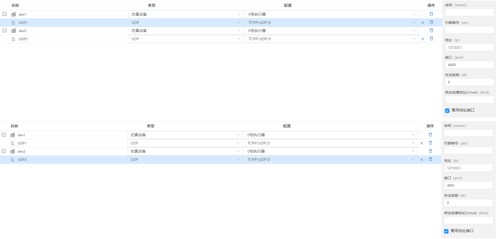

      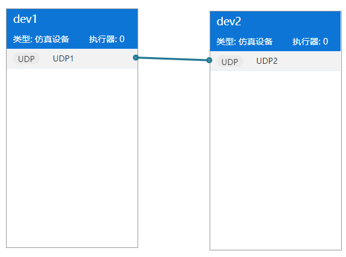

   2. 新建【协议】myptoy.prot：新建后，将前两个数据改成【大端序】

      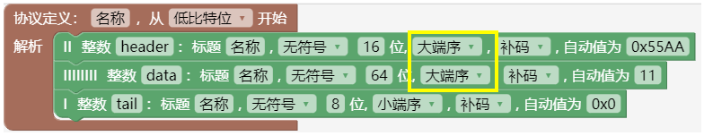

2. 新建【表格】
   1. 左侧菜单的项目目录下->鼠标右键选择【新建文件】->选择【执行程序(表格)】

      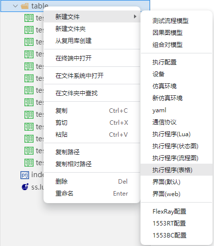

   2. 输入名称->回车（文件名称要符合标识符命名规范。）  

      

   3. 表格文件以“.tce”为扩展名结尾的文件。

      

   4. 新建【示例接收.tce】
      - 方法1：新建【示例接收.tce】
      - 方法2：点击刚刚新建的【示例发送.tce】Ctrl+C，Ctrl+V，生成副本，然后重命名为【示例接收.tce】

      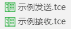

3. 编辑【示例发送.tce】
   1. 点开【示例发送.tce】的界面，然后点击【输出】旁边的小三角形，展开【输出】,将【数据发送】拖拽到右侧空白处

      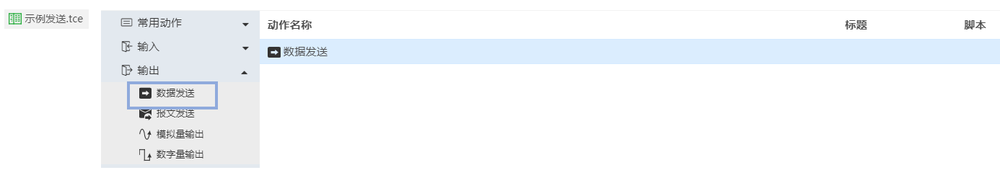

   2. 点击【数据发送】，填写右侧的【全局配置】，填写【动作设置】。

      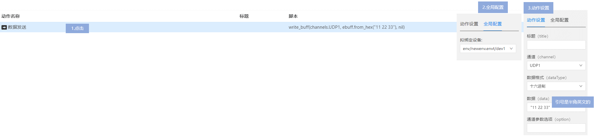

   3. 拖拽【打印】，并填写其【动作设置】。这里打印内容填写为【channels】

      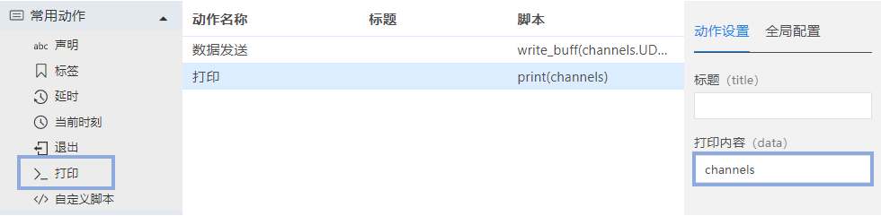

4. 编辑【示例接收.tce】

   1. 点开【示例接收.tce】的界面

      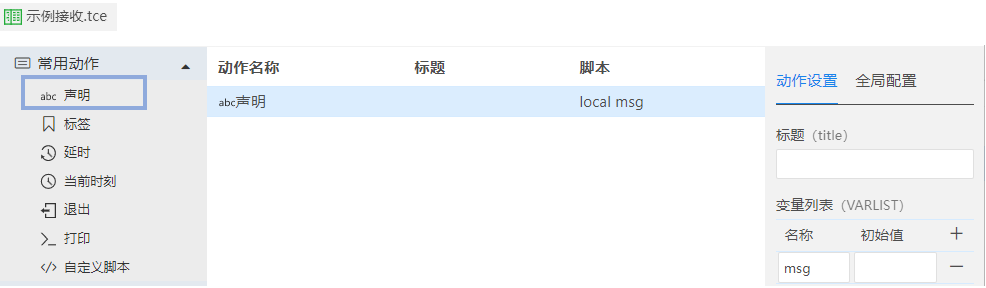

   2. 拖拽【声明】，添加变量local变量msg

      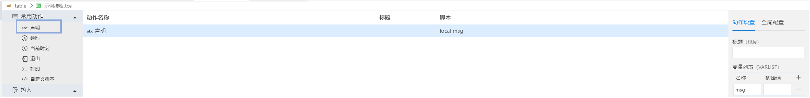

   3. 拖拽【数据接收】，填写【全局配置】，【动作设置】

      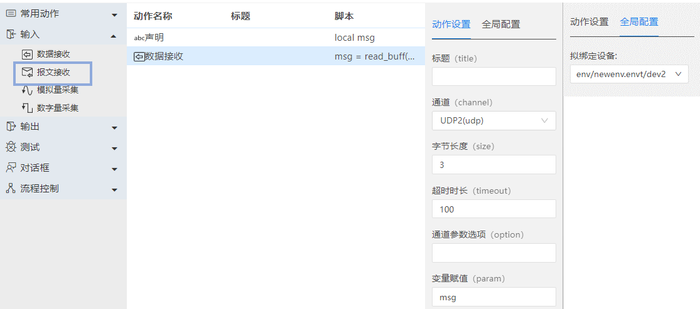

   4. 拖拽【if】，填写【动作设置】
      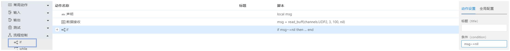

   5. 拖拽【打印】到空白处，然后将【打印】拖拽到【if】里（成功后，可以看到【打印】比【if】缩进了一些）。然后填写【打印】的【动作设置】

      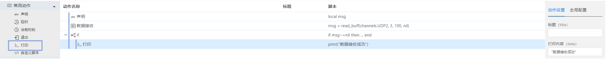

   6. 拖拽【退出】

      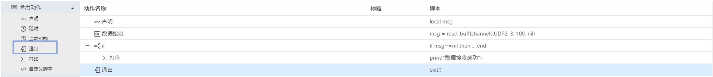

5. 新建【执行配置】run_table.run（绑定【仿真环境】和【表格】）

   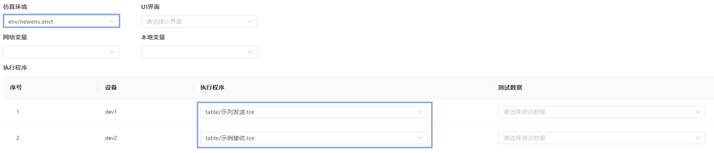

6. 执行，以下方法任选其一：
   - 方法一：点击要执行的【表格】（【示例接收.tce】或者【示例发送.tce】）的右上角的【执行】按钮

     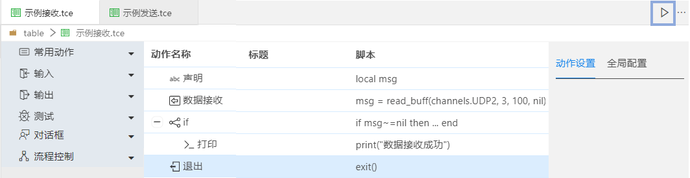

   - 方法二：点击执行配置【run_table.run】的右上角的【执行】按钮

     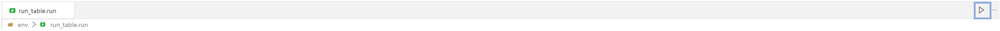

7. 执行结果

   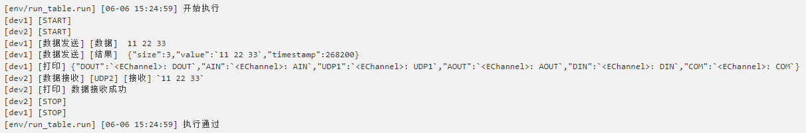

8. 功能说明

   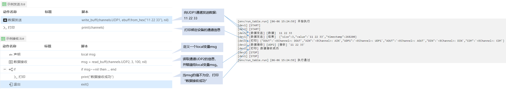

### 本章结束
[点击跳转下一章【python】](#/document?catalogId=49&id=49&type=doc)