## 表格相关术语
这里会详细介绍表格的各个动作及其用法。

### 常用动作
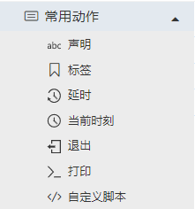

#### 声明
- 功能：定义local变量，并添加初始值。

  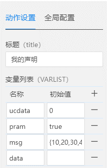

- 【标题】：可以填写适当的内容，也可以为空。
- 【初始值】可以填写各种类型的内容，也可空着不填写。
  - number：
    - 10
    - 52.1
  - boolean：
    - true
    - false
  - string：
    - "我shi字符串"
    - '我shi字符串'
    - [[我shi字符串]]
  - table：
    - {10,20,30,40}
    - {a=10,b=20,c=30,d=40}

- 在【声明】里添加的变量属于本地local变量，只能在当前表格使用。

  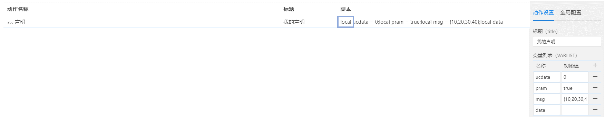  

- 在表格中使用的变量需要【声明】里添加定义。如没有声明直接使用某变量，那么该变量的值为nil。

#### 标签
- 相当于lua脚本的注释

  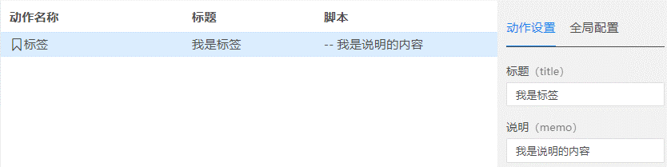

#### 打印
- 对应API：print(v1，v2，...)
- 【标题】填写的内容显示在表格的【标题】栏。
- 【打印内容】
  - 遵循print()的Lua语言语法

    例如："ucdata=",ucdata,"pram=",pram,"msg=",msg,"data=",data

    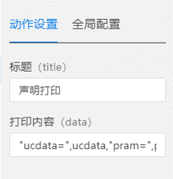
    
- 【声明】和【打印】的示例：

  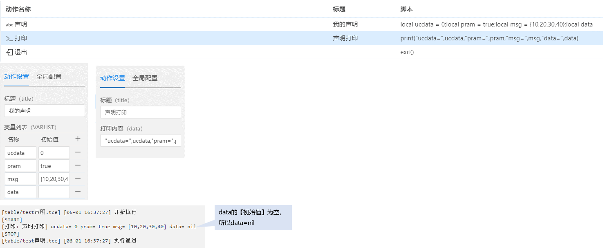

#### 延时
- 功能：延长一段时间
- 对应API：etimer.delay(tout_ms)
- 【标题】：可以填写适当的内容，也可以为空。
- 【延时时间】整数类型（大于等于零的整数）。例：200，10000

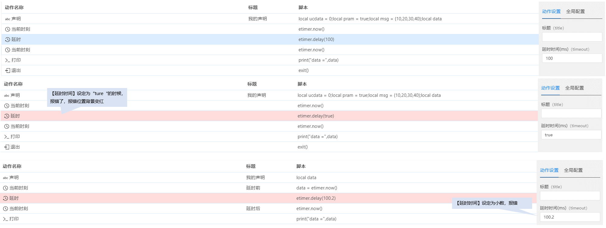

#### 当前时刻
- 功能：程序启动后至当前点的时长
- 对应API：value = etimer.now(format)
- 【标题】：可以填写适当的内容，也可以为空。
- 【变量赋值】可为空。可填写【声明】中的local变量。【执行完当前时刻】后，该变量的值为程序启动后至当前点的时长。

  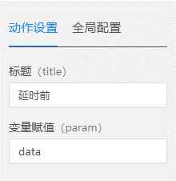

- 【延时】和【当前时刻】的示例
  - 如下图，因为延时100ms，所以两次当前时刻的值的差**大概**也是100ms。

  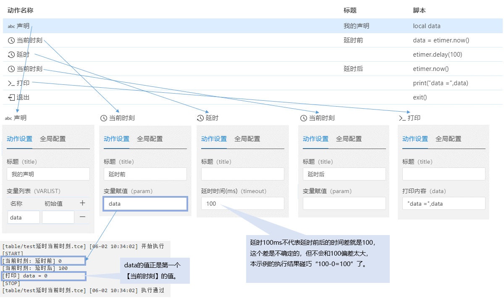

#### 退出
- 功能：退出执行程序
- 对应API：exit()
- 示例：

  - 如下图，没有添加动作【退出】，点击执行，程序会一直执行，点击界面右上角的方块才会停止[STOP]。

    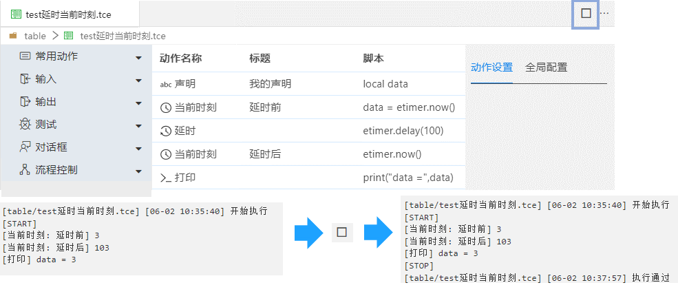

  - 添加【退出】后，会自动停止[stop]
    
    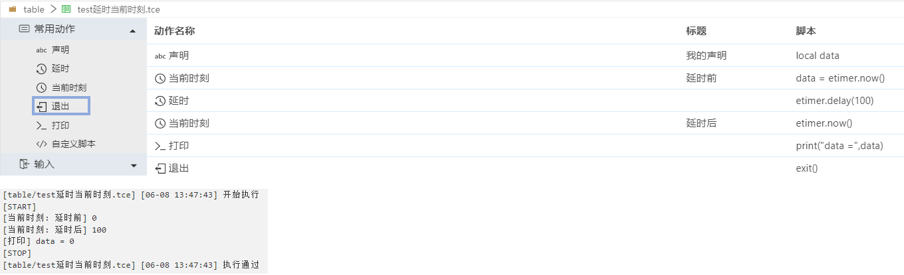

#### 自定义脚本
- 功能：可以自定义Lua脚本内容，使用方法灵活。
- 可以填写一条或多条代码，内容不限（定义局部变量，或者调用API等）。建议一个【自定义脚本】只写一条代码。
  - 多条脚本

    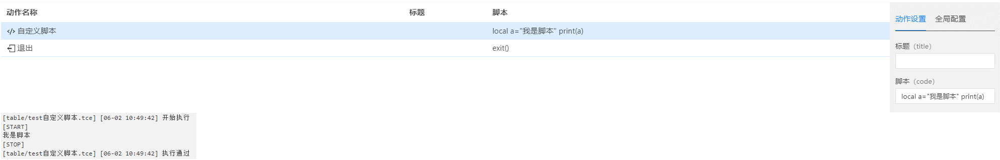

  - 一条脚本

    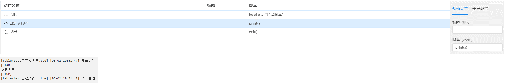
- 示例
  - 通过在whlie循环中添加【自定义脚本】，改变i的值，从而使得while循环的条件不成立，跳出while循环。

    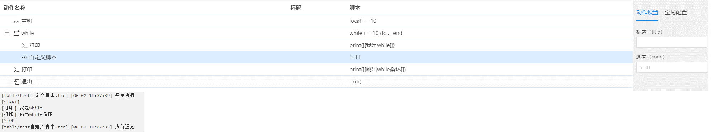

### 输出

  

#### 数据发送
- 功能：异步输出缓冲区数据。适用于总线型通道。
- 对应API：result = write_buff(channel，buff，option)

  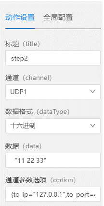

- 【标题】：可以填写适当的内容，也可以为空。
- 【数据格式】与【数据】
  - 【数据格式】有两种：十六进制，字符串
    - 选择【十六进制】时，对应的【数据】输入如下：“112233”或“11 22 33”

      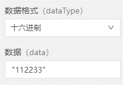

    - 选择【字符串】时候，对应【数据】输入如下：

      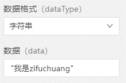

- 【通道参数选项】：k-v键值对，缺省参数 nil
  - 根据不同的通道类型，填写对应的参数。可以为空。
    
    

  - 【通道参数选项】和流程图的【IO选项】是一样的，只是叫法不同，它们都对应API的参数option。[点击查看【IO选项】](#/document?catalogId=42&id=43&type=doc#option-id)

- 示例

  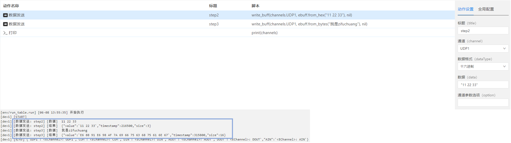

#### 报文发送
- 功能：使用协议打包报文数据，并在通信通道异步输出。适用于总线型通道。
- 对应API：result = write_msg(channel，prot，msg，is_strict，option)

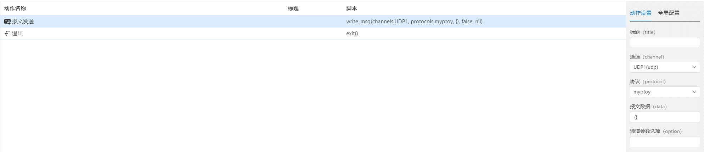

- 【报文数据】
  - 【报文数据】根据【协议】内容填写【报文数据】，以下面协议为例，说明报文数据可填写的几类内容
    
     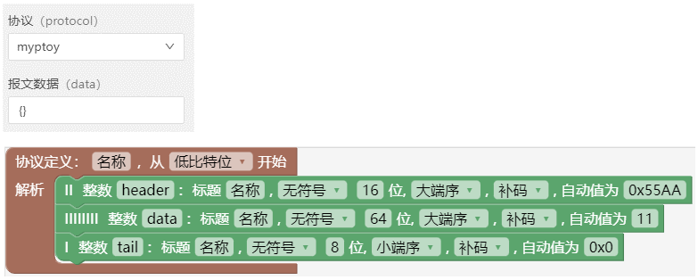
  - 【报文数据】填写内容：
    - 空：{}（所有协议字段为协议的【自动值】）

       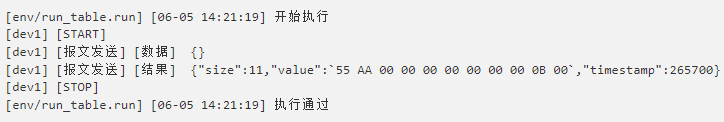

    - 仅指定协议中个别字段的值：{header=0xABCD}（未指定的协议字段为协议的【自动值】）

       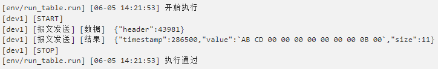

    - 十六进制数据：{header=0xABCD,data=11,tail=12} 

       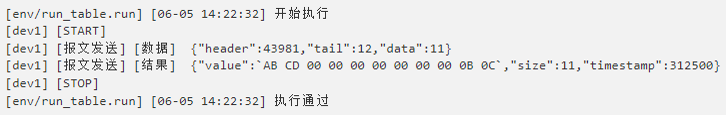

    - 十进制数据：{header=43981,data=11,tail=12}

       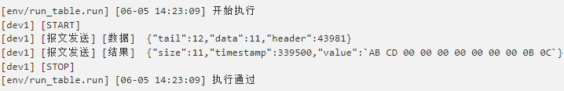

- 【通道参数选项】：k-v键值对，缺省参数 nil
  - 根据不同的通道类型，填写对应的参数。可以为空。
    
    

  - 【通道参数选项】和流程图的【IO选项】是一样的，只是叫法不同，它们都对应API的参数option。[点击查看【IO选项】](#/document?catalogId=42&id=43&type=doc#option-id)

#### 模拟量输出
- 功能：模拟量通道异步输出
- 对应API：result = write_analog(channel，value)

  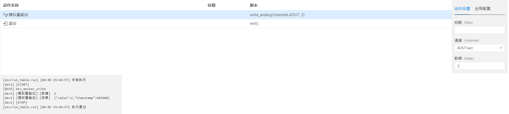

- 【数据】：类型为number，也就是双精度的实浮点数。
  - 例：0，2，1.2，-10

#### 数字量输出

- 功能：数字量通道异步输出
- 对应API：result = write_digital(channel，value)

- 【数据】：输出的状态值。
  - true
  - false
  - 1
  - 0
  
  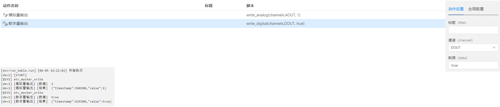

### 输入
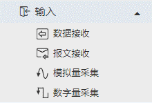

#### 数据接收
- 功能：异步读取通信通道的输入数据。适用于总线型通道。
- 对应API：result = read_buff(channel，size，tout_ms，option) 
  
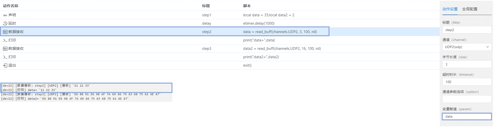

- 【字节长度】：integer 类型，读取数据的字节长度，0 表示全部读取
- 【超时时长】：当超过输入的时间，就停止接收。单位ms，number 类型(双精度浮点型) 
- 【通道参数选项】：k-v键值对，缺省参数 nil
  - 根据不同的通道类型，填写对应的参数。可以为空。    
  - 【通道参数选项】和流程图的【IO选项】是一样的，只是叫法不同，它们都对应API的参数option。[点击查看【IO选项】](#/document?catalogId=42&id=43&type=doc#option-id)

- 【变量赋值】：需要事先在【声明】里定义该变量，然后在【变量赋值】中填写该变量。如上图，接收数据后，将接收的数据赋值给变量data。

- 【数据发送和数据接收的示例】

  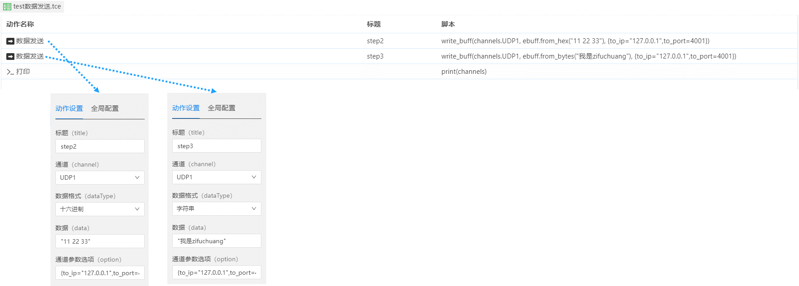

  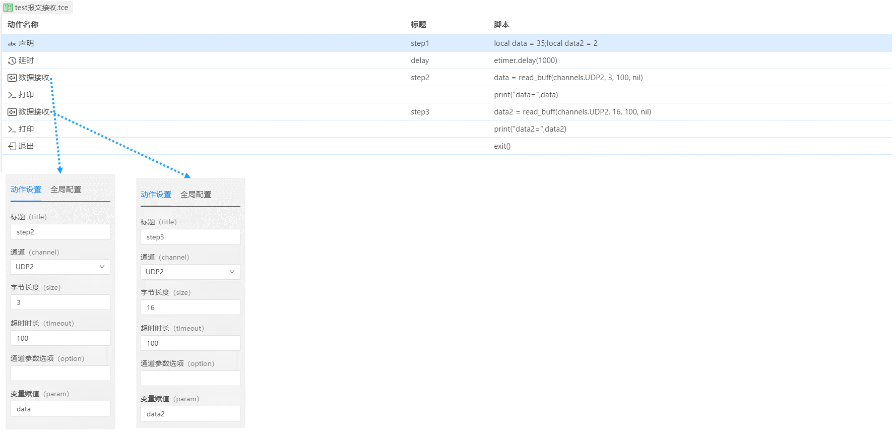

  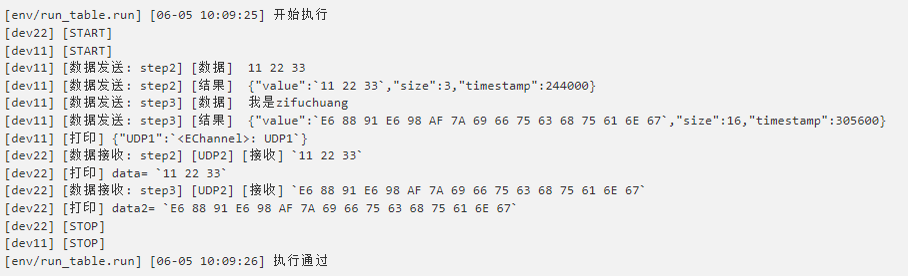

#### 报文接收
- 功能：异步读取通信通道的输入数据并按照协议解析。适用于总线型通道。
- 对应API：result = read_msg(channel，protocol，data，option)
- 示例：发送报文数据为空【{}】，接收值为协议字段的默认值

  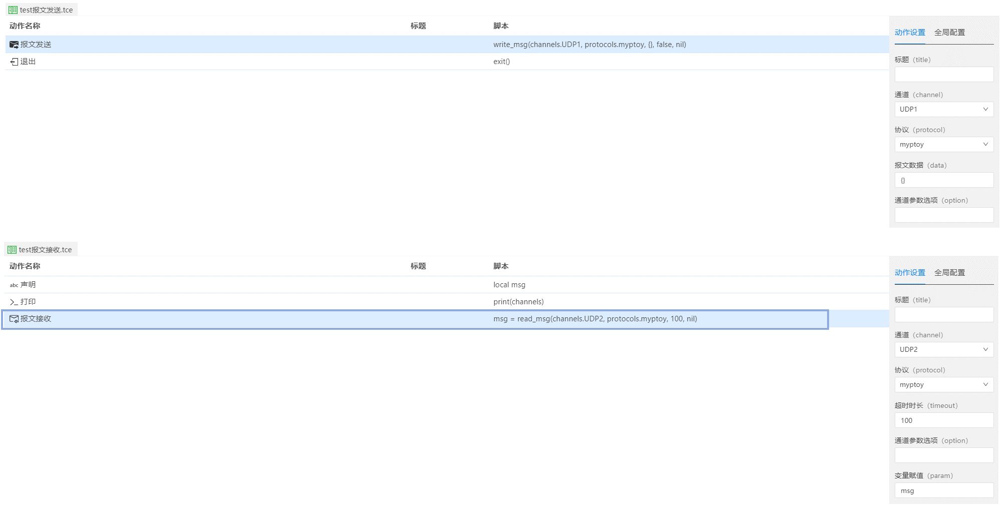

  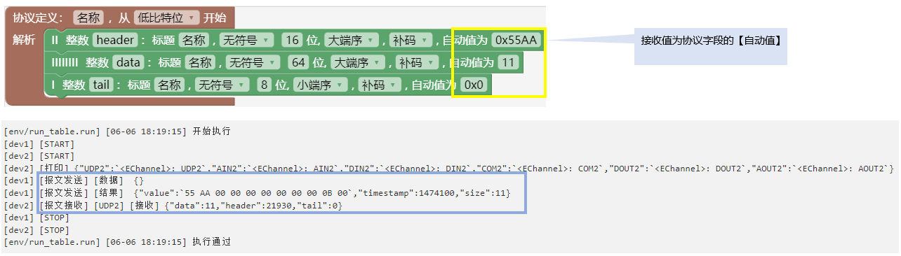

#### 模拟量采集
- 功能：异步读取模拟量输入通道的采集结果
- 对应API：result = read_analog(channel)
- 【通道】：模拟通道
- 【变量赋值】：【声明】中定义的变量名称

  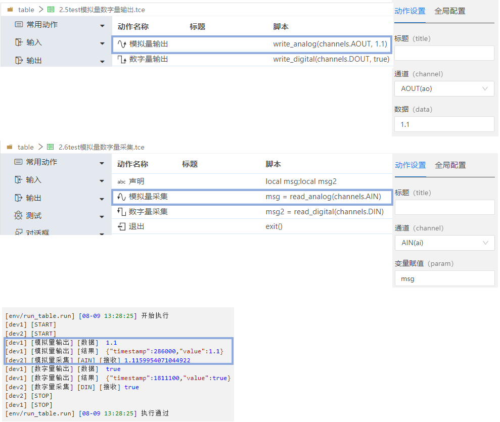

#### 数字量采集
- 功能：异步读取数字量(开关量)输入通道的采集结果
- 对应API：result = read_digital(channel)
- 【通道】数字通道
- 【变量赋值】：【声明】中定义的变量名称

  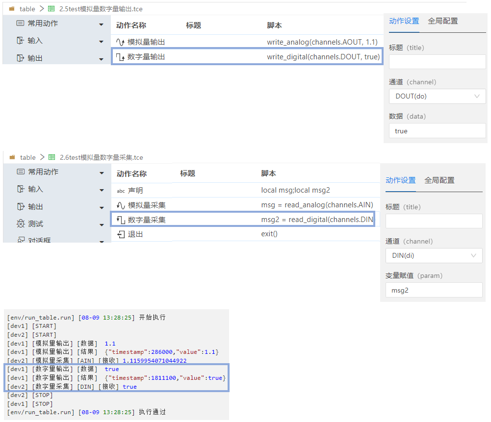

### 测试

#### 合格/失败测试
- 功能：当条件成立，返回true；当条件不成立，返回false
- 对应API：passed = verify(condition，fail_tip)
- 【测试条件】：填写条件。例如：a==b
- 【测试失败信息】：string 类型，条件不成立时的提示信息。

- 示例：
  - 【声明】添加变量data，初始值为3.8。所以，条件【data~=3.8】失败，输出测试失败信息【测试失败】和测试结果【false】

    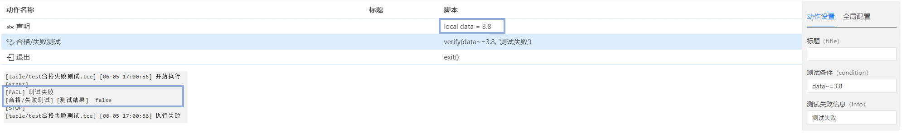

  - 在【声明】中改变data的值【data=0】。条件【data~=3.8】成功，输出测试结果【true】

    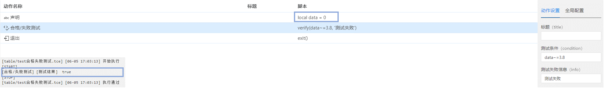

#### 数值限度测试
- 功能：当【测试数据源】值在范围内的时候，返回true；值不在范围内时候，返回false。
- 对应API：passed = verify(condition，fail_tip)    

    输入值：    
    condition：boolean类型，预期结果为true的表达式    
    fail_tip：string类型，断言失败时的提示信息    
    返回值：    
    passed：boolean类型，断言是否通过    

  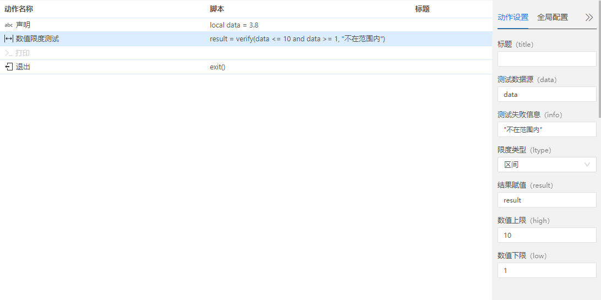

- 【测试数据源】：要判定的变量名称
- 【测试失败信息】：条件失败时的提示信息。输入字符串时需要加上英文引号；也可以输入变量名。
- 【结果赋值】：就是变量赋值，可以进行打印输出或其他操作
- 【限度类型】

  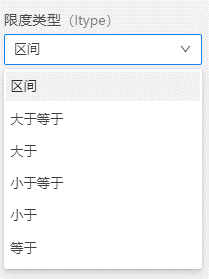

- 示例：将【限度类型】选为【区间】为例

  

  - data=10时，在10~20的范围内，所以返回true

    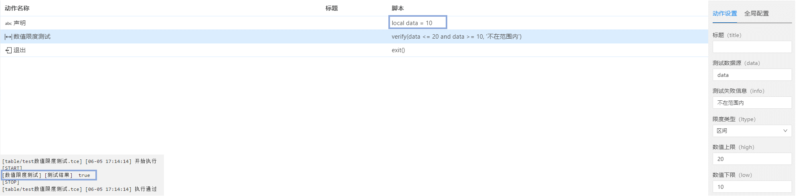

  - data=5时，不在10~20的范围内，输出【测试失败信息】“不在范围内”，返回false。

    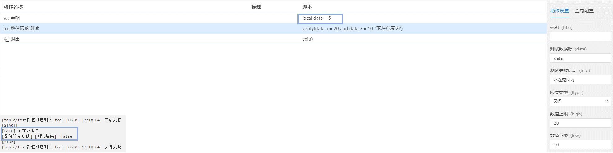
- 

#### 多数值限度测试
- 功能：判定【多数值】的每个元素的值是否全部在范围内。
- 【测试数据源】：要判定的【多数值】的名称
- 【测试失败信息】：string 类型，条件失败时的提示信息。
- 【限度类型】：

  

- 示例：
  - 添加声明：因为【多数值限度测试】的判定对象是【多数值】，所以首先需要在【声明】中定义一个【多数值】变量

    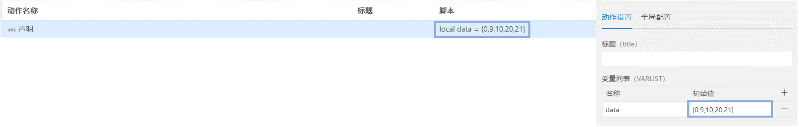
  - 添加【多数值限度测试】

    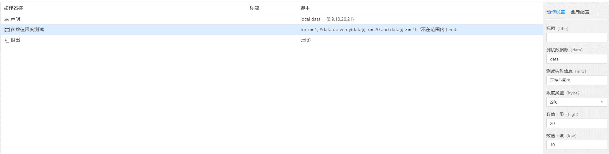

  - 一共五个值，其中有三个值(0，9，21)不在范围内，所以执行输出了三个失败信息【不在范围内】，返回false

    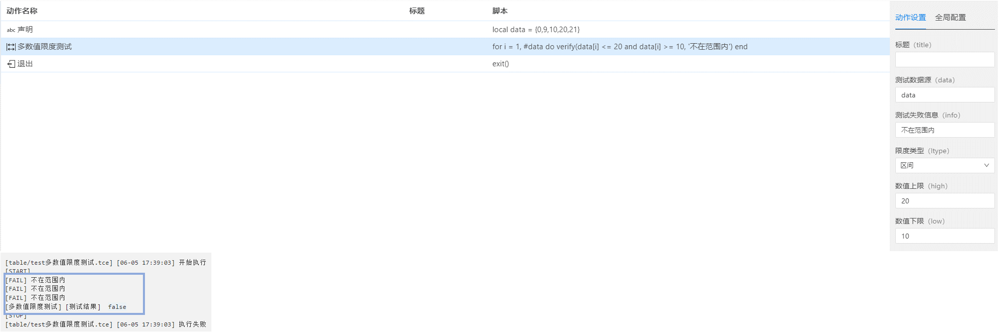

  - 改变data的值，使得data的五个值（所有值）都在范围内，返回【true】（多数值每个元素的值都在范围内才返回true）

    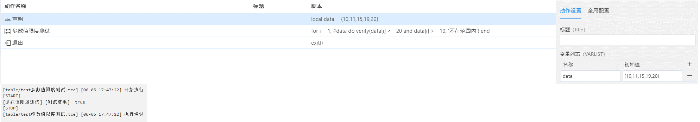

### 流程控制

#### if
- 功能：if条件判断
- 【条件】：填写判定表达式即可
  - data>=0
  - data~=10
  - data==3.8

  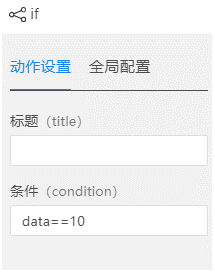

- 条件中使用的变量需在【声明】中定义，变量的值可以通过【声明】的【初始值】，还有【自定义脚本】设定。

  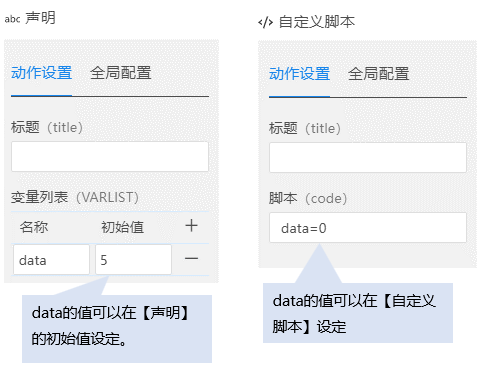

#### ifelse
- 功能：if-else条件判断，支持嵌套使用。

  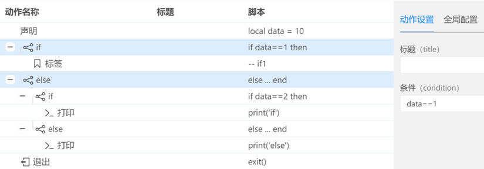

#### while
- 功能：条件循环
- 【条件】：填写判定表达式即可
  - data>=0
  - data~=10
  - data==3.8

  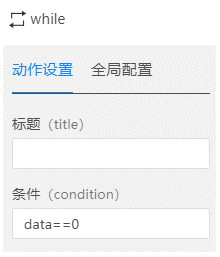

- if和while的示例

  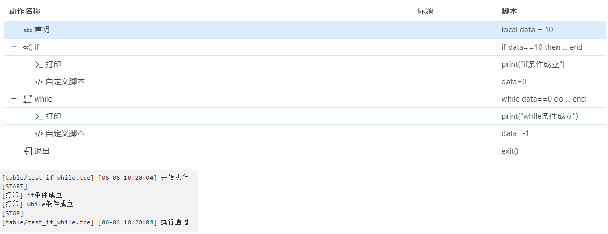

### 对话框
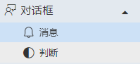
#### 消息
- 对应api：ask('OK',option)
- 超时时间：单位是ms，如填写1000，意味着1s后自动确认。为空的时候，代表一直等待，直到用户提交交互结果。

  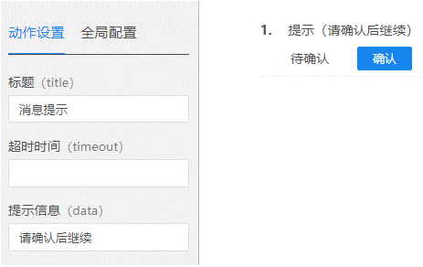

#### 判断
- 对应api：ask('yesno',option)

  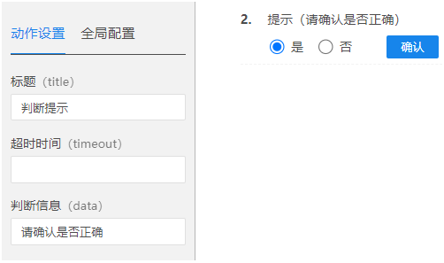

#### 消息和判断的示列
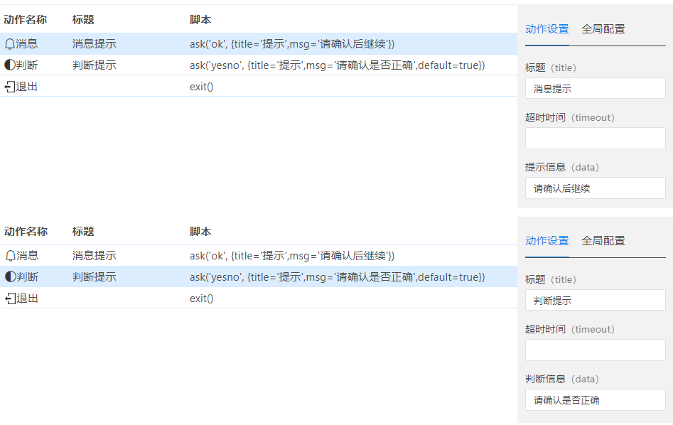
- 点击执行，切换到【实时交互】界面

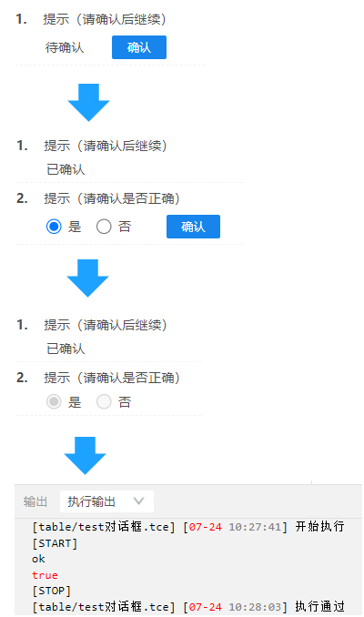

### 本章结束
[点击跳转下一章【表格搭建】](#/document?catalogId=47&id=47&type=doc)