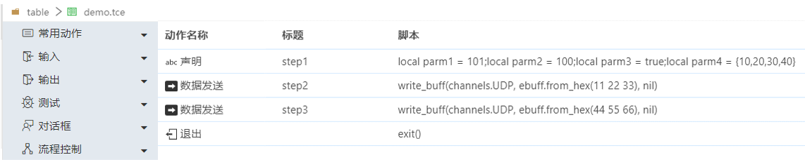
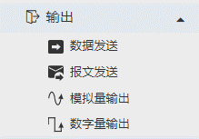
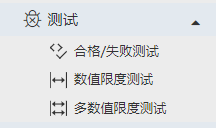
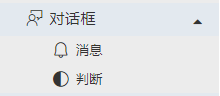
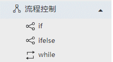
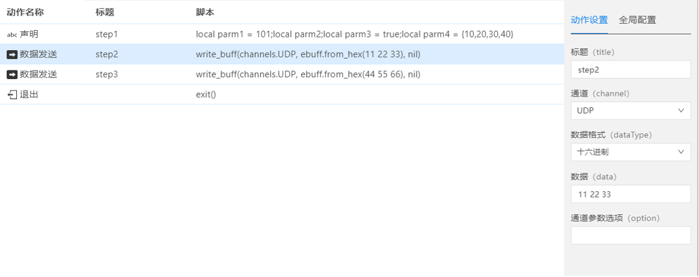

## 表格简介
行序列是一系列动作的集合。它提供了一种图形化的方式来搭建测试脚本；能够将执行序列自动转化成Lua脚本。
执行序列可以和lua脚本一样，在执行配置文件中使用，从而完成测试过程。

### 什么是表格

将动作添加到表格中，并从上到下顺序执行，即用表格的表现形式搭建执行程序。

### 使用场景
当需要从上到下顺序执行一系列固化逻辑的时候，使用表格来表示执行程序会更合适。 

### 优势
图形化的设计通俗易懂，不会编程的用户也可以轻松搭建执行流程。

### 动作说明

- 常用动作

  
  - 声明：定义local变量
  - 标签：注释
  - 延时：延时时间
  - 当前时刻：执行到当前时刻的时长
  - 退出: 退出执行程序exit()
  - 打印：print
  - 自定义脚本：编写一段可执行lua脚本

- 输入

  
  - 数据接收：使用read_buff，接收buff
  - 报文接收：使用 read_msg，接收报文
  - 模拟量采集：使用read_analog，接收模拟量数据
  - 数字量采集：使用read_digital，接收数字量数据

- 输出

  

  - 数据发送：使用write_buff，发送buff
  - 报文发送：使用write_msg，发送报文
  - 模拟量输出：使用write_analog，发送模拟量数据
  - 数字量输出：使用write_digital，发送数字量数据

- 测试

  
  - 合格/失败测试：测试数据是否满足限度
  - 数值限度测试：对数值限度进行测试
  - 多数值限度测试：测试多个数据是否满足限度

- 对话框

  
  - 消息：提示消息并确认交互
  - 判断：提示判断内容并选择判断交互

- 流程控制

  
  - if：if条件判断
  - ifelse：if-else条件判断
  - while：while条件循环

### 基本操作
- 添加动作：鼠标选中左侧列表的动作名称，拖拽到右侧编辑区域
- 移动动作：直接鼠标拖拽移动
- 复制动作：右键复制；快捷键【Ctrl】+【C】
- 粘贴动作：右键粘贴；快捷键【Ctrl】+【V】
- 剪切动作：右键剪切；快捷键【Ctrl】+【X】
- 删除动作：右键删除；快捷键【delete】删除
- 撤销：快捷键【Ctrl】+【Z】
- 恢复：快捷键【Ctrl】+【Y】

### 全局配置
- 拟绑定设备

只有在此处绑定设备后，动作设置-通道选择时，才显示对应设备下的通道。才能选择正确的通道，进行数据的收发。

  

### 动作设置

不同的动作项，【动作设置】对应不同的内容。[详见下一章【表格相关术语】](#/document?catalogId=46&id=46&type=doc)

### 本章结束
[点击跳转下一章【表格相关术语】](#/document?catalogId=46&id=46&type=doc)