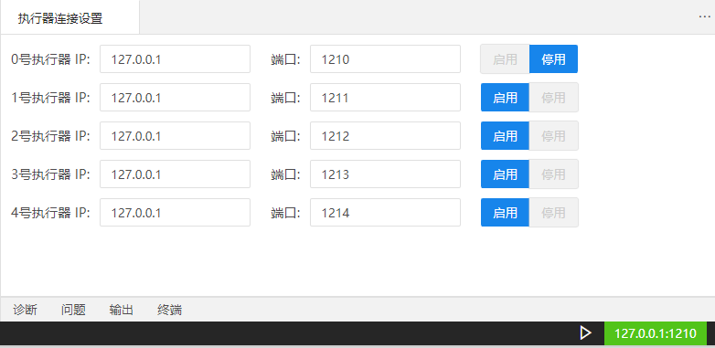
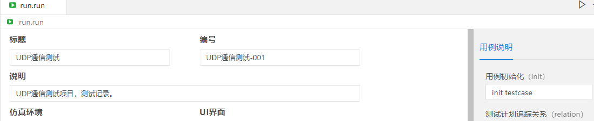
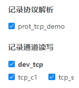
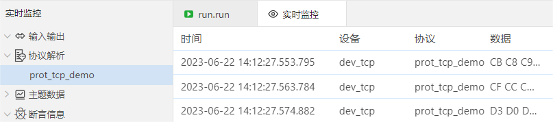
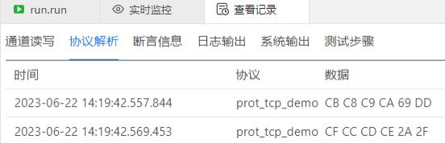
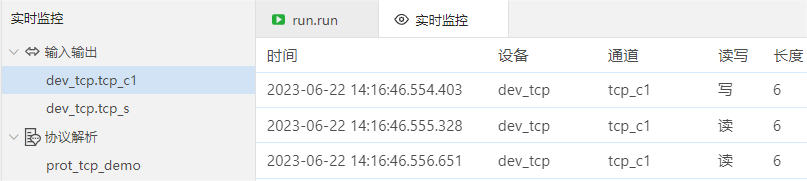
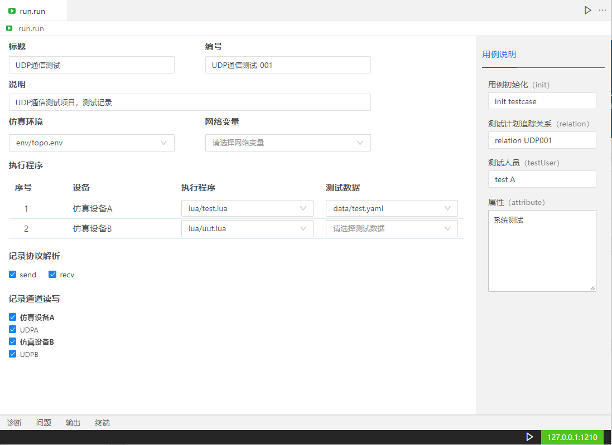
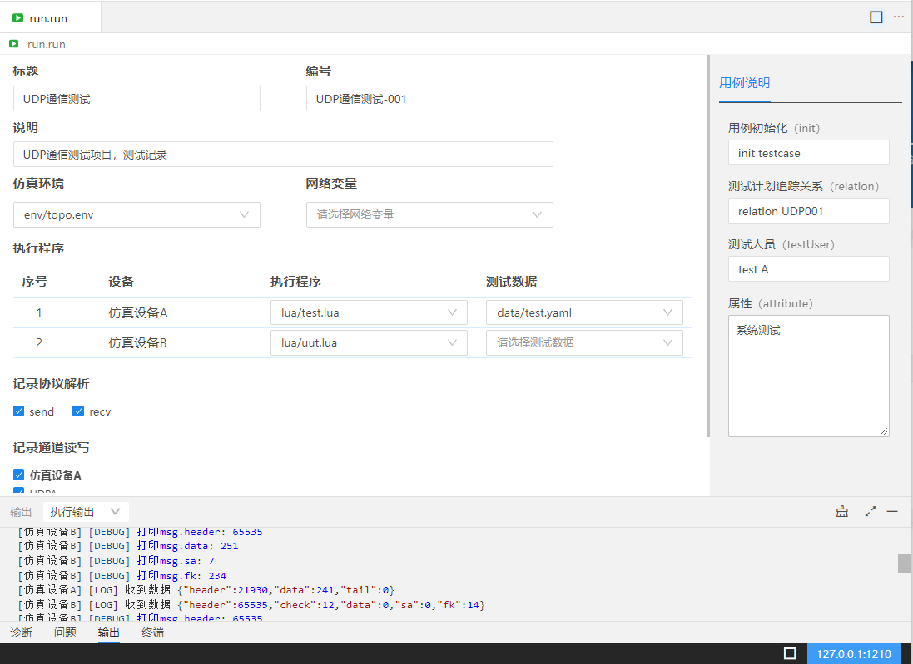
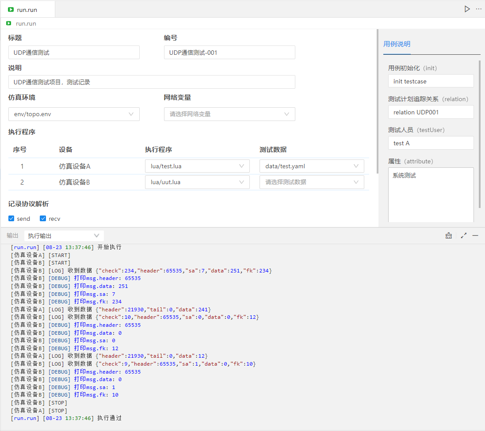

## 执行配置

执行配置是程序执行时的一个配置文件，是将测试程序、测试数据、仿真环境组合成可运行的配置，通过该配置可实现测试的执行。可以建立很多执行配置。

### 执行的前置条件

- 执行器连接显示绿色时，执行配置文件才能执行。

### 执行配置功能实现步骤

- 新建执行配置文件。
- 执行配置文件里配置仿真环境和执行程序等。
- 点击执行按钮，执行程序，执行输出界面显示程序输出的信息。

### 执行配置文件新建

- 鼠标右键选择【新建文件】->选择【执行配置】->输入名称->回车，文件新建成功。

### 执行配置文件编辑

- 标题：标题内容非必填项，输入标题内容后，该内容会显示在执行与报告界面和测试报告里。
- 编号：编号内容非必填项，输入编号内容后，该内容会显示在执行与报告的测试报告里。
- 说明：说明内容非必填项，输入说明内容后，该内容会显示在执行与报告界面和测试报告里。
- 用例说明：用例说明内容非必填项，输入用例说明内容后，该内容会显示在执行与报告的测试报告里。

- 仿真环境：点击下拉列表，选中对应的仿真环境文件。选择仿真环境文件后，在执行程序区域才会显示出该仿真环境里添加的所有设备。
- 网络变量：网络变量是设计器和执行器共享的变量。下拉列表选中要在设计器和执行器都需要使用的yaml文件。
- 执行程序：显示执行程序的序号、项目的设备，选择对应设备的执行程序脚本和测试数据，使脚本、数据和设备进行绑定。

- 记录协议解析：默认不勾选状态，执行后在实时监控/批量执行后的测试报告/历史版本的历史回看里，不会记录协议解析内容；当勾选上时，执行后在实时监控/批量执行后的测试报告/历史版本的历史回看里，会记录协议解析内容。

- 记录通道读写：默认不勾选状态，执行后在实时监控/批量执行后的测试报告/历史版本的历史回看里，不会记录通道读写内容；当勾选上时，执行后在实时监控/批量执行后的测试报告/历史版本的历史回看里，会记录通道读写内容。

- 程序执行

执行器连接显示绿色时，执行器连接成功，可以执行程序。点击执行按钮，程序开始执行。

执行器连接显示蓝色时，表示程序正在执行中。点击停止按钮，程序停止执行。

- 执行输出

开始执行程序后，输出界面的执行输出下，会持续输出显示该项目下对应设备的输出内容。程序执行结束后，输出停止。

