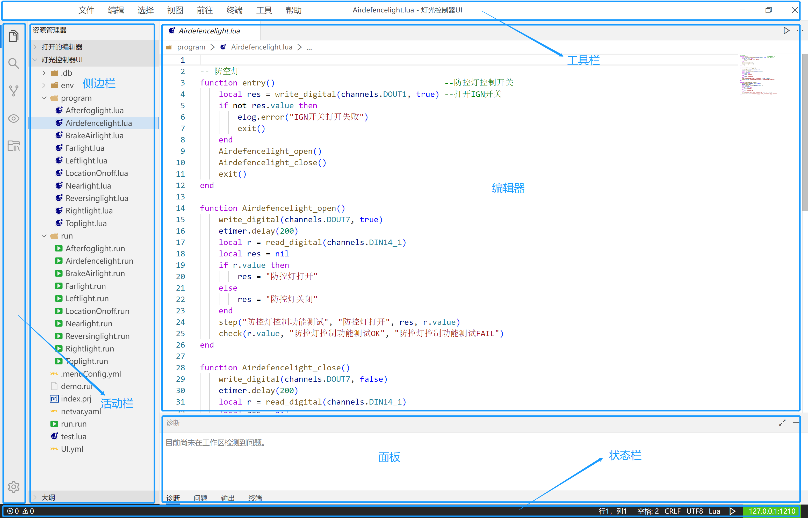

## 主要功能
IDE的界面布局与vscode相似，兼容vscode插件
### 基本布局

IDE被分为以下6个区域，由上至下由左至右依次为工具栏、活动栏、侧边栏、编辑器、面板、状态栏

- 工具栏：位于IDE的最上方，提供多种工具
- 活动栏：位于最左侧，方便在不同视图之间切换
- 侧边栏：位于活动栏的右侧，通过`ctrl + B`实现打开或者关闭
- 编辑器：这里是编辑区，支持打开多个编辑器
- 面板：编辑器的下方展示不同的面板，包括诊断面板、问题面板、输出面板、终端面板
- 状态栏：显示当前打开的文件、项目、执行器连接状态、执行按钮等其他基本信息

### 工具栏

顶部工具栏包括系统、文件、编辑、选择、视图、前往、终端、工具、帮助，支持二级菜单操作，与Vscode相似

- 文件：项目的操作及文件的保存等
- 编辑：包括复制、粘贴、剪切、撤销和重做等操作
- 选择：全选、展开、收起等快捷的基本操作
- 视图：Git源代码管理、资源管理、跨文件搜索等
- 前往：文件的跳转、前进、后退等功能
- 终端：新建终端、拆分终端
- 工具：提供的各种实用工具
- 帮助：内置使用说明文档、开发者选项、窗口的重载、关于等

###  活动栏

包括资源管理器、手动用例管理器、跨文件搜索、源代码管理、实时监控、复用库管理、设置

- 资源管理器是一个用于查看和管理项目文件的侧边栏。它以树形结构显示项目文件和文件夹，并允许用户对它们进行操作
- 手动用例管理器，通过测试用例生成器AutoTCG生成的测试用例
- 跨文件搜索又称全局搜索，输入要搜索的内容，选择要搜索的文件类型，然后点击“搜索”按钮
- 实时监控，监控程序运行时通道的输入输出、协议的打包与解包、网络变量的数据变化、断言的输出等信息
- 复用库管理包括个人复用库与系统复用库，提供资源的复用功能
- 设置，设置执行器的连接、主题、图标、快捷键等操作

### 侧边栏

侧边栏的内容由当前活动的界面所决定，在活动栏切换功能，侧边栏会随之变化
### 编辑器

编辑器位于工具栏的下方面板的上方，是可编辑元素的编辑区，包括代码、文本、图形等

- 并排编辑，通过`ctrl + | 或者 ctrl + @`打开多个编辑器同时编辑
- 缩略图，通过`ctrl + b`隐藏侧边栏进行显示
- 面包屑导航，显示当前位置，可以快速跳转到不同的文件夹、文件或符号
- 代码的格式化，通过`alt + shift + f`格式化编辑区的代码
- Tab标签页，编辑器的标题区域显示Tab,支持打开文件之前的快速跳转
- 智能提示，提供强大的智能提示功能，通过`TAB`与`Enter`进行智能补全
- 兼容vscode编辑器的功能

### 面板
提供四种不同的命令面板，对于不同的命令面板提供不同的操作

- 诊断，检查当前资源管理器中是否有无法编译的错误，当诊断异常时，所在的资源管理器无法编译执行
- 问题，提示当前所在资源管理警告信息、语法的错误检查等信息
- 输出，启动执行时，执行记录与执行结果会相应输出
- 终端，与windows终端功能一致

### 状态栏
显示当前打开项目文件及其他信息

- 当前文件的错误与警告信息
- IDE的软件版本号
- 显示编码方式、语言模式、执行按钮、执行器的连接状态等信息

