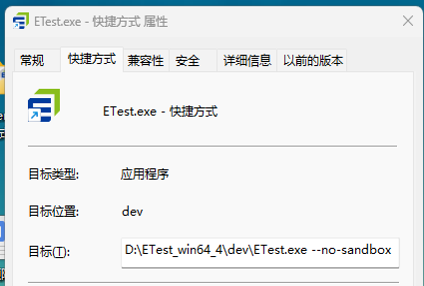

## 为什么手册中描述的部分功能在软件中看不到

手册中包含软件全部功能，针对不同用户需求软件的授权功能不同；所以会出现手册中描述的部分功能在软件中无法显示。如需增加授权请致电400-8299-000 

## 项目启动后报多个错误，显示来源：Lua

1.是因为安装路径中有中文导致的报错。中文路径下一些 NPM 包不支持，导致Lua插件加载失败，因此安装路径不应包含中文。    
2.项目路径包含中文不影响。    

## 多次启动后，启动失败

需要查看电脑上的“任务管理器”的进程，是不是还有任务残留，需要手动结束任务。再重启启动系统。

## 启动项目时显示白屏

是电脑上安装了杀毒软件导致。启动项目时，有些文件不能被杀毒软件正确识别，因此需要将杀毒软件关闭后再启动项目。

## 启动后界面样式显示异常

是因为两个不同版本之间有框架升级，导致颜色主题和之前的颜色主题设置不兼容导致样式异常。需要打开一个项目后，进入设置-颜色主题界面，重新设置一下颜色主题，样式就会显示正常了。

## 活动栏-工具里的设置和颜色主题，设置不起作用。

工具里的设置和颜色主题设置，是对项目起作用的，需要先打开一个项目，然后再进行对应的设置。

## 网页上帮助手册里的示例不能保存到本地

帮助手册里的示例只能是启动系统，在系统的帮助手册里找到对应的示例，点击另存为，可以保存到本地后，打开项目执行运行使用。

## 无法打开ETest，ETest软件出现闪退

- 删除用户目录里面的配置文件，文件路径为 C:\Users\【user】\\.etest-oss
- 新建ETest.exe的快捷，然后给快捷键的属性添加【--no-sandbox】

