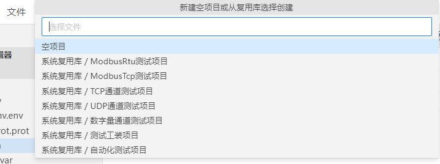
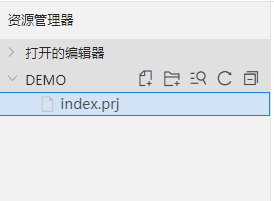
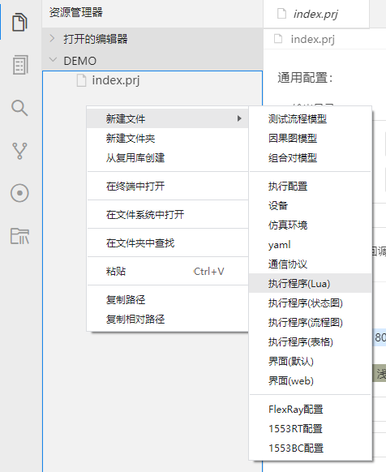

## 快速入门

### 构建快速入门程序
1. 双击exe可执行程序，启动IDE

2. 新建一个空项目

    - 依次选择文件->新建项目->空项目->选择一个空文件夹

        

    - 以空文件夹demo为例，新建成功后会自动创建`index.prj`文件

        


3. 新建Lua程序

    - 空白区域鼠标右键->新建文件->执行程序(Lua)

        

    - 输入文件名`test`回车

         

    - IDE会创建一个test.lua的文件，文件中包含一段测试脚本

    ```lua
    function entry()
        -- 此处输入程序代码
        exit()
    end
    ```
    - 函数entry为入口函数，启动执行时，会执行entry函数
4. 构建第一个测试程序
    - 修改entry函数增加一行代码，修改完成后如下所示
    ```lua
    function entry()
        print("hello world")
        exit()
    end
    ```
5. 启动执行
    - 点击状态栏执行按钮或右上角执行按钮启动执行
6. 查看命令面板输出
    - 输出`hello world`表示执行成功
    ```lua
    [test.lua] [06-01 15:49:45] 开始执行 
    [START]
    hello world
    [STOP]
    [test.lua] [06-01 15:49:45] 执行通过
    ```

### 学习的途径与方式
- B站上提供了大量视频，可通过[链接](https://space.bilibili.com/2010659231?spm_id_from=333.337.search-card.all.click)进行跳转。
- 通过软件帮助中心自行学习。
- 加入软件交流群一起交流使用心得。

### 导入示例运行
1. 新建项目
- 选择`系统复用库/自动化测试项目`

2. 新建成功查看项目目录

- index.prj为项目标识文件
- test.run:执行配置文件
- data：测试数据目录，包含.yml结尾的测试数据文件
- env：仿真环境目录，包含通信协议、仿真环境
- Lua：测试程序目录，包含lua测试程序

3. 启动执行
- 依次选择工具栏->栏工具->执行报告->勾选自动化测试项目->点击执行按钮

    

4. 执行成功后显示执行结果、可查看生成用例执行报告、测试记录表单、测试记录、项目报告

    
