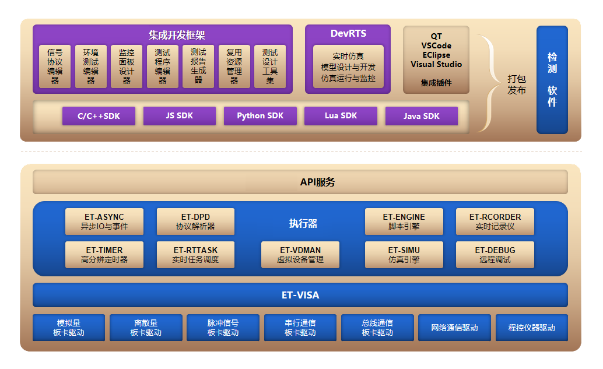

##  系统组成
如下图所示，系统由IDE与执行器组成，虚线上方为IDE，虚线下方为执行器；IDE与执行器通过守护进程API服务进行通信。

### IDE
IDE由集成开发框架与SDK二次开发包构成，通过SDK二次开发包可以构建出不同的功能模块，包括但不限于：

- 项目管理：以文件的方式管理所有工程文件
- 复用库管理：文件、文件夹及项目可以多次拷贝复用
- 仿真环境配置：提供图形与文件两种方式搭建仿真环境
- 通信协议定义：提供图形与文件两种方式，支持位序、字节序、条件分支等多种表示方式
- 测试流程设计：支持表格、流程图、状态图可视化测试流程开发
- 测试数据生成：Yaml格式定义测试数据
- 测试脚本开发：支持Lua、Python、ETL等多种测试脚本
- 测试报告生成：自动生成word、excel测试报告，测试报告可定制
- 历史数据管理：支持历史数据的回看、分析
- 可视化UI界面设计：定制UI界面，输出可独立运行的测试程序
- 执行与监控：对通道、协议等数据进行实时监控
- 快速测试：使用通信协议与仿真环境自动生成可视化UI界面进行快速测试
- 主题数据：支持分布统计、聚类统计、回归分析等多种数据分析算法
- 测试用例生成器-组合对模型：合理与全面地覆盖条件因素及其取值情况自动生成测试用例
- 测试用例生成器-因果图模型：输入条件和输出结果之间的逻辑关系自动生成测试用例
- 测试用例生成器-测试流程模型：基于深度的路径组合算法生成测试用例
- 测试用例生成器-模糊测试：通过算法生成测试用例

SDK二次开发包支持与QT、Vscode等第三方开发工具进行无缝集成

### 执行器

执行器包括EtestX与ET-visa，EtestX是执行器的核心功能，通过EtestX可以构建出多种功能模块，包括但不限于：

- 硬件驱动
- 异步IO
- 事件通知
- 协议解析
- 脚本引擎
- 执行记录
- 定时器
- 实时任务
- 远程调试
- 第三方集成

ET-visa为硬件驱动层，适配不同的硬件驱动，这样设计的好处保证了硬件的互换性与软件的可移植性
