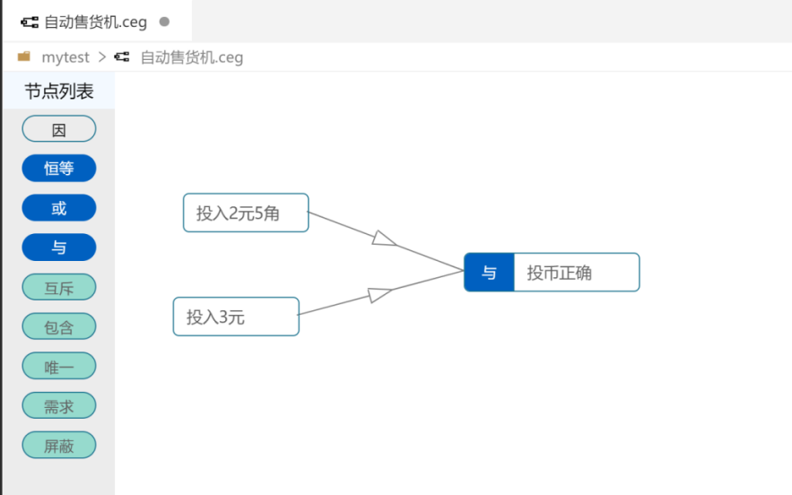
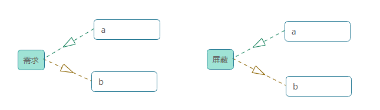

## 常见问题

1、编辑完因果图，顶部会有个小圆点，是未保存提示。按ctrl+s 快捷方式保存，ctrl+z 撤消。

2、若生成的用例出现问题，或者生成不了用例。可以查看面板下面的诊断，或者ctrl+alt+i查看控制台输出。  
3、左侧菜单中若“加载不出目录”或者“目录不全”或者“新增文件未显示”，快捷键ctrl+shift+r刷新。  
4、因果图20多个节点以上，生成用例可能较慢，需要耐心等待。  
5、约束关系中，“需求”和“屏蔽”注意箭头的指向，  
举例1：若a和b是需求关系，若a=1，那么b=1，  
举例2：若a和b是屏蔽关系，若a=1，那么b=0，  

