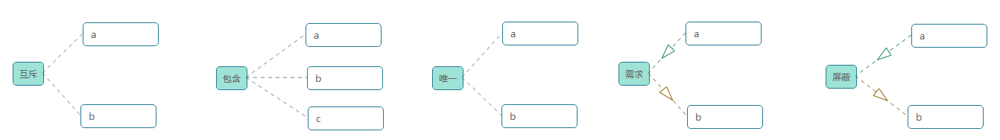
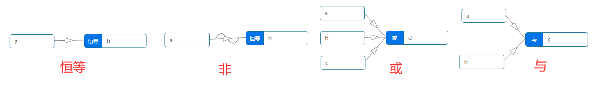
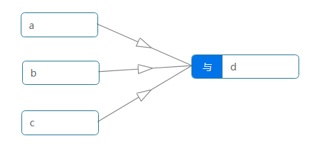
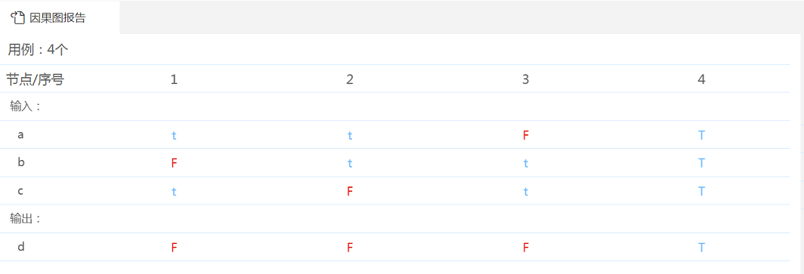

## 术语

### 约束条件

上图分析如下：（以1代表true，0代表fasle）

|约束|释义|组合|
|:-|:-|:-|
| E(互斥) | a和b两个原因不会同时成立，两个原因中最多有一个可能成立。即a和b中只能有1个1或者全0| ab=00,10,01 |
| I(包含) | a,b和c三个原因中至少有一个必须成立。即a,b和c不能同时等于0，abc≠000 | abc=100,010,001,110,101,011,111 |
| O(唯一) | a,b两个原因中必须有一个且仅一个成立。即a,b中有且仅有1个=1 | ab=10,01 |
| R(需求) | 当a出现时，b也必须出现。a=1则b=1 | ab=11 |
| M(屏蔽) | 当a出现时，b不出现。a=1则b=0 | ab=10 |

互斥和唯一的区别：

互斥：允许全部=0，  
唯一：不允许全部=0  

### 逻辑符号

因果图中的基本符号有四种，分别是恒等 (—) 、或 (∨) 、与 (∧) 、非(～)。

注：在实线上双击，会切换到“非”，实线上增加了一个波浪线～，再次双击会取消“非”。

|基本符号|描述|举例|
|:---|:-|:-|
|  恒等 (—)| 若原因出现，则结果出现。若原因不出现，则结果不出现。| a=1,则b=1；a=0,则b=0|
|  非(～)|若原因出现，则结果不出现。若原因不出现，则结果出现。 |a=1,则b=0；a=0,则b=1 |
|  或 (∨)| 若几个原因中有一个出现，则结果出现。若几个原因都不出现，则结果不出现。| a=1或b=1或c=1，则d=1；a=0且b=0且c=0，则d=0|
|  与 (∧)| 若几个原因都出现，结果才出现。若其中有一个原因不出现，则结果不出现。| a=1且b=1,则c=1；a=0或b=0,则c=0|

### 敏感关系与强弱覆盖率

#### 相关术语定义
 
- 用例：判定表中的一列数据组成一条用例。
- 因果关系对：在因果图中，如果因A和果B间存在通路，则称<A，B>为因果关系对。
- 因果关系对总数量：因果图中因果关系对的数量总和。
- 敏感：在某条用例C中，如果因果关系对<A，B>，只有因A的值变化，其他的“因”的值保持不变，结果B的值变化，则称因果关系对<A，B>对C敏感。
- 因果关系对强覆盖：对某个因果关系对<A，B>，如果所选择的用例集中，存在<A，B>对用例C1敏感，且A在C1取true；且存在<A，B>对用例C2敏感，且A在C2中取false；则称该用例集实现了对该因果关系对的强覆盖。
- 因果关系对强覆盖数量：对某个用例集，所有实现了“因果关系对强覆盖”的“因果关系对”的数量。
- 强覆盖率：因果关系对强覆盖数量/因果关系对总数量
- 因果关系对弱覆盖：对某个因果关系对<A，B>，如果所选择的用例集中，存在<A，B>对用例C1敏感，且A取true；或存在<A，B>对用例C2敏感，且A取false；则称该用例集实现了对该因果关系对的弱覆盖。
- 因果关系对弱覆盖数量：对某个用例集，所有实现了“因果关系对弱覆盖”的“因果关系对”的数量。
- 弱覆盖率：因果关系对弱覆盖数量/因果关系对总数量。

#### 筛选用例

- 最优用例：强覆盖率+弱覆盖率最大值，例如：选择n条最有效覆盖的用例，用例组中会自动选上，强覆盖率+弱覆盖率最大值的有效用例。
- 强覆盖率达到：输入值n，筛选强覆盖率大于n%的最优用例集。
- 弱覆盖率达到：输入值n，筛选弱覆盖率大于n%的最优用例集。

#### 结合示例理解强弱覆盖率：

因果图简单实例  

生成的用例  

因果关系对数量是3个  
a->d  
b->d  
c->d  

|用例|强覆盖率|弱覆盖率|因果关系对弱覆盖|因果关系对强覆盖|
|:-|:-|:-|:-|:-|
|case1|0%|33.33%|b->d|无|
|case2|0%|33.33%|c->d|无|
|case3|0%|33.33%|a->d|无|
|case4|0%|100%|a->d,b->d,c->d|无|
|case1和case2|0|66.67%|b->d，c->d|无|
|case1和case3|0|66.67%|b->d，a->d|无|
|case2和case3|0|66.67%|c ->d，a->d|无|
|case1和case4|33.33%|100%|a->d，b->d，c->d|b->d|
|case2和case4|33.33%|100%|a->d，b->d，c->d|c->d|
|case3和case4|33.33%|100%|a->d，b->d，c->d|a->d|
|case1和case2和case4|66.67%|100%|a->d，b->d，c->d|b->d，c->d|
|case2和case3和case4|66.67%|100%|a->d，b->d，c->d|c->d，a->d|
|case1和case2和case3|0%|100%|a->d，b->d，c->d|无|

#### 生成结果的标准

当且仅当选中判定表所有列时，强覆盖率达到100%。

