## 自动生成用例

### 1、创建因果图文件

因果图文件是".ceg"为扩展名的文件。

（1）选中项目目录->鼠标右键->新建文件->选择因果图模型

注：若无项目目录，点击菜单【文件】->新建项目，会新打开一个已经新建的项目窗口，然后再在新窗口的项目目录下，新建因果图模型。

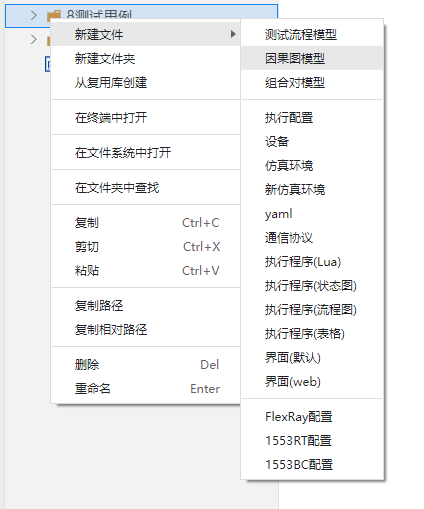

（2）输入因果图名称“测试因果图”，按回车键；左侧菜单所选中的目录下会新建一个因果图文件“测试因果图.ceg”。注意：名称不能重复。

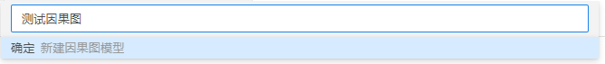

### 2、创建因果图

节点列表中白色背景的是因节点，灰色背景的是逻辑节点，绿色背景的是约束条件节点。

（1）添加节点并连线

左侧节点列表，鼠标点击选中节点，拖动到右侧空白区域，创建节点。

鼠标选中节点，节点两边会显示两个实心圆点，光标从原点开始对两个节点进行连线(实线)。

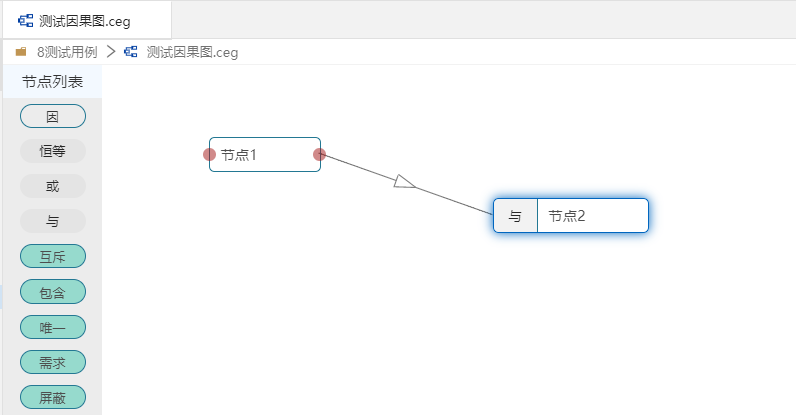

约束条件为虚线。注：约束条件包含（互斥、包含、唯一、需求、屏蔽）   
约束条件详细含义请查看“术语”一章。

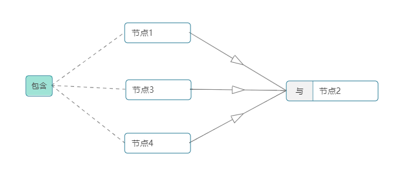

（2）修改节点名称

右侧菜单切换“节点设置”tab，点击节点，右侧节点设置会出现编辑名称、选择类型和增加描述的输入项。

- 当选中“因”节点，可以编辑名称和描述。
- 当选中“约束条件（绿色按钮）”节点，可以编辑类型。
- 当选中“逻辑”（恒等、或、与）节点，可以编辑名称、类型、描述。

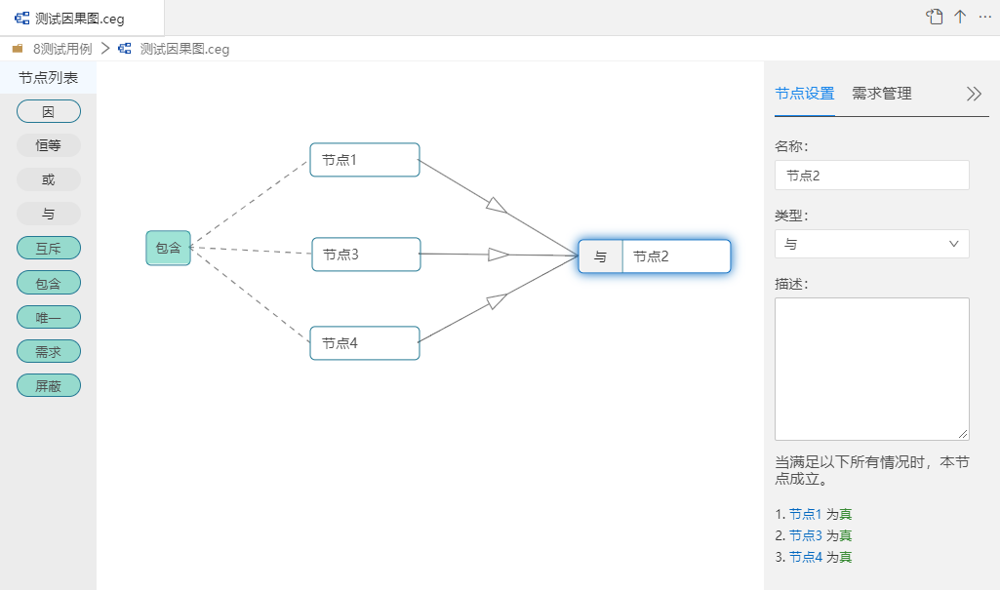

把节点2修改为A，节点3修改为B，节点5修改为C，节点5修改为D，如下图：

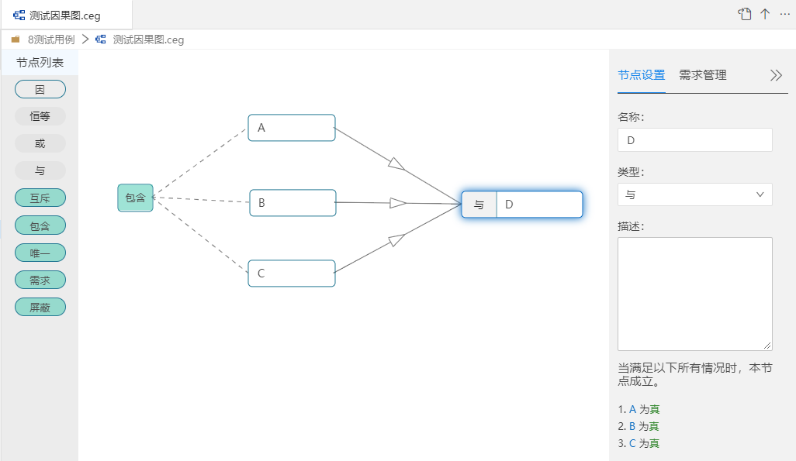

注：当右侧菜单选中的是“需求管理”tab，点击节点，不会显示节点和编辑节点信息。要修改节点名称和描述，需要切换到“节点设置”tab。

### 3、需求管理

若因果图需要关联一个或多个需求时，右侧菜单切换到“需求管理”tab下，添加需求关联节点。  

右侧菜单中，切换到“需求管理”tab，点击新增按钮，出现输入项：

（1）标题：测试需求    
（2）节点：选择ABCD    
（3）描述：输入描述内容    
（4）切换鼠标焦点，默认会保存    

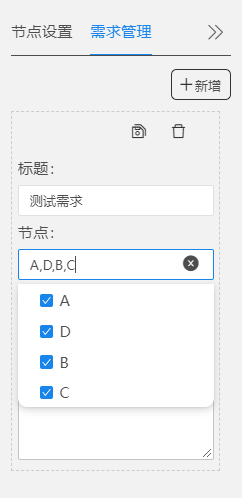

### 4、生成测试用例

因果图绘制完成后，点击工具右上角“生成测试用例”按钮，生成因果图判定表。  
注：此因果图判定表，为临时文件，需在判定表页点击右上角输出，才能生成用例文件"xxx.tcm"。

操作：

因果图页面点击右上角“生成测试用例”

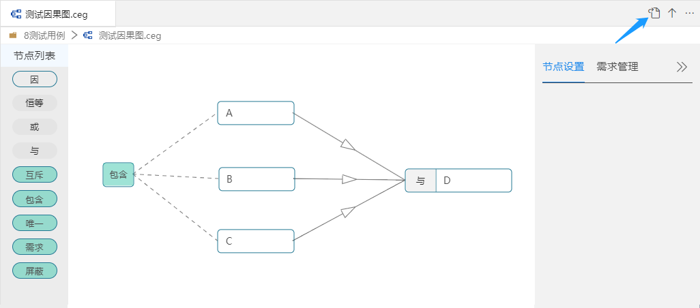

生成用例判定表

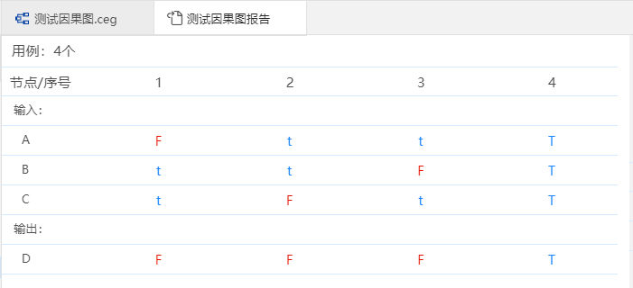

图中包含“f、t、F、T”, f和F代表False，t和T代表True。  

其中“F”和“T”代表 在对本用例敏感的因果关系对中。鼠标悬停会有提示。
如：
图中的“F”悬停提示“对D敏感”，代表<C,D>这对因果关系对，对用例2敏感。

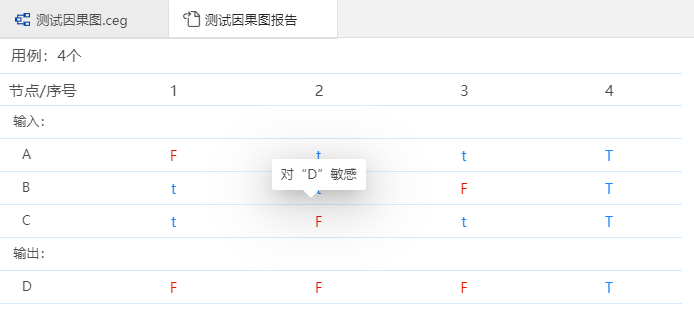

敏感关系详细含义请查看“术语”一章。

### 5、覆盖率分析

覆盖率分为：强覆盖率和弱覆盖率。    
判定表右侧菜单，可以查看不同需求下以及全选时的强弱覆盖率情况。

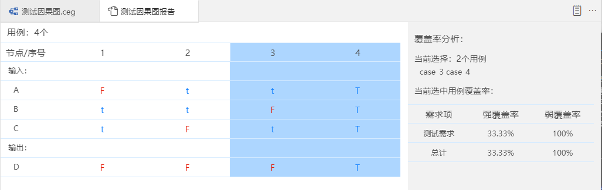

强弱覆盖率详细含义请查看“术语”一章。

### 6、筛选用例

筛选用例有四种方式：最优用例、总强覆盖率、总弱覆盖率，手动选中列，四者筛选为互斥条件。
    
- 最优用例：强覆盖率+弱覆盖率最大值，例如：选择n条最有效覆盖的用例，用例组中会自动选上，强覆盖率+弱覆盖率最大值的有效用例。
- 强覆盖率达到：输入值n，筛选强覆盖率大于n%的最优用例集。
- 弱覆盖率达到：输入值n，筛选弱覆盖率大于n%的最优用例集。

可以通过“最优用例”的个数，或“总强覆盖率”或“总弱覆盖率”的百分比进行筛选，执行筛选后，左侧用例列会被选中，覆盖率分析会展示用例的强弱覆盖率。

比如，输入最优用例个数为2，进行删选后，选中了两条用例。

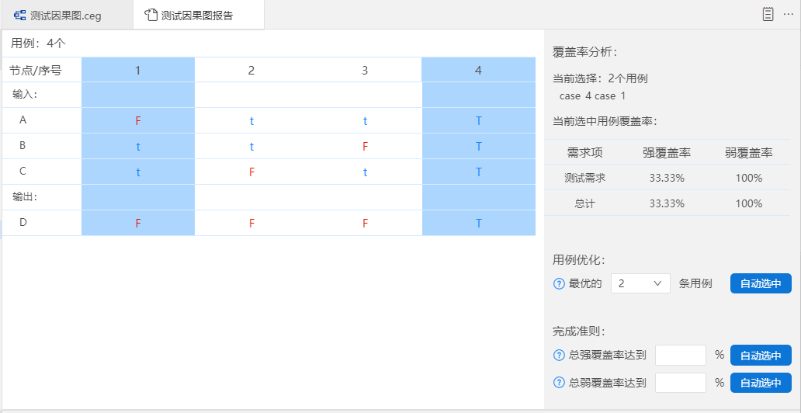

### 7、输出用例

点击右上角“输出”按钮，输入用例名称，回车。保存成用例文件"xxx.tcm"。

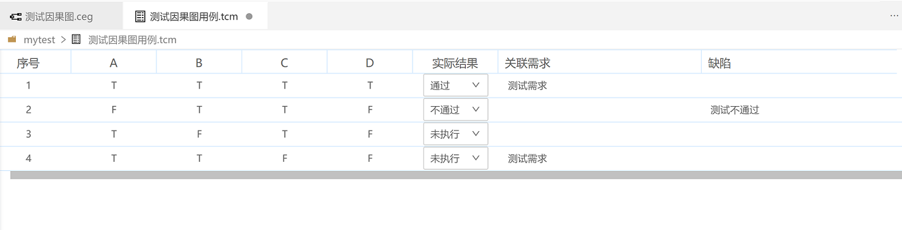

（1）生成部分用例

如果选中部分用例，输出的用例文件只包含选用的用例。
    

（2）生成全部用例

若不选中任何列，或者选中所有的列，输出的用例文件包含所有的用例。

### 8、手动执行用例

根据因果图生成的用例，进行测试。

实际结果：未执行，通过，不通过三种状态。  
缺陷记录：可以输入缺陷的描述步骤。

### 9、导入需求生成因果图

参见“”

