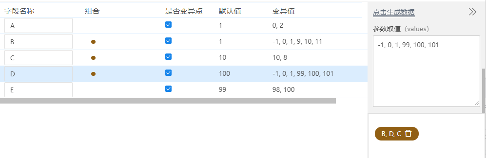

## 术语

### 参数生成方法

1、边界值
自动取以下5个值：
- 下边界值 - 精度
- 下边界值
- 下边界值 + 精度
- 上边界值 - 精度
- 上边界值
- 上边界值 + 精度

2、随机数
自动生成“随机数量”个随机数

3、自增
从最小值开始，以精度为步长，逐次增加，直到达到最大值为止（不超过最大值）

4、自减
从最大值开始，以精度为步长，逐次减少，直到达到最小值为止（不小于最小值）

### 组合

有的时候，需要对不同的字段的变异点进行组合测试。比如，字段B、C和D 之间的交互可能会更多，而字段A和E的交互比较少，所以我们希望对B、C和D 的组合覆盖得更彻底。使用组合就可以实现这一点。

组合操作方法：

选中两条以上字段，鼠标右键->新建组合。字段列增加带颜色的圆点关联选中的字段行，同时右下角区域新增一个关联标识
组合。

如果m个字段被选中为一个组合，则使用这m个字段的所有变异值进行全组合，生成v1*v2*…*Vm个测试用例。 （其他字段使用默认值。）

### 默认值、变异值、变异点

默认值：字段默认使用的数据。

变异值：根据属性设置的最小值、最大值、精度和生成方法进行组合，生成的一组测试数据。

变异点：如果某个字段被选中为变异点，则使用其变异值生成测试用例。

