## 自动生成用例

### 案例说明

对通信协议进行模糊测试，协议字段包括header、data、tail、code。

1、协议字段header，保持固定内容不变；

2、对于关键协议字段data和tail，产生多种正常及异常数据；

3、对于协议字段code，进行异常数据测试。

### 1、创建模糊测试模型文件

模糊测试模型文件是".fuz"为扩展名的文件。

操作：

（1）资源管理器内，鼠标右键->新建文件->选择模糊测试，输入名称，文件创建成功。

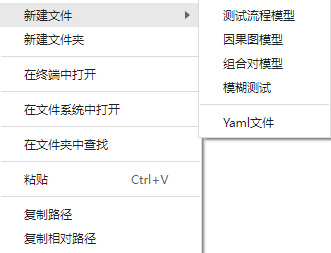

### 2、创建字段行

此操作针对字段的增删改。

操作：

（1）鼠标右键->新建

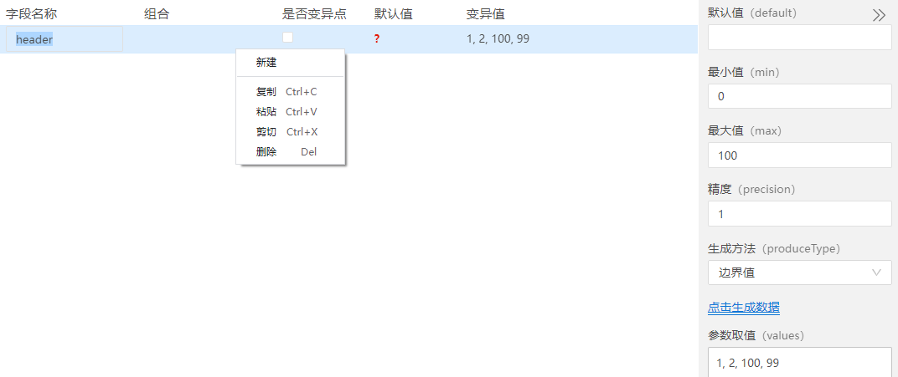

注：选中字段行，鼠标右键可以新建，复制，粘贴，剪切，删除字段行。

（2）双击字段名称，会出现编辑状态，更改字段名称。

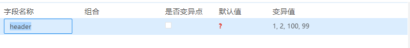

#### 从协议导入

有些测试中，字段名称就是协议中的字段。这时可以直接导入协议，进行测试数据的设计。

功能按钮在界面右上角。

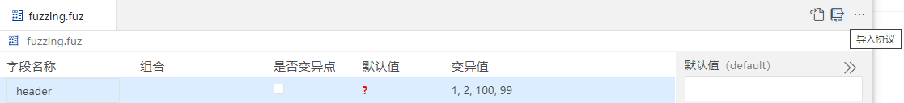

### 3、设置默认值

（1）：如果某个字段没有被选中为变异点，则使用其默认值；生成1条测试用例。 （其他字段也使用默认值。）    
（2）：非变异点且非组合时，默认值不能为空。    

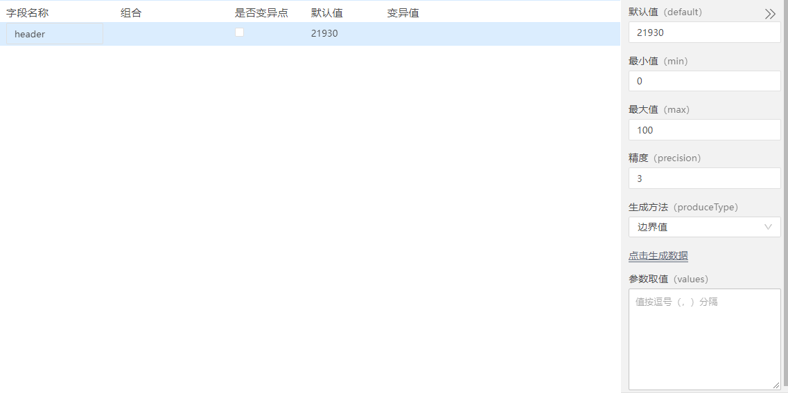

### 4、设置参数取值

参数取值可以使用：手动输入和自动生成两种方式

（1）手动自定义输入取值：

直接在参数取值输入框中，输入数据值，不同数据值以“英文逗号”隔开。

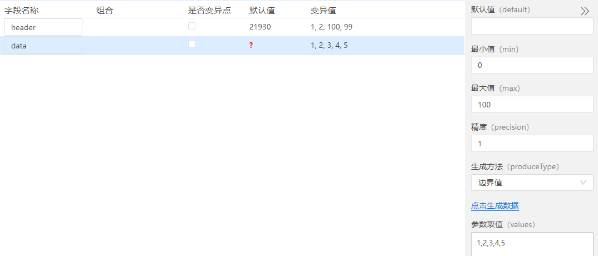

（2）自动生成取值有四种方式：

- 边界值  
- 随机数  
- 自增  
- 自减  

自动生成取值，需要输入最小值(默认0)，最大值(默认100)，精度。  
最小值和最大值为取值区间。    
精度为相邻两个值的步长。例如：1,2,3则精度为1；1,4,7则精度为3。  

操作：    
①选中字段行，右侧菜单输入预期最小值和最大值，以及精度；    
②选择生成方法中的边界值；    
③点击生成数据。    
④参数取值输入框以及取值列会自动生成边界值数据。 

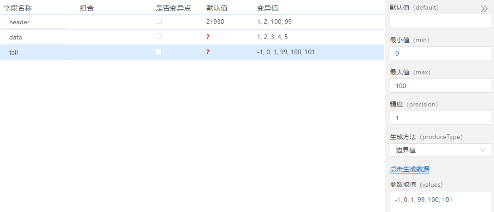

### 5、是否变异点

字段勾选为变异点，则使用其变异值（设为n个），生成n条测试用例。（其他字段使用默认值。）

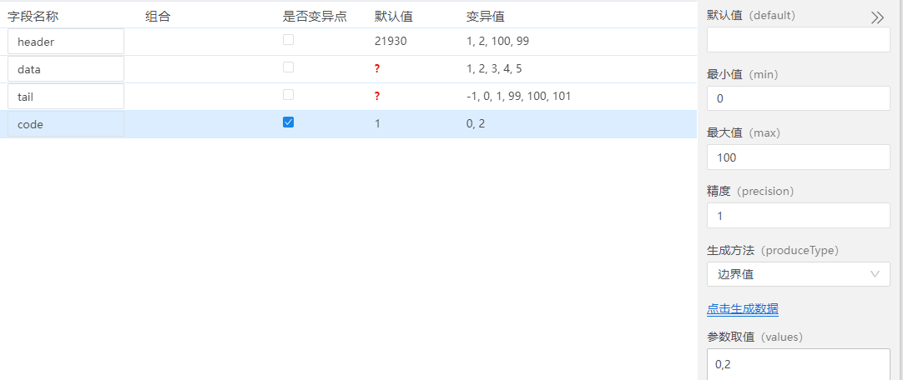

### 6、组合

如果m个字段被选中为一个组合，则使用这m个字段的所有变异值进行全组合，生成v1*v2*…*Vm个测试用例。 （其他字段使用默认值。）

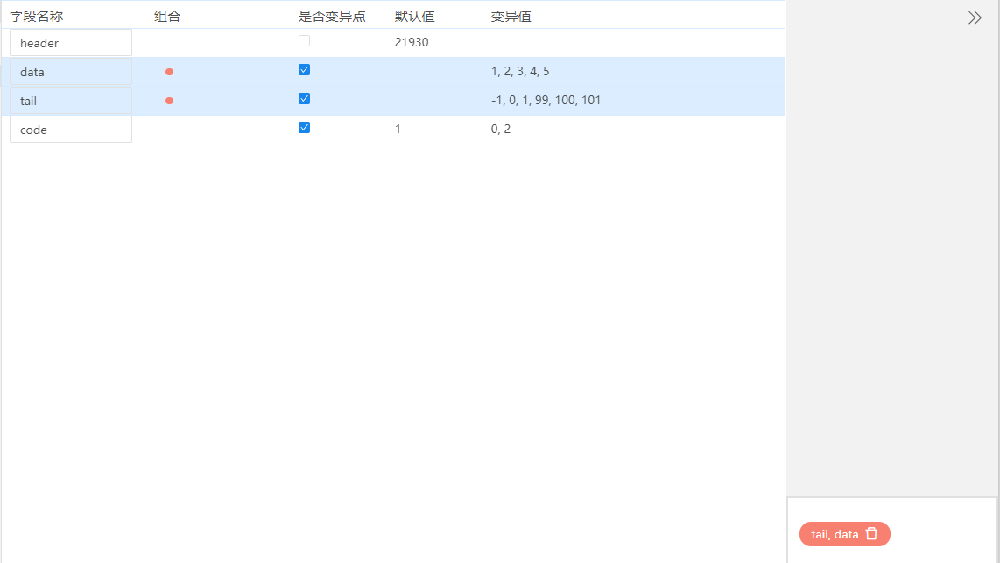

### 7、生成测试用例

（1）生成测试用例

操作：  

点击右上角“生成测试用例”按钮，生成用例文件 "模糊测试报告"。

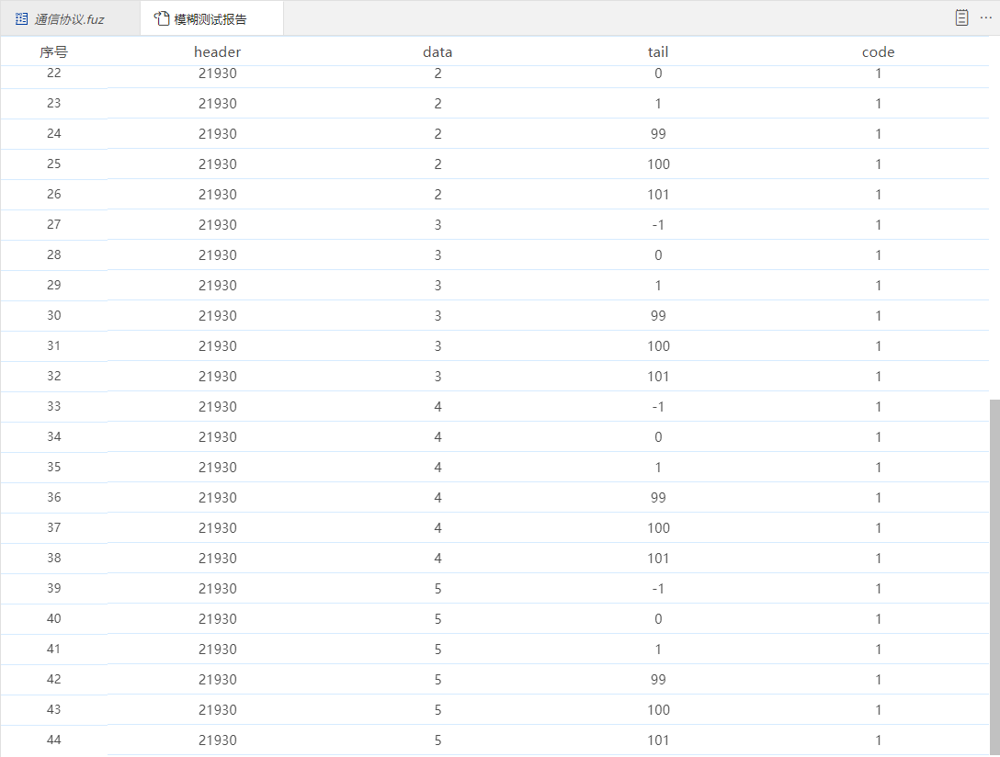

（2）生成yml测试用例文件

操作：  

"模糊测试报告"页面点击右上角“输出yml”按钮，输入文件名称，确认后生成yml类型的测试用例文件。

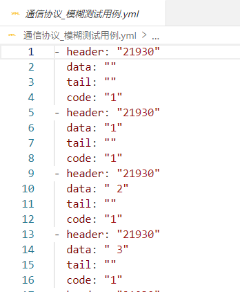

