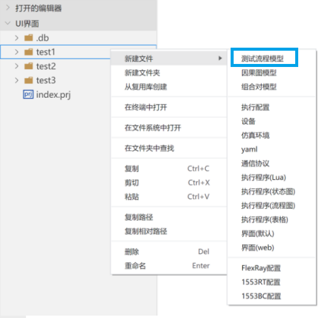
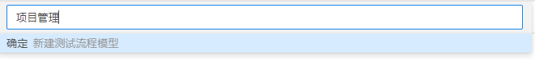
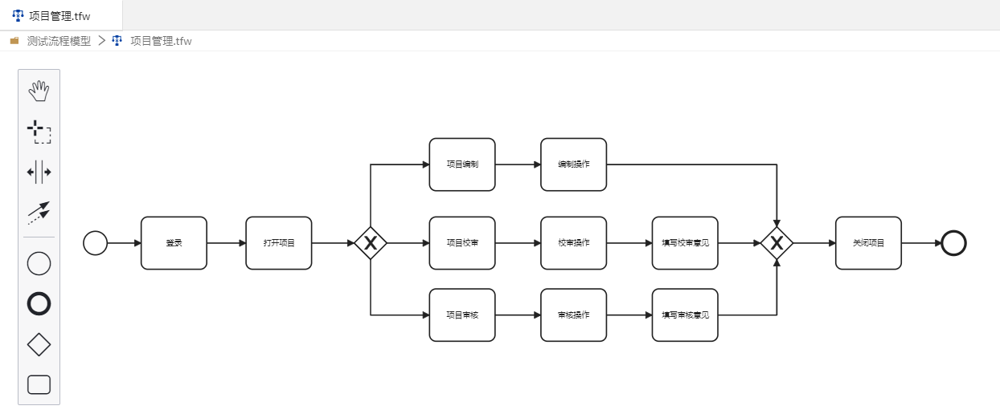
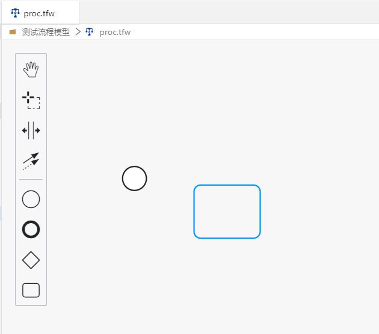
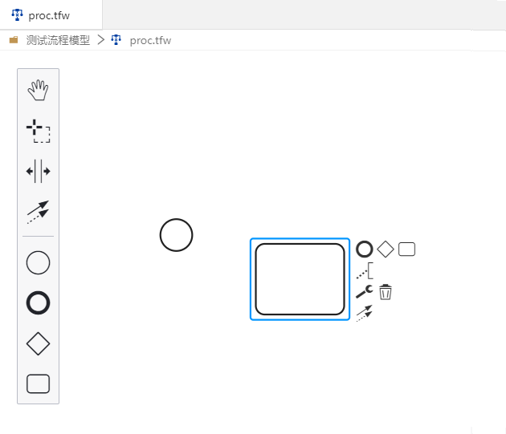
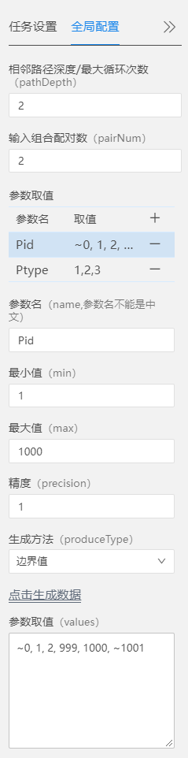
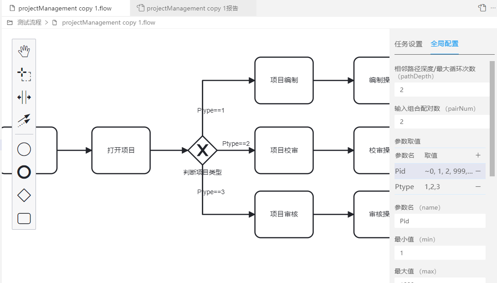
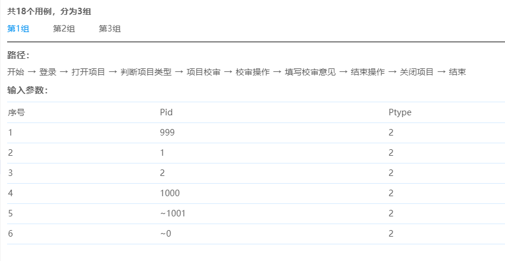
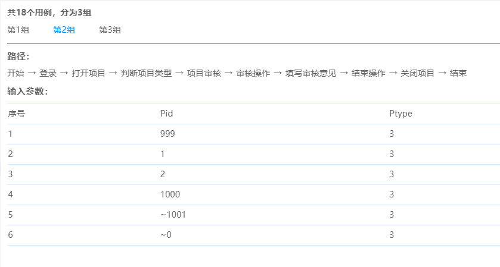
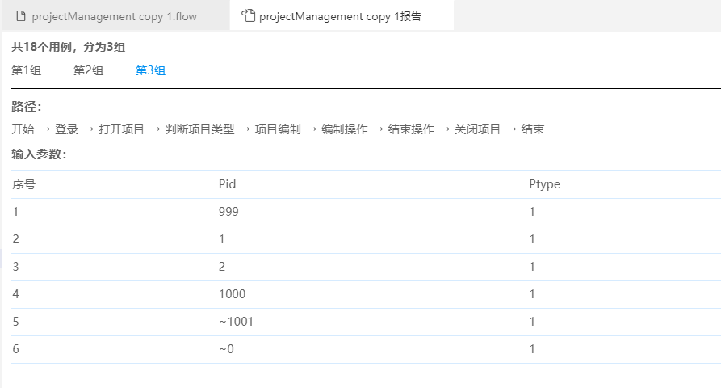

## 自动生成用例

案例一：

> 用户登录系统；
> 打开一个项目；
> - 如果项目是“编制”状态，用户进行项目的编制，输入编制操作内容，关闭项目；
> - 如果项目是“校审”状态，用户进行项目的校审，输入校审内容，填写校审意见，关闭项目；
> - 如果项目是“审核”状态，用户进行项目的审核，进行审核操作，填写审核意见，关闭项目；
>
> 用户退出系统。

### 1、创建测试流程模型文件

测试流程模型文件为".tfw"扩展名的的文件。

操作：

1. 右侧菜单选中项目目录，鼠标右键->新建文件->选择测试流程模型

注：若无项目目录，点击菜单【文件】->新建项目，会新打开一个新建的项目窗口，然后在新窗口的项目目录下，新建测试流程模型。

2. Etest顶部输入项中输入名称

左侧的菜单文件下会创建一个"xxx.tfw"的文件，同时自动打开该文件。

### 2、编辑模型

测试流程模型提供了基于BPMN2.0的图形化建模工具。

界面元素包括“开始”、“结束”、“网关”、“任务”四种类型。
- 细线的圆圈是开始节点，代表流程的开始。
- 矩形是任务节点，代表一次操作；
- 菱形是网关节点，代表流程的分支；
- 粗线圆圈是结束节点，代表流程的终点。

建立一个流程，只需要从工具栏上选择需要的节点，用鼠标按住，拖动到画布上。
双击节点，可以输入名称。
点击“连线工具”，然后用鼠标在两个节点之间滑动，可以在两个节点之间绘制一根连线。

- “抓取工具”可以拖动整个图形；
- “区域选择工具”可以框选图形的一部分，并调整位置；
- “间隙工具”可以扩大或缩小节点之间在横向或纵向之间的间隙。

节点的快捷工具栏有添加元素、添加注释、设置或删除、添加连线的功能，可以用于快速构建流程。

选中一个任务，在“任务设置”区域勾选参数，并输入用Lua语言编写的任务执行代码。

针对案例一，可以绘制测试流程图，如下所示。

操作：

1. 点击工具栏图标->拖动->放下

2. 选中节点，会出现快捷菜单，进行对应的操作。

注：快捷菜单包括结束、网关、任务、注释、修改类型、移除、连接。

### 3、数据配置

进入“全局配置”区域，添加流程中会用到的参数。

加号代表增加参数，减号代表删除参数。

参数取值可以手工输入，用逗号进行分隔，也可以用辅助生成工具进行辅助生成。

如，在本例中，“Pid”（代表项目编号）、“Ptype”（代表项目类型）是两个输入参数。
- Pid的取值范围是1到1000；使用边界值法生成的测试数据有\~0, 1, 2, 999, 1000, \~1001。其中0和1001这两个值之前有~符号，代表这两个值是异常值。（多个异常值不能出现在同一个用例中。）
- Ptype的取值范围是枚举值1,2,3，分别代表“编制中”、“校审中”、“审核中”三种状态。

### 4、设置约束条件

某些路径分支只对一些参数的特定取值有效，因此需要设定约束条件。

比如，只有当项目类型Ptype的取值为1（“编制中”）时，才能够进行“项目编制”、“编制操作”这两个动作。

约束条件配置在连线上。双击连线可以进行输入。布尔表达式采用Lua脚本的格式编写。

如图所示。

### 5、设置相邻路径深度/最大循环次数/输入组合配对数

接下来我们需要配置测试覆盖策略的参数。

对于路径覆盖的参数有：

1. 相邻路径深度：在模型图不存在环路时设置本参数。代表生成的测试路径对相邻层级的路径进行组合的深度。（其值不大于整个模型的层次。）
2. 最大循环次数：在模型图存在环路时设置本参数。代表生成的每项测试路径中任何一个节点重复出现的最大次数。

对参数组合需要配置的参数有：

3. 组合配对数：参数进行组合配对的阶数。（其值不大于所有参数的个数。）

本例中我们取“相邻路径深度”为2，输入组合配对数为2。

### 6、生成用例

操作：  

点击“生成测试用例”按钮，即开始生成操作。软件会将路径、数据和约束条件一起进行计算，生成最终的测试用例，并确保满足测试覆盖策略。

如本例子生成的用例有18个，分为3组：

第一组用例：

第二组用例：

第三组用例：

