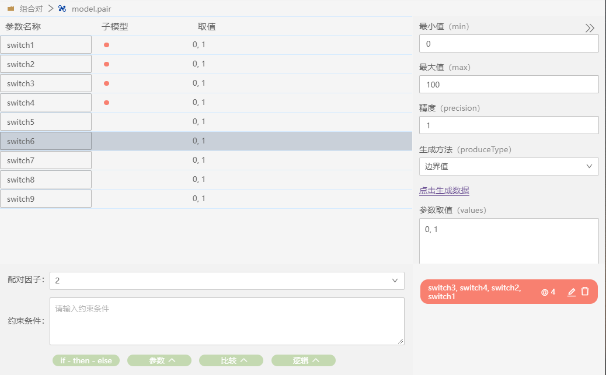

## 术语

### 参数生成方法

1、边界值
自动取以下5个值：
- 下边界值 - 精度
- 下边界值
- 下边界值 + 精度
- 上边界值 - 精度
- 上边界值
- 上边界值 + 精度

2、随机数
自动生成“随机数量”个随机数

3、自增
从最小值开始，以精度为步长，逐次增加，直到达到最大值为止（不超过最大值）

4、自减
从最大值开始，以精度为步长，逐次减少，直到达到最小值为止（不小于最小值）

### 配对因子

当配对因子为2时，模型的生成算法就是成对测试生成器。

以此类推，可以规定多于2个参数的组合均被覆盖到；因此有了配对因子的概念。

即：当配对因子为m时（2<=m<=n ），在n个参数中任意m个参数的全部取值组合都能被覆盖到，且用例总数最少。n是参数总个数。

### 约束条件

在实际应用中，参数之间很少是独立的。因此会需要约束条件。约束条件描述了测试域的限制，也就是一定有问题的参数组合。

约束条件用布尔表达式来描述。任何使表达式结果为false的参数组合都会被从用例集中去掉，替换为其他的用例。

注：约束条件的编写语法是lua语法。

其中，类似：

if [温度传感器]==40  then [工作模式]=="制冷" ;

的条件中，“then” 后面的表达式不是赋值表达式，而是条件表达式，因此使用“==”而不是“=”。
它意思是：if条件成立，那么then 条件也必须成立，整个表达式的结果才能为true。

### 子模型

有的时候，需要对不同的参数子集设定不同的配对因子。比如，参数B、C和D 之间的交互可能会更多，而参数A和E的交互比较少，所以我们希望对B、C和D 的组合覆盖得更彻底。

使用子模型就可以实现这一点。

子模型内部可以设置一个配对因子。通常比外部的配对因子的数值更大。从而实现对部分参数进行更高强度的测试，而整个测试用例个数又保持比较少的状态。

子模型操作方法：

选中两条以上组对参数，鼠标右键->新建子模型。子模型列增加带颜色的圆点关联选中的参数行，同时右下角区域新增一个关联标识

子模型可以设置配对因子：@4 

### 反向用例

反向测试代表对异常值的测试。

在参数取值范围中，有些取值是正常值，有些是异常值。

在测试过程中，异常值往往一定会带来错误。这种错误也是预期结果，是测试人员希望看到的。

但是，如果同时输入两个异常值，我们就不知道是不是每个错误都被正确处理了。

所以，在进行反向测试的时候，应该避免两个异常值出现在同一个测试用例里面。

在参数取值中，异常值的前面会带有一个“~”符号。

### 权重

使用权重，可以使生成用例时倾向于某些取值。

一个权重可以是任何正整数。

如果不明确指定不同的权重，默认使用“1”。

在使用权重时，需要注意：在 “(1)以最小数量的测试用例覆盖所有组合” 和 “(2)根据权重值选择数据” 这两个需求发生矛盾时，软件总是优先满足需求(1)。
