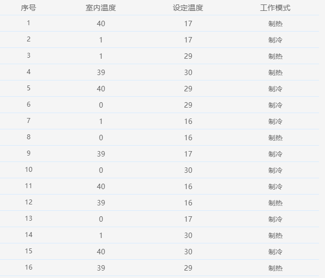

##  组合对模型

组合对模型是一种有效的测试用例生成技术，用于黑盒测试中测试用例的生成。

### 背景介绍

软件的正确运行可能受到多种条件因素的影响，每一种条件因素往往又具有多种可能的取值。从测试时间和成本考虑，对条件因素及其取值的所有组合情况进行全面测试，往往是不现实的。例如，某个软件模块有6个输入参数，每个输入参数取4个值进行全面测试，需要设计和执行4×4×4×4×4×4=4096个测试用例。针对这种情况，需要采用一种算法，从大量的输入数据组合中挑选出适量有代表性的典型的数据组合进行测试，合理与全面地覆盖条件因素及其取值情况，精简测试用例的数量，用最低的测试成本得到尽可能好的测试效果。

### 理论基础

经过研究发现，大多数故障是由最多两个因素的相互作用引起的。由两个以上的因素造成的故障少之又少。因此，测试用例的选择，可以考虑使用对任意两个因素的组合进行覆盖，从而用较少的用例达到较好的测试效果。

成对测试（pairwise test）就是基于这一理论提出的测试用例生成方法。

### 方法详解

举例来说，假如某空调设备的输入参数有：室内温度、设定温度、工作模式三个。每个参数的取值有：

室内温度：0, 1, 39, 40
设定温度： 16, 17, 29, 30
工作模式： “制冷”, “制热”

如果采用穷尽测试，需要生成的测试用例个数为：4 * 4 * 2 = 32 （个）

我们采用成对测试的方法，生成下表中所列的16个测试用例：

其中包含了任意两个参数的所有取值的组合。
验证如下：

1、室内温度 和 设定温度 的所有参数的组合

| 编号 | 室内温度 | 设定温度 |
| ---- | -------- | -------- |
|  1   |  0       |  16      |
|  2   | 0        | 17       |
|  3   | 0        | 29       |
|  4   | 0        | 30       |
|  5   | 1        |  16      |
|  6   | 1        |  17      |
|  7   | 1        |  29      |
|  8   | 1        |  30      |
|  9   | 39       |  16      |
|  10  | 39       |  17      |
|  11  | 39       |  29      |
|  12  | 39       |  30      |
|  13  | 40       |  16      |
|  14  | 40       |  17      |
|  15  | 40       |  29      |
|  16  | 40       |  30      |

在16条用例中全部能找到。

2、室内温度 和 工作模式 的所有参数的组合

| 编号 | 室内温度 | 工作模式 |
| :--- | -------- | -------- |
|  1   |  0       |  制冷    |
| 2    | 0        |  制热    |
| 3    | 1        |  制冷    |
| 4    | 1        |  制热    |
| 5    | 39       |  制冷    |
| 6    | 39       |  制热    |
| 7    | 40       |  制冷    |
|  8   | 40       |  制热    |

在16条用例中全部能找到。

3、设定温度 和 工作模式 的所有参数的组合

| 编号 | 设定温度 | 工作模式 |
| :--- | -------- | -------- |
|  1   |  16      |  制冷    |
| 2    |  16      |  制热    |
| 3    |  17      |  制冷    |
| 4    |  17      |  制热    |
| 5    |  29      |  制冷    |
| 6    |  29      |  制热    |
| 7    |  30      |  制冷    |
|  8   |  30      |  制热    |

在16条用例中全部能找到。

因此以上16个用例可以达到较好的测试效果。

组合对模型就提供了成对测试生成器。用户可以通过简单输入参数及其取值，就可以快速得到所要求的测试用例。

### 组合对模型基本功能

1、可视化建立组合配对模型

- 简单快捷的设计组合配对模型

2、输入参数取值设计

- 通过一定数值区间，自动生成边界值、随机数、自增、自减等取值
- 可任意设定数据取值精度
- 支持设置特定取值的权重系数
- 支持从协议定义自动导入参数定义和取值

3、自动生成用例

- 采取优化的组合配对算法，自动生成用例
- 以最小数量的测试用例集达到设定的组合覆盖目标

### 高级功能

- 自动分析模型设置，实时给出友好提示
- 可自由选择配对因数
- 支持设定参数间的约束条件
- 支持子模型多层嵌套，分解
- 支持生成反向测试用例

