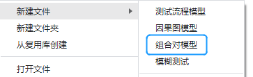
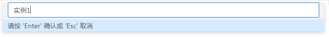
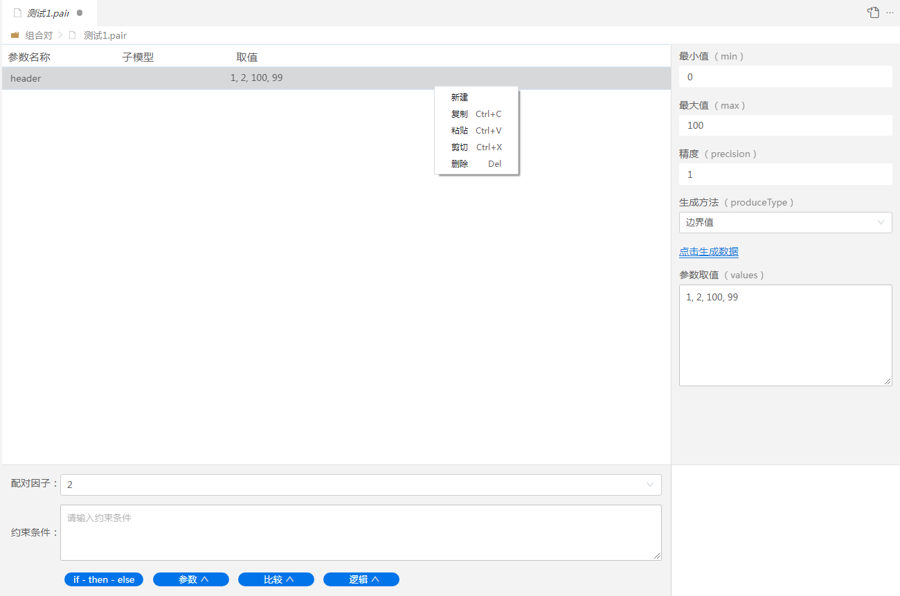
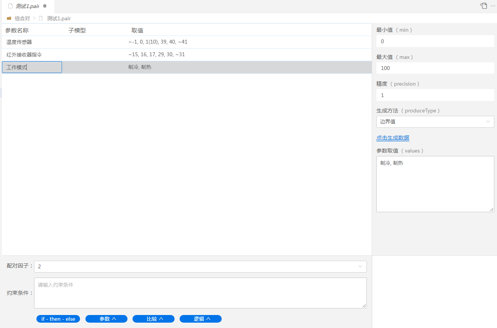
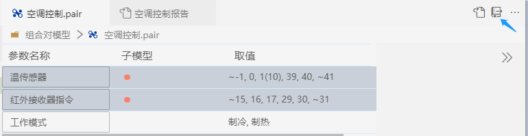
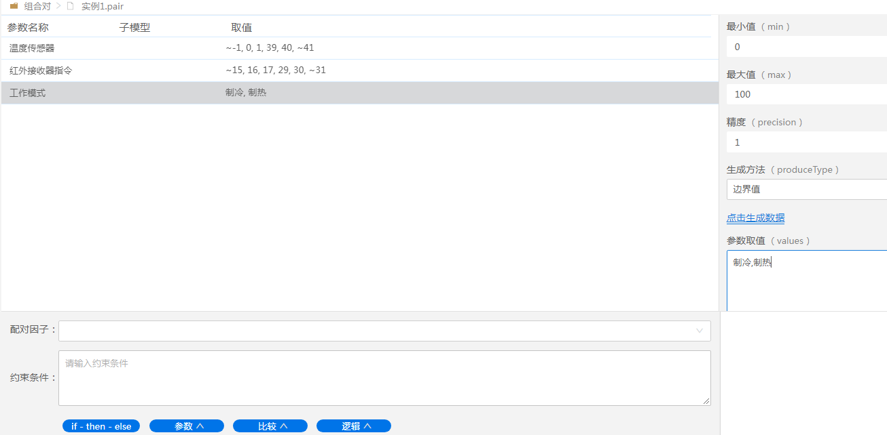
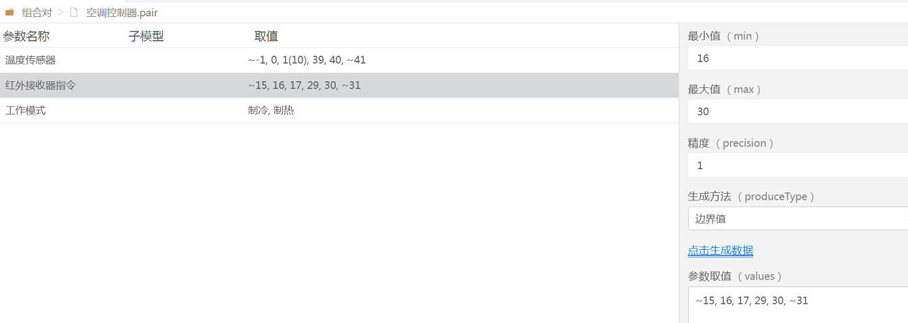
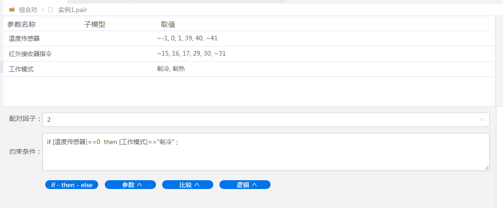
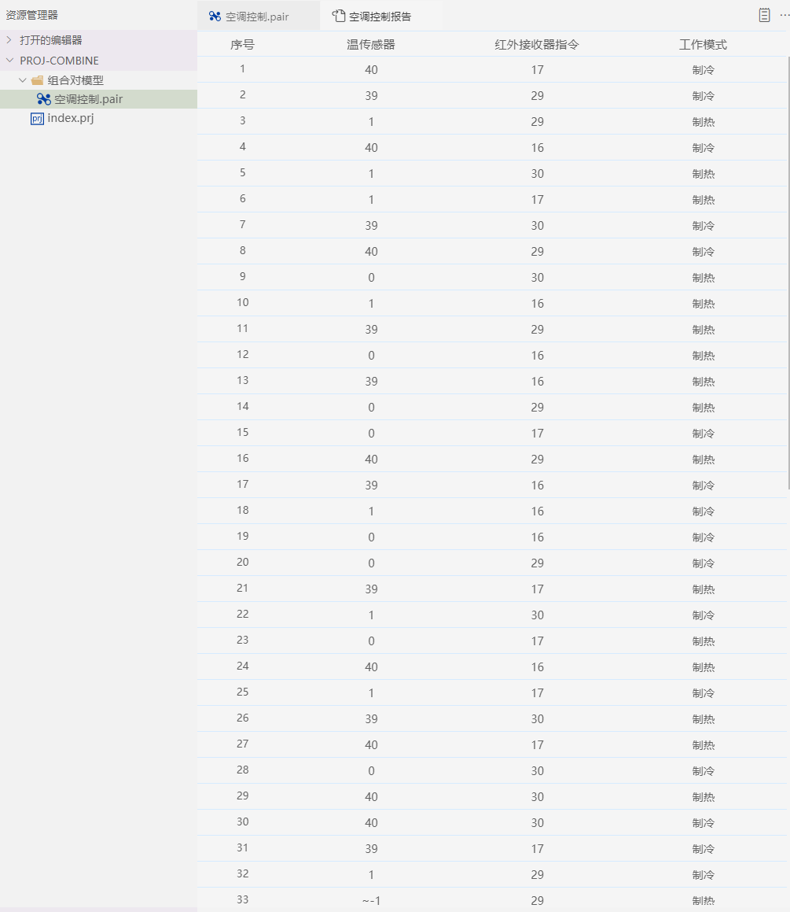

## 自动生成用例

### 案例说明

某空调控制器受三个参数影响：温度传感器、红外接收器，工作模式。
控制器会通过温度传感器采集室内温度(0-40℃)，通过红外接收器指令接受目标温度(16-30℃)，以及制冷或制热工作模式来进行工作。

请为空调控制器设计测试用例，对其进行较好的覆盖。

### 1、创建组合对模型文件

组合配对模型文件是".pair"为扩展名的文件。

操作：

（1）右侧菜单选中项目目录，鼠标右键->新建文件->选择组合对模型

注：若无项目目录，点击菜单【文件】->新建项目，会新打开一个已经新建的项目窗口，然后再在新窗口的项目目录下，新建组合对模型。

（2）系统顶部输入项中输入名称

左侧的菜单文件下会创建一个"xxx.pair"的文件，同时自动打开该文件  
默认有一行参数名为header的示例数据

### 2、创建参数行

此操作针对参数的增删改。

操作：

（1）鼠标右键->新建

注：选中参数行，鼠标右键可以新建，复制，粘贴，剪切，删除参数行。

（2）双击参数名称，会出现编辑状态，更改参数名称。

#### 从协议导入

有些测试中，参数就是协议中的字段。这时可以直接从协议中导入参数名称。

功能按钮在界面右上角。

### 3、设置参数取值

参数取值可以使用：手动输入和自动生成两种方式

（1）手动自定义输入取值：

直接在参数取值输入框中，输入数据值，不同数据值以“英文逗号”隔开。如下图

（2）自动生成取值有四种方式：

- 边界值  
- 随机数  
- 自增  
- 自减  

自动生成取值，需要输入最小值(默认0)，最大值(默认100)，精度。  
最小值和最大值为取值区间    
精度为相邻两个值的步长。例如：1,2,3则精度为1；1,4,7则精度为3  

操作：    
①选中参数行，右侧菜单输入预期最小值和最大值，以及精度；    
②选择生成方法中的边界值；    
③点击生成数据。    
④参数取值输入框以及取值列会自动生成边界值数据。 

|参数|取值范围|生成方法|参数取值|
|:-|:-|:-|:-|
|温度传感器|0-40℃|边界值|~-1, 0, 1(10), 39, 40, ~41|
|红外接收器指令|16-30℃|边界值|~15, 16, 17, 29, 30, ~31|
|工作模式|制冷or制热|自定义|制冷, 制热|

注：  

~-1, 0, 1(10), 39, 40, ~41 

1(10) 10代表权重，默认权重为1，若自定义权重，英文括号中加数字。因此生成判定表时，取1值的权重为10/15,即66.66%    
波浪线~ 代表该值为区间范围以外的值。   

### 4、设置配对因子

配对因子的概念见“术语”。

本例中，使用配对因子为默认最小值：2，即两两配对；

### 5、子模型

子模型的概念见“术语”。
本例中不需要用到子模型。

### 6、约束条件

约束条件的概念见“术语”；

本例中要求如果温度传感器的值为40的话，工作模式必须是“制冷”模式。因此输入以下约束条件。

if [温度传感器]==40  then [工作模式]=="制冷" ;

#### 约束条件的语法

约束条件的语法为lua语法   
if A then B 表达式的意思是“要求”。
意思是：if A 成立 则 要求 B 成立。（A、B都成立整个表达式为true。）
（then 后面表达式不是赋值表达式，而是条件表达式。）

下面我们看一些实例

|控制语句|实例|说明|
|:-|:-|:-|
|if 条件 then 表达式|if [温度传感器]==40  then [工作模式]=="制冷" ;|温度传感器为40的用例，工作模式为制冷|
|if 条件 then 表达式 else 表达式|if [温度传感器]==40  then [工作模式]=="制冷" else [工作模式]=="制热" ;|温度传感器为40的用例，工作模式为制冷。否则为制热|
|且and逻辑|if [温度传感器]==40 and   [红外接收器指令] ==30 then [工作模式]=="制冷" ;|温度传感器为40且红外接收器指令为30的用例，工作模式为制冷|
|或or逻辑|if [温度传感器]==40 or  [红外接收器指令] ==30 then [工作模式]=="制冷" ;|温度传感器为40或红外接收器指令为30的用例，工作模式为制冷|
|非not逻辑|if not [温度传感器]==40  then [工作模式]=="制冷" ;|温度传感器不是40的用例，工作模式为制冷|
|in{x,y...}|if  [温度传感器] in {40,39}  then [工作模式]=="制冷" ; |温度传感器为39或40的用例，工作模式为制冷|

#### 图形化输入

点击约束按钮即可在输入区域的光标位置追加一个相应的条件。    
- if-then-else：控制语句    
- 参数：表中参数因素的的名称    
- 比较：等于(==)，不等于(~=)，大于(>)，小于(<)，大于等于(>=)，小于等于(<=)    
- 逻辑：in，且and，或or，非not    

### 7、生成用例

（1）生成用例

操作：  

点击右上角“生成测试用例”按钮，生成用例文件 "空调控制报告"

