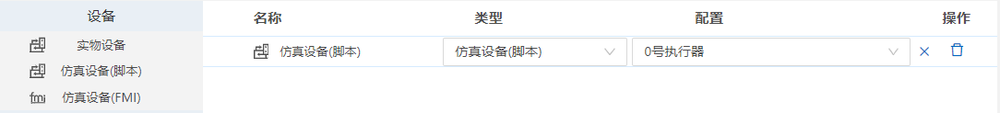
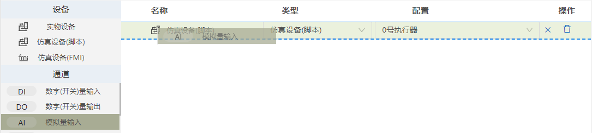
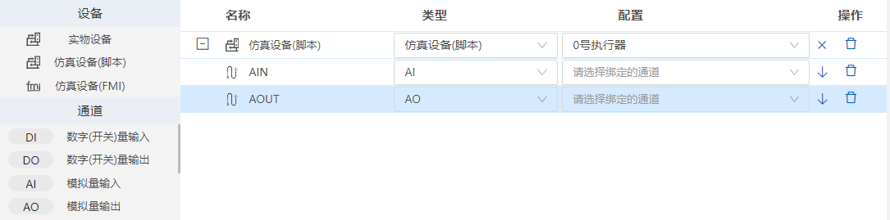
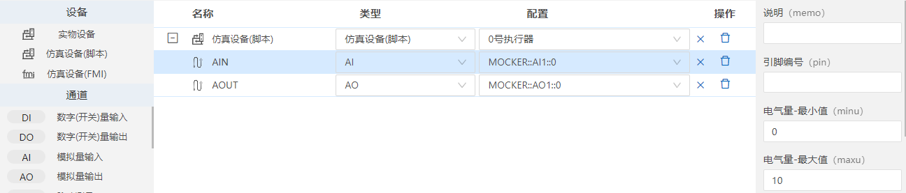
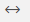
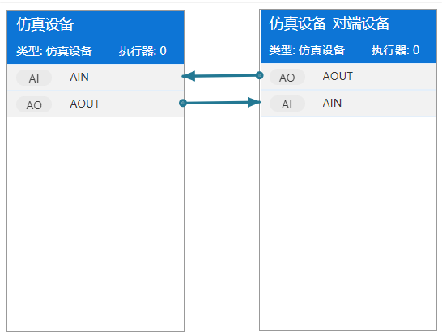
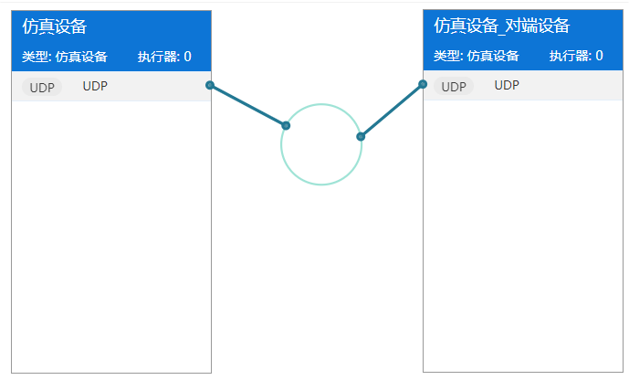
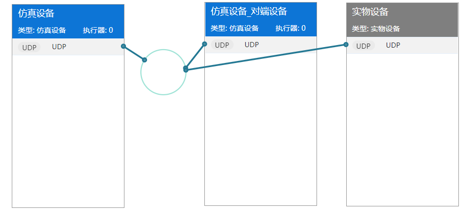
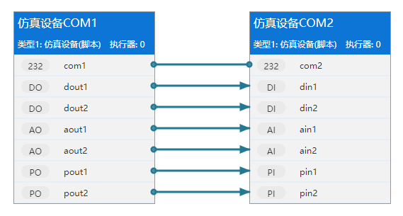
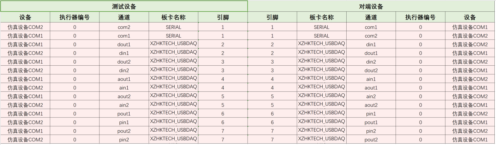

## 仿真环境

仿真环境是指通过软件模拟的方式，模拟出现实中的某个系统或设备的工作环境，以便进行测试、验证和优化等工作。在仿真环境中，通常会使用仿真设备来代替实物设备，以模拟实物设备的工作过程和行为。这样可以避免对实物设备造成损坏或影响实际生产和运行。在仿真环境中，使用仿真设备来代替实物设备进行测试和验证，以确保系统的稳定性和可靠性。

### 仿真环境搭建整体流程

按以下步骤搭建仿真环境：

1. 新建仿真环境文件。
2. 首先要添加设备，添加设备后才能向设备里添加测试所需要的通道。
3. 添加通道后，要对通道进行绑定和通道属性设置。
4. 切换到可视化连线界面，对通道进行连线。

### 仿真环境新建

仿真环境文件以“.env”为扩展名结尾的文件。

- 鼠标右键选择【新建文件】->选择【仿真环境】->输入名称->回车，文件新建成功。

### 添加设备

设备是仿真环境中的各种终端的简称，设备可以产生数据或者消费数据。在整个系统中，各个设备使用通道进行连接，并进行数据通信。本系统设备分3种类型。第一种是仿真设备(脚本)，是测试执行器和其中运行脚本模拟的对象；第二种是仿真设备(FMI)，即是符合FMI标准的模型仿真，例如动力学模型。第三种是实物设备，可以是不同系统里的被测设备，例如用于电气、机械、化工、水力、热力等系统里的设备。

- 设备添加：鼠标选中“仿真设备”或“实物设备”拖拽到空白区域，设备添加成功。
- 设备名称：设备名称可以修改，设备名称可以是中文、英文；设备名称不可以重复。
- 设备类型：添加设备后，类型可以进行修改为仿真设备或实物设备。
- 设备配置：配置信息显示的是仿真设备进行通信时使用的执行器信息；实物设备不显示配置信息。
- 设备删除：点击设备后的删除按钮，设备可以被删除；选中一个设备或多个设备后，鼠标右键菜单点击删除或操作快捷键Delete，删除设备。
- 设备复制：选中一个设备或多个设备后，鼠标右键菜单点击复制或操作快捷键ctrl+c，可以复制设备。
- 设备粘贴：选中设备复制后，鼠标右键菜单点击粘贴或操作快捷键ctrl+v，可以粘贴设备。
- 设备剪切：选中一个设备或多个设备后，鼠标右键菜单点击剪切或操作快捷键ctrl+x，可以剪切设备。
- 创建对端设备：选中一个设备或多个设备后，鼠标右键菜单点击创建对端设备，会生成新的设备和设备里的对端通道。
- 批量粘贴：选中一个设备或多个设备后，鼠标右键菜单点击批量粘贴，弹出要粘贴数量的输入框，输入数字后回车，会新增对应数量的设备及设备下的通道。

### 添加通道

- 通道添加：鼠标选中要添加的通道（例如添加通道AI和AO），将通道拖拽到设备下后，通道添加成功。

- 通道名称：通道名称可以修改，名称是由字母、数字、下划线组成，不能以数字开头，不能是关键字，不能是中文；同一个设备下的通道名称不可以重复。
- 通道类型：通道添加后，通道类型可以进行修改。
- 通道配置：下拉列表选中要绑定的通道，该操作是把对应的执行器逻辑通道绑定到板卡中的物理通道上或模拟的物理通道上，只有绑定通道后，才能实现数据通信；同时也支持自动绑定，点击配置后的↓图标，会自动进行绑定。
- 通道删除：点击通道后的删除按钮，通道可以被删除；选中一个通道或多个通道后，鼠标右键菜单点击删除或操作快捷键Delete，删除通道。
- 通道属性设置：添加通道后，可以编辑对应的通道属性内容，属性的设置内容取决于具体的需求和应用场景。
- 通道移动：属性选中已添加的通道，进行拖拽移动，可以移动通道到其他的设备下。
- 通道复制：选中一个通道或多个通道后，鼠标右键菜单点击复制或操作快捷键ctrl+c，可以复制通道。
- 通道粘贴：选中通道复制后，鼠标右键菜单点击粘贴或操作快捷键ctrl+v，可以粘贴通道。
- 通道剪切：选中一个通道或多个通道后，鼠标右键菜单点击剪切或操作快捷键ctrl+x，可以剪切通道。
- 创建对端设备：选中一个通道或多个通道后，鼠标右键菜单点击创建对端设备，会生成新的设备和对端通道。
- 批量粘贴：选中一个通道或多个通道后，鼠标右键菜单点击批量粘贴，弹出要粘贴数量的输入框，输入数字后回车，设备下会新增对应数量的通道。
- 通道展开/折叠：设备下添加多个通道后，可以点击设备前的加/减图标，进行展开/折叠操作。

### 通道连接

通道连接是指不同设备通道之间的通信连接方式。设备包含若干接口，用于相互进行通信。两个通信的设备之间，必须使用同一类型的接口进行相互连接。本系统中通道连接支持点对点连接和总线拓扑。点对点连接是输入输出两个通道之间直接连线；总线拓扑是指多个设备通道通过共享同一个通信线路来进行通信的连接方式。在实际应用中，选择哪种通道连接拓扑取决于具体的需求和应用场景。

- 点击切换图标，进入通道连线界面。
- 仿真设备：蓝色标识，表示系统可以对其接口通道等进行操作。    
- 实物设备：黑色标识，表示系统不可以对其接口通道等进行操作（作为一个黑盒子）。  

### 生成接线表

点击“生成接线表”按钮，会根据设备的连线情况，生成一份Excel文件的设备接线表，可以根据该接线表进行设备的连线。

设备连线如图所示。    

接线表如图所示。    

