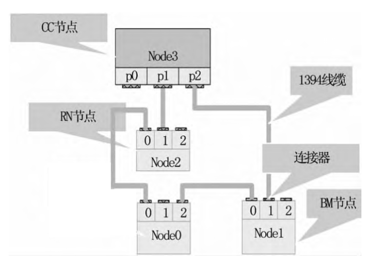
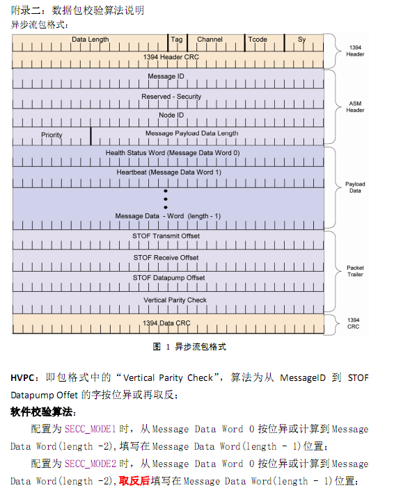
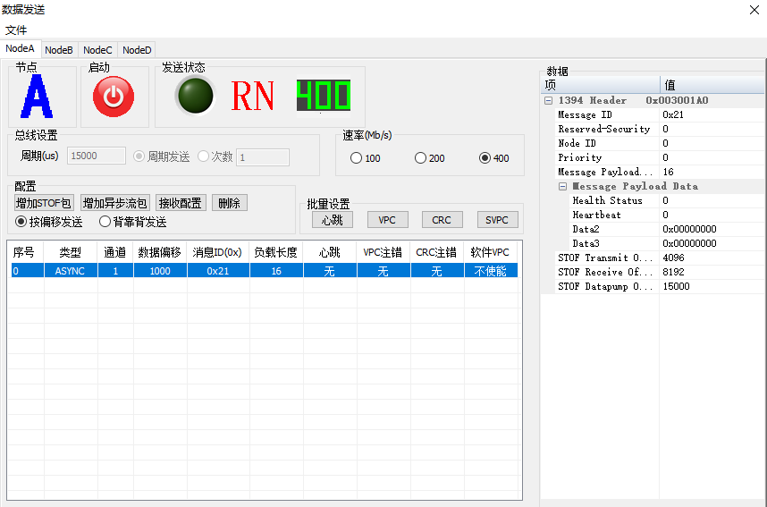
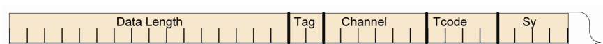
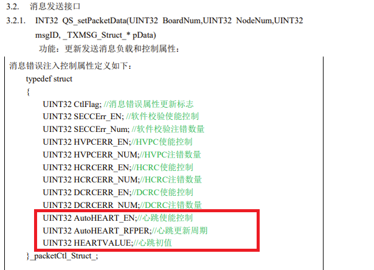
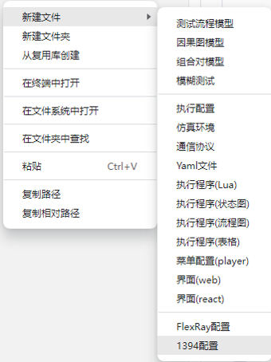

## 1394基础

### 概述
- 1394总线在IEEE-1394总线协议的基础上，采用静态配置、带宽分配和严格时间触发通信调度机制等策略，去除原有总线 通信的一些不确定因素，通过增加心跳、健康状态字、纵向奇偶校验等方法并结合IEEE-1394b协议特有的环检测和环断开机 制提高整个总线的容错能力，确保了总线通信的确定性和可靠性。
- 1394总线所具有的静态分配通道号、STOF同步、异步流包通信、预分配带宽等功能特点满足新型飞机航空电子系统总线通信要求，并成为新型飞机安全关键/任务关键系统总线首选。
- 1394总线特点传输速度快、传输距离长、高可靠性等优点。

### 拓扑结构
+  
### 节点
+ 对应软件里的通道的概念，每个节点都可以作为CC，RN，BM
    + 总线控制器节点（Control Computer，简称 CC）
    + 远程节点（Remote Node，简称 RN）
    + 总线监控节点（Bus Monitor，简称 BM）
### 端口
+ 类似1394总线的BUSA，BUSB，冗余设计，但是主要用途是方便串联组网
### 通道
+ 各个节点之间协商确定的tag，发送方和接收放的tag一致才能正确收发
### VPC
+  

### 消息
+ 消息界面
    +  
+ 消息头（Header）
    +  
    + Data length：长度16位，范围8~2008
        + 对应界面右侧表格从MessageID开始至最后一个字段，另外加一个硬件校验的整数（界面不可见）。
        + 等于左侧表格负载长度+8
    + Tag:长度2位，协议规定固定值为0
    + 通道:长度6位，范围0~63
    + TCode:长度4位，协议规定固定值为0X0A
    + Sy:长度4位，协议规定固定值为0
+ 负载（Message Payload）
    + 前2个字段固定意义，具体使用方法参见后续章节（所以负载长度最小为8）
        +  
            + 硬件控制心跳：AutoHEART_EN=true，AutoHEART_RFPER=心跳更新周期（us），HEARTVALUE=心跳起始值
            + 软件控制心跳：AutoHEART_EN=enable，定期调用QS_setPacketData更新MSGDATA[1](./db-images/界面上的Heartbeat)
    + 其余字段为用户数据
+ stof：Start of frame

### 新建1394配置文件

- 1394配置文件是以“.1394”为扩展名结尾的文件。文件名是由字母、数字、下划线、汉字组成。

- 鼠标右键选择【新建文件】->选择【1394配置】

- 界面顶部弹出文件名输入框->输入文件名称->确认回车(Enter键)

- 1394配置文件新建成功

