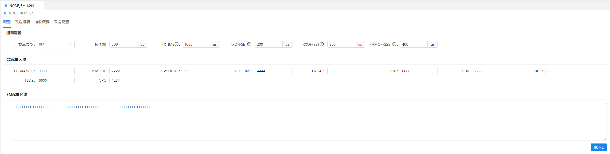
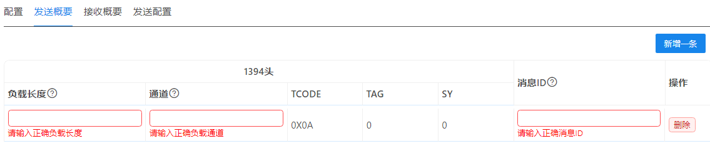
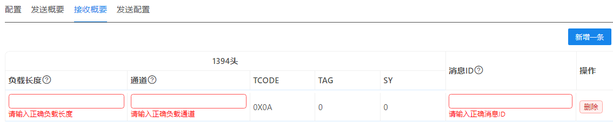
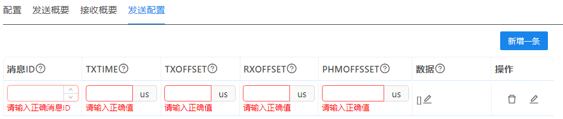
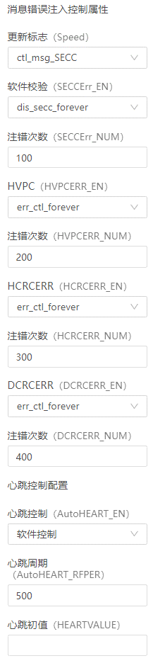
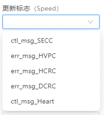
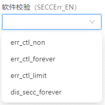
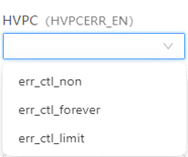
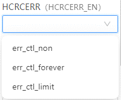
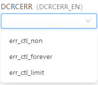

## 配置*.1394文件

### 配置

#### 通用配置
+ 节点类型：CN，RN，BM可选。
  - CN：总线控制器节点。
  - RN：远程节点。
  - BM：总线监控节点。
+ 帧周期：对应“STOF_PER”，发送STOF包的周期。范围:100-65535。
+ TXTIME：节点发送消息偏移时间。范围:100-65535。
+ TXOFFSET：节点发送消息ASM包尾中的发送偏移。范围:100-65535。
+ RXOFFSET：节点接收消息ASM包尾中的接收偏移。范围:100-65535。
+ PHMOFFSET：节点健康消息ASM包尾中的健康偏移。范围:100-65535。

#### CC配置区域
+ 概述：该区域配置的是总线控制器节点的stof字段，需要参考板卡厂家的界面来配置。
+ CCBRANCH："CC Branch Status"，总线控制分支装状态。
+ BUSMODE："Network Bus Mode"，总线模式。
+ VCHLSTS："Vehicle Status"，状态工具。
+ VCHLTIME："Vehicle Time"，时间工具。
+ CLNDAR：虚拟通道时间。
+ RTC："Real-Time Clock"，即实时时钟。
+ TBD0："To Be Determined 0"，即待定0。
+ TBD1："To Be Determined 1"，即待定1。
+ TBD2："To Be Determined 2"，即待定2。
+ VPC："Vertical Parity Check"，纵向奇偶校验。
+ 速率：对应字段"Speed"，可选S100,S200,S400。
+ 发送模式：对应字段"SendMode"，值范围:100-65535。

#### BM配置区域
+ 对应字段"BM_MASK"，对BM节点有效，64位掩码，对应0-63路通道。
+ 输入内容：只能输入64位的二进制（只能输入0或1）。
+ 格式化：点击后，将输入的二进制数每8位用空格隔开，增加可读性。

### 发送概要

+ 功能：描述发送流包的概要信息
+ 负载长度："Data Length"长度16位，值范围8~2008。
+ 通道：长度6位，范围0~63。（这里的通道仅仅是一个标志）
+ TCODE："Transaction Code"，即事务码。TCODE用于标识数据包的类型和传输方式。长度4位，协议规定固定值为“0x0A”。
+ TAG：长度2位，协议规定固定值为“0”。
+ SY：长度4位，协议规定固定值为“0”。
+ 消息ID：发送和接收的消息ID一致才能正确收发。

### 接收概要

+ 功能：描述需要接收的流包的概要信息。
+ 其他参考“发送概要”。

### 发送配置

+ 功能：对应字段"TXMSG_DETAIL"，用于配置发送的每条信息的内容和详细信息。
+ 消息ID：消息的核心属性，与前面“发送概要”部分里定义的消息ID一致。
+ TXTIME：消息发送时间，相对于Stof的发送偏移，单位us，0代表默认值。
+ TXOFFSET：消息发送偏移，相对于该节点的发送偏移，单位us，0代表默认值
+ RXOFFSET：消息接收偏移，相对于该节点的发送偏移，单位us，0代表默认值
+ PHMOFFSET：同Stof
+ 数据：消息的初始数据，以4字节为单位长度，数据的范围是0 ~ 4294967295。
+ 操作-删除：删除该条信息
+ 操作-编辑：发送信息的详细信息。

  
  - 消息错误注入控制属性：分为多个节，每节包含：使能和注入错误的次数。
    - 更新标志（FLAG）： 支持多选，选择后，下面的软件校验，HPVC，HCRCERR，DCRCERR，心跳控制的使能和注错次数才会生效。
      - clt_msg_SECC
      - err_msg_HVPC
      - err_msg_HCRC
      - err_msg_DCRC
      - ctl_msg_Heart

      
  
    - 软件校验（SECCErr_EN）：软件校验使能控制。
      - err_ctl_non：不注入错误。
      - err_ctl_forever：持续注入错误。
      - err_ctl_limit：注入有限次错误，此时“注错次数”有效。
      - dis_secc_forever：禁用软件校验。

      
    - 注错次数（SECCErr_NUM）：软件校验注错数量。

    - HVPC（HVPCERR_EN）：HVPC校验使能控制。
      - err_ctl_non：不注入错误。
      - err_ctl_forever：持续注入错误。
      - err_ctl_limit：注入有限次错误，此时“注错次数”有效。

      
    - 注错次数（HVPCERR_NUM）：HVPC校验注错数量。

    - HCRCERR（HCRCERR_EN）：HCRC校验使能控制。
      - err_ctl_non：不注入错误。
      - err_ctl_forever：持续注入错误。
      - err_ctl_limit：注入有限次错误，此时“注错次数”有效。

      
    - 注错次数（HCRCERR_NUM）：HCRC校验注错数量。

    - DCRCERR（DCRCERR_EN）：DCRC校验使能控制。
      - err_ctl_non：不注入错误。
      - err_ctl_forever：持续注入错误。
      - err_ctl_limit：注入有限次错误，此时“注错次数”有效。

      
    - 注错次数（DCRCERR_NUM）：DCRC校验注错数量。

  - 心跳控制配置：
    - 心跳控制（AutoHEART_EN）：心跳使能控制。可选择硬件控制，软件控制心跳。
    
      
    - 硬件控制的场合:心跳周期和心跳初值有效。
      - 心跳周期（AutoHEART_RFPER）
      - 心跳初值（HEARTVALUE）
    - 软件控制的场合：通过脚本（lua）控制心跳周期和心跳初值。

