## 1553BC配置

“1553BC配置”主要用于对1553总线消息进行配置。

本章节介绍1553BC配置的内容和用法。

### 配置文件新建

- 1553BC配置文件是以“.bc”为扩展名结尾的文件。文件名是由字母、数字、下划线组成，不能以数字开头，不能是关键字。

- 鼠标选中对应的文件夹->鼠标右键选择【新建文件】->选择【1553BC配置】

- 界面顶部弹出文件名输入框->输入文件名称->确认回车(Enter键)

- 1553BC配置文件新建成功，显示主帧、消息列表、非周期消息

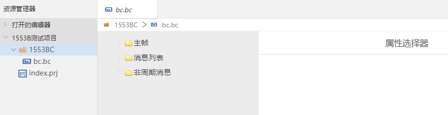

## 配置内容

1553BC消息模式，共有3种：

- 子帧模式：消息属于不同的子帧，循环运行各个子帧,每个子帧间隔一个子帧周期。
- 消息列表模式：各个消息以其自身周期依次循环运行。
- 非周期消息模式：独立单次运行特定消息帧。    

子帧模式和消息列表模式不能同时使用。子帧模式和消息列表模式都可以和非周期消息模式同时使用。

对应的，1553BC配置文件的内容也包括主帧模式配置、消息列表模式配置和非周期消息配置三个部分。

### 1 主帧模式配置

在主帧模式下，主帧可以包括多个子帧，每个子帧又可以包括多个消息。

主帧模式配置包括主帧信息、子帧信息和消息信息几部分。

#### 1.1 主帧信息（ROOT）

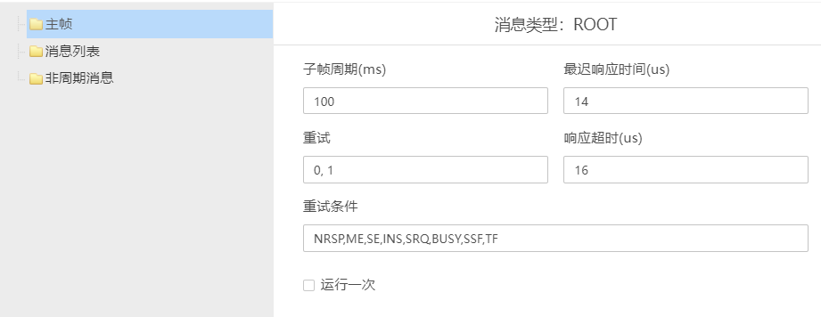

参数说明：

1）子帧周期(ms)：每个子帧循环的周期，默认是100毫秒。

2）最迟响应时间(us)：每个子帧的最迟响应时间，默认是14微秒。

3）重试：当通信失败时会尝试进行重试，重试方式可以选择相同总线或切换总线，也可以两者都选择。

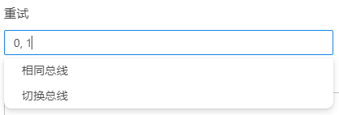

4）响应超时(us)：响应超时时间设置，默认是16微秒。

5）重试条件：当通信过程中触发到已设置的重试条件时，会进行重试。

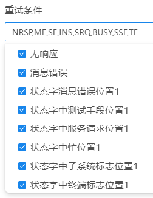

6）运行一次：如果勾选运行一次，设置的消息只发送一次；如果不勾选，则按照其他设置的规则执行。

#### 1.2 子帧信息（SUB）

选中“主帧”文件夹，鼠标右键选择“新建子帧”，完成在主帧下面新建一个子帧，默认命名为“子帧0”。

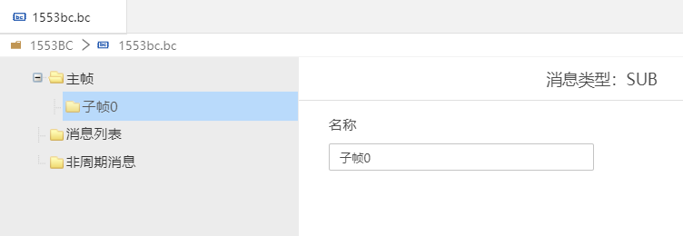

#### 1.3 消息信息

- BC->RT消息

选中“子帧0”，鼠标右键选择“新建消息”，选择“BC->RT"，新建BC到RT的消息

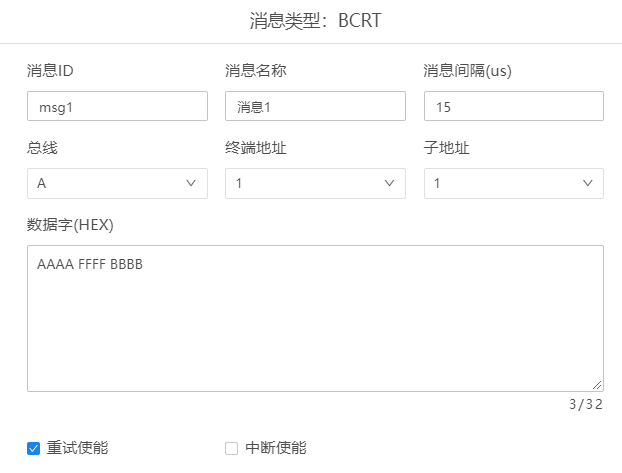

参数说明：

1）消息ID：id,内容可修改。    

2）消息名称：名称，内容可修改。  

3）消息间隔(us)：每条消息发送的间隔时间，默认是15微秒。    

4）总线：1553b是双总线，可以选择总线A通信，也可以选择总线B通信。    

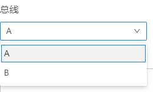

5）终端地址：即是RT地址，表示参与本次通讯的远程终端的地址，每个远程终端被指定为一个专有地址，从十进制地址1到30均可采用。地址0是用于广播消息的特殊地址，地址31是用于广播响应的特殊地址。用于实现广播通信和集体通知的功能，可以方便地将消息发送给整个网络或接收来自整个网络的响应。

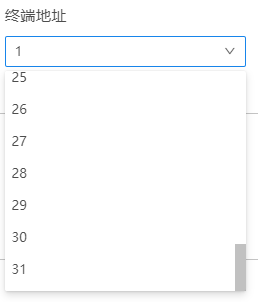

6）子地址：用来指定远程终端的子地址，或者用作总线系统进行方式控制时的标记。每个远程终端的接收发送功能被分为32个子地址，其中十进制1（00001）到30（11110）用于指定子系统地址，表示一般的接收和发送消息。十进制0（00000）和31（11111）不能用于指定子系统地址，而是用于方式代码控制，表示此时“字计数/方式码”段的内容为方式代码。

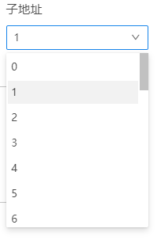

7）数据字(HEX)：HEX表示数据格式是十六进制。任何一条消息内最多可以发送或接收32个数据字。

8）重试使能：能够进行重试。

9）中断使能：被中断时可以继续。

- RT->BC消息

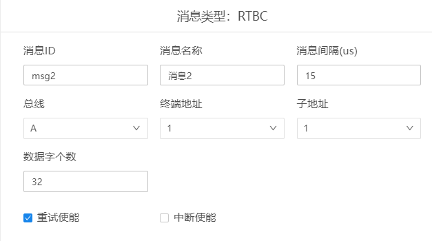

参数说明：

1）数据字个数：限制数据字个数，最多32个。

- RT->RT消息

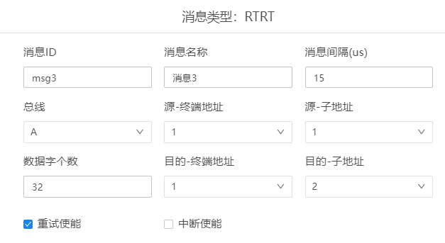

参数说明：
 
1）源-终端地址：发送终端的地址    

2）源-子地址：发送终端的子地址    

3）目的-终端地址：接收终端的地址    

4）目的-子地址：接收终端的子地址    

- Mode Code消息

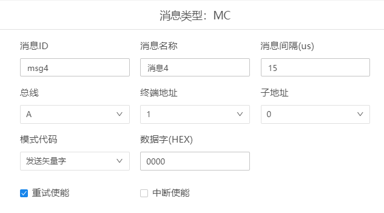

参数说明：

1）子地址：子地址选择0    

2）模式代码：可以选择列表中的类型   

3）数据字(HEX)：只能输入一个十六进制的数据字   

- COND消息

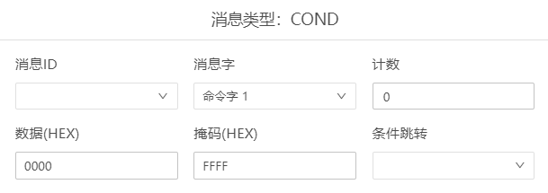

参数说明：

1）消息字：可以选择列表中的类型     

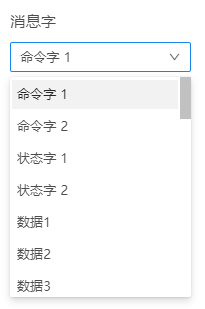

2）计数：输入个数    

3）数据(HEX)：只能输入一个十六进制的数据字   

4）掩码(HEX)：只能输入一个十六进制的数据字   

5）条件跳转：可以选择列表中的条件    

- GOTO消息

参数说明：

1）条件跳转：可以选择列表中的跳转条件

#### 1.4 操作

- 主帧操作

  选中主帧，鼠标右键显示“新建子帧”，可以添加多个子帧；存在多个子帧时，可以点击主帧文件夹左侧的+/-图标进行展开、收起操作。    
- 子帧操作

  选中子帧，鼠标右键显示菜单，可以进行新建消息、复制、粘贴、剪切、删除、禁用、启用操作，同时也可以使用对应的快捷键进行操作。存在多个消息时，可以点击子帧文件夹左侧的+/-图标进行展开、收起操作。    

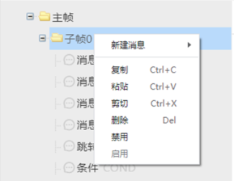

- 消息操作：

  选中消息，鼠标右键显示菜单，可以进行新建消息、复制、粘贴、剪切、删除、禁用、启用操作，同时也可以使用对应的快捷键进行操作。    

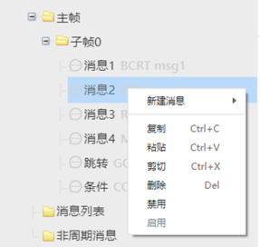

### 2 消息列表模式配置

#### 2.1 消息列表信息（MSG）

参数说明：

1）最迟响应时间(us)：默认14微秒

2）响应超时(us)：默认16微秒

#### 2.2 消息信息

- BC->RT消息

选中“消息列表”文件夹，选择“新建消息”，选择“BC->RT"，新建BC到RT的消息。

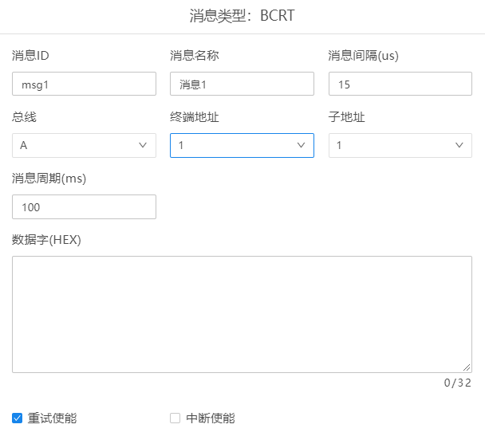

消息周期(ms)：消息周期默认100毫秒。

- RT->BC消息

- RT->RT消息

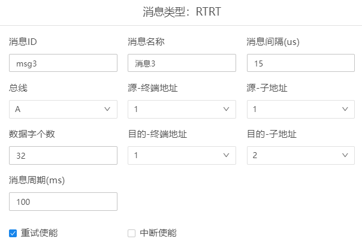

- Mode Code消息

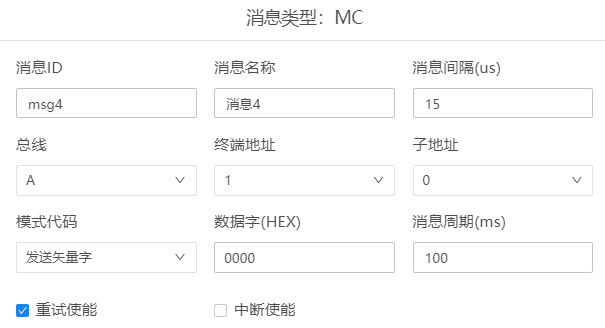

- NIL消息

空消息，仅消息列表支出该类型

消息类型：NIL

消息周期(ms)：默认1毫秒

- COND消息

- GOTO消息

#### 2.3 操作

- 消息列表操作

  选中消息列表，鼠标右键显示“新建消息”，可以添加多个消息；存在多个消息时，可以点击文件夹左侧的+/-图标进行展开、收起操作。    

- 消息操作

  选中消息，鼠标右键显示菜单，可以进行新建消息、复制、粘贴、剪切、删除、禁用、启用操作。同时也可以使用对应的快捷键进行操作。  

### 3 非周期消息模式配置

#### 3.1 消息帧信息（SUB）

选中“非周期消息”文件夹，选择“新建消息帧”，消息帧默认命名为“消息帧1”。

#### 3.2 消息信息

- BC->RT消息

选中“消息帧1”文件夹，选择“新建消息”，选择“BC->RT"，新建BC到RT的消息。

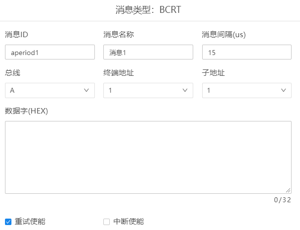

- RT->BC消息

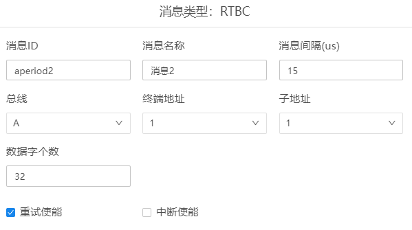

- RT->RT消息

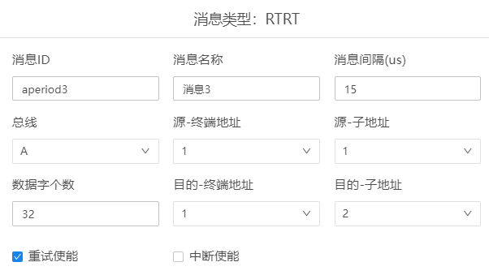

- ModeCode消息

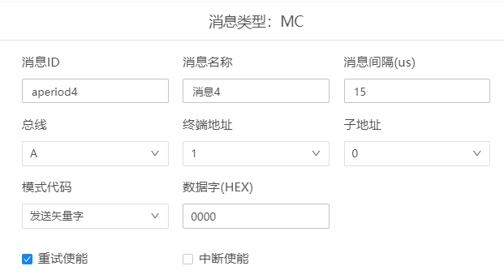

#### 3.3 操作

- 非周期消息操作

  选中非周期消息，鼠标右键显示“新建消息帧”，可以添加多个消息帧；存在多个消息帧时，可以点击非周期消息文件夹左侧的+/-图标进行展开、收起操作。    
- 消息帧操作

  选中消息帧，鼠标右键显示菜单，可以进行新建消息、复制、粘贴、剪切、删除、禁用、启用操作，同时也可以使用对应的快捷键进行操作。存在多个消息时，可以点击消息帧文件夹左侧的+/-图标进行展开、收起操作。    

- 消息操作

  选中消息，鼠标右键显示菜单，可以进行新建消息、复制、粘贴、剪切、删除、禁用、启用操作。同时也可以使用对应的快捷键进行操作。    

