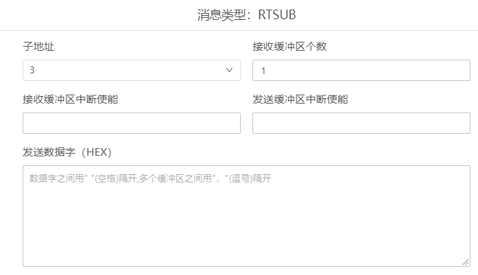
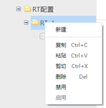
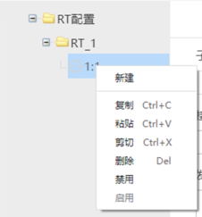

## 1553RT配置

“1553RT配置”主要用于对1553总线RT进行配置。

本章节介绍1553RT配置的内容和用法。

RT:远程终端（Remote Terminal）。1553B总线协议最多可以连接32个RT终端。

### 配置文件新建

- 1553RT配置文件是以“.rt”为扩展名结尾的文件。文件名是由字母、数字、下划线组成，不能以数字开头，不能是关键字。

- 鼠标选中对应的文件夹->鼠标右键选择【新建文件】->选择【1553RT配置】

- 界面顶部弹出文件名输入框->输入文件名称->确认回车(Enter键)

- 1553RT配置文件新建成功

### 配置内容

#### 1 RT配置信息

#### 2 RT信息

参数说明：

1）终端地址：0到31均可采用。0和31是广播地址，一般不选择。    

#### 3 RT子地址信息

参数说明：

1）子地址：RT的子地址，同一个RT下的多个子地址不能重复。    

2）接收缓冲区个数：可以设置多个。    

3）接收缓冲区中断使能：接收缓冲区存在中断时可以继续。   

4）发送缓冲区中断使能：发送缓冲区存在中断时可以继续。   

5）发送数据字(HEX)：发送多个缓冲区时用“,”(英文逗号)隔开。    

### 操作

- RT配置操作

  选中RT配置，鼠标右键显示“新建”，可以添加多个RT；存在多个RT时，可以点击RT配置文件夹左侧的+/-图标进行展开、收起操作。    

  

- RT操作

  选中RT_1，鼠标右键显示菜单，可以进行新建消息、复制、粘贴、剪切、删除、禁用、启用操作，同时也可以使用对应的快捷键进行操作。存在多个消息时，可以点击RT_1文件夹左侧的+/-图标进行展开、收起操作。    

  

- 子地址操作

  选中消息，鼠标右键显示菜单，可以进行新建消息、复制、粘贴、剪切、删除、禁用、启用操作。同时也可以使用对应的快捷键进行操作。   

  

