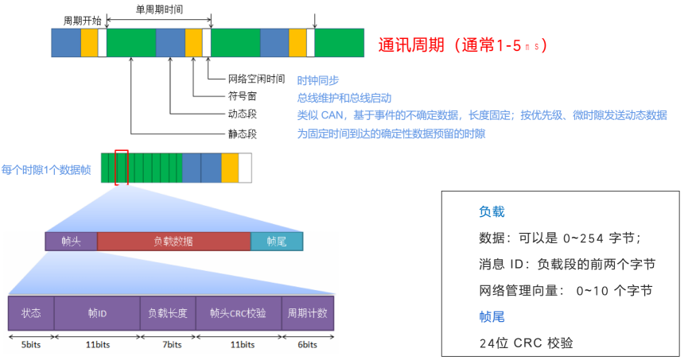
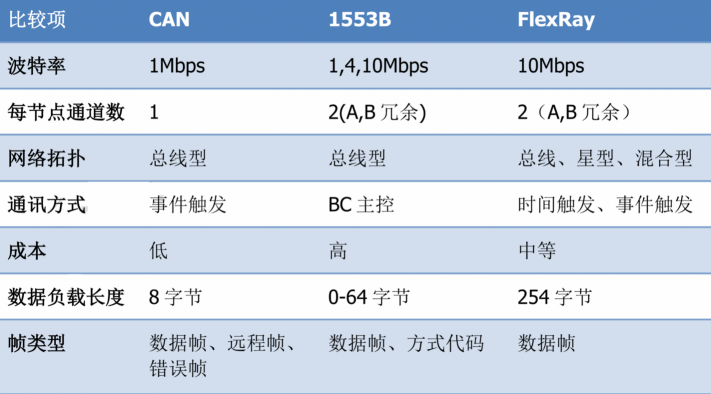
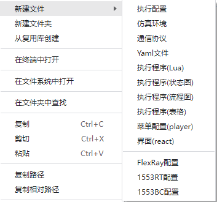
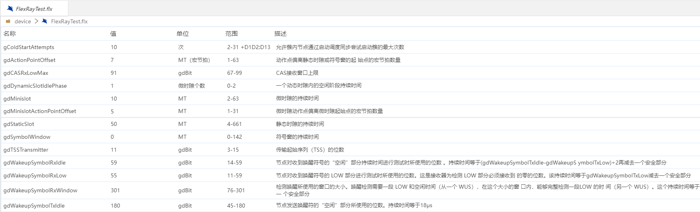

## FlexRay

FlexRay车载网络标准已经成为同类产品的基准，将在未来很多年内，引导整个汽车电子产品控制结构的发展方向。FlexRay是继CAN 和LIN之后的最新研发成果，可以有效管理多重安全和舒适功能。主要用于确定性和容错性要求高的线控应用中，如线控驱动、线控转向、线控制动等。使用非屏蔽双绞线电缆将节点连接在一起，FlexRay 网络末端节点需要端接电阻，阻抗在 80 到 110 欧姆之间，FlexRay 支持总线拓扑、星形拓扑、混合拓扑，传输速度10 Mbit/s，FlexRay总线可以有两个通道，两个通道可以冗余，也可以聚合，或仅使用一个通道，其传输性能、可靠性、功能都超过CAN。

本系统提供图表方式显示FlexRay通信所需要的全部总线参数，使参数配置一目了然。所有参数在一个文件内进行维护，便于管理。用户只需要根据实际的需求，修改对应参数的值后，即可使用该文件作为测试数据，进行测试。

### FlexRay协议

- FlexRay 协议是一种独特的时间触发协议，有两种数据处理方式
  + 可确定性的时间范围（低至微秒）内到达的确定性数据。
  + 可处理多种帧的类似 CAN 的动态事件驱动数据。

- FlexRay 通过预设的通信周期实现了核心静态帧和动态帧的混合
  + 网络设计者根据网络需求配置总线周期分配。
  + FlexRay 网络上的节点必须知道如何配置网络的所有部分才能进行通信。

- FlexRay 使用时分多址或 TDMA 方案管理多个节点
  + 每个 FlexRay 节点都同步到相同的时钟，轮流写入总线，不会产生冲突。

### FlexRay通信

### FlexRay 时钟同步和冷启动

- 2种特殊类型的帧：“启动帧”和“同步帧”
  + 冷启动：启动 FlexRay 总线的操作称为冷启动
  + 至少需要 2 个不同的节点才能发送启动帧
  + 启动帧类似于启动触发器，该触发器告诉网络上的所有节点启动

- 时钟同步：网络启动后，所有节点都必须将其内部振荡器与网络的全局时钟同步
  + 使用两个同步节点来完成，预先指定在首次打开时广播特殊同步帧
  + 其他节点等待同步帧广播，并测量连续广播之间的时间，校准内部时钟

### FlexRay与CAN、1553比较

### FlexRay配置文件新建

  FlexRay配置文件是以“.flx”为扩展名结尾的文件。文件名是由字母、数字、下划线组成，不能以数字开头，不能是关键字。

- 鼠标选中对应的文件夹->鼠标右键选择【新建文件】->选择【FlexRay配置】

- 界面顶部弹出文件名输入框->输入文件名称->确认回车(Enter键)

- FlexRay配置文件新建成功，显示全部的总线参数。

### FlexRay总线配置设置

- 总线参数共有51个参数，配置文件内显示参数的名称、值、单位、范围、描述。其中只有值可以进行编辑，参考范围进行对应值的修改。其他内容不可编辑。

