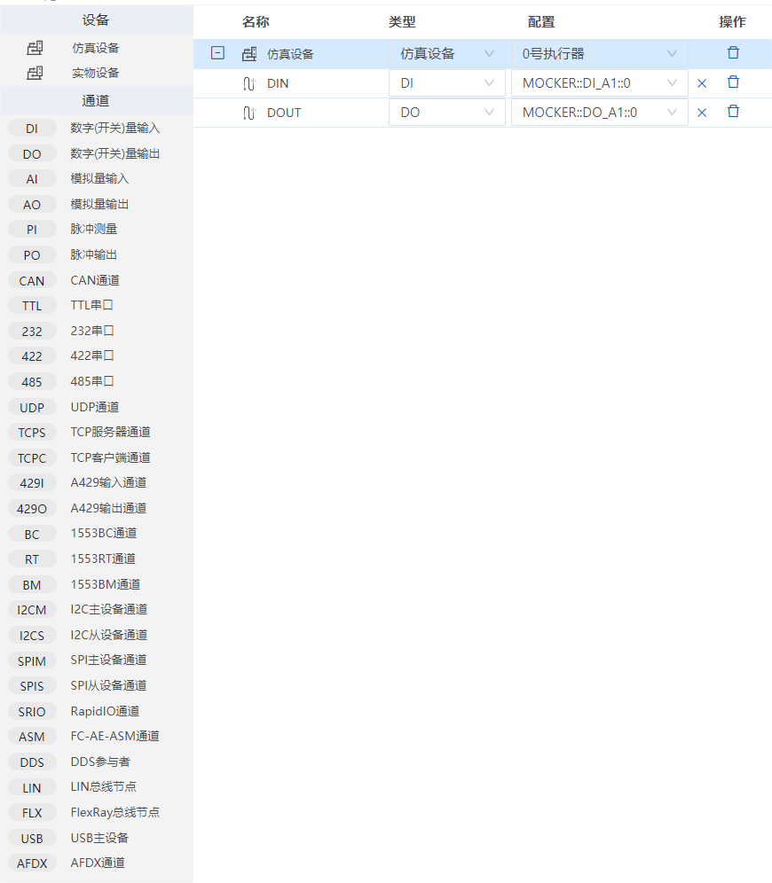

## 其他设备类型

### 其他设备类型对应的通道

在仿真环境文件内可以添加其他设备类型的通道。添加方法请查看[仿真环境](#/document?catalogId=31&id=36&type=doc)内容。

- 数字(开关)量输入/输出：DI   DO 
- 模拟量输入/输出通道：AI   AO
- 脉冲测量/脉冲输出：PI   PO
- CAN通道：CAN 
- 串口：TTL 232  422 485 
- UDP通道：UDP
- TCP服务器/客户端通道：TCPC TCPS
- A429输入/输出通道：429I 429O
- 12C主设备/从设备通道：12CM 12CS   
- SPI主设备/从设备通道：SPIM SPIS
- RapidIO通道：SRIO 
- FC-AE-ASM通道：ASM 
- DDS参与者： DDS
- LIN总线节点：  LIN
- USB主设备：USB
- AFDX通道：AFDX

### 设备通道的使用

设备通道的具体使用请查看[通道的使用](#/document?catalogId=60&id=57&type=doc)内容。

